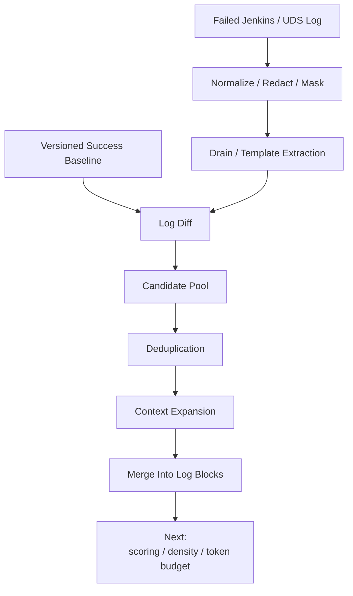
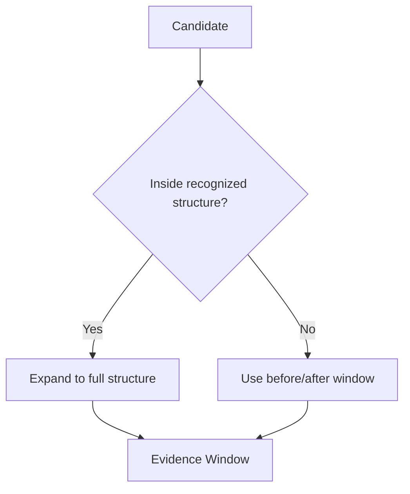
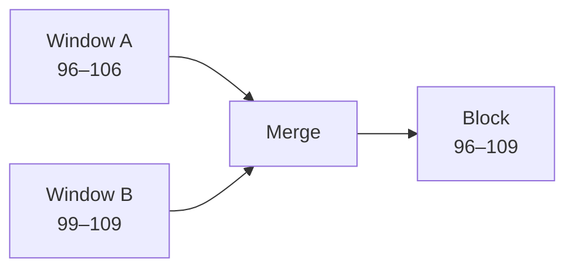
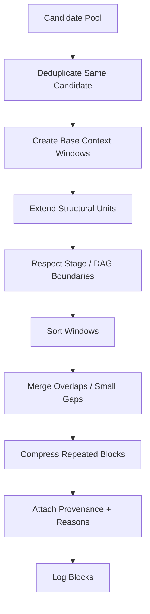
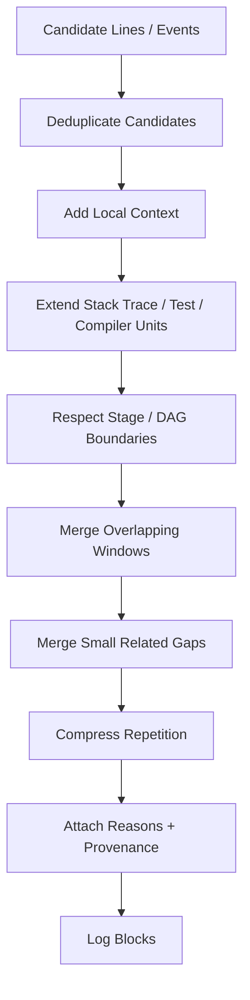

# Deduplication + Context Expansion + Log Block Construction

> A junior-engineer deep dive into how our CI/CD Log Intelligence Service turns isolated suspicious lines into complete diagnostic evidence.
>
> This chapter starts **after** Log Diffing + Candidate Selection.
>
> At this point, we already have candidate lines/events such as:
>
> - `NOVEL_VS_SUCCESS`
> - `FAILURE_KEYWORD`
> - `NEAR_TAIL`
> - `FAILED_STAGE`
> - `EXCEPTION`
> - `NONZERO_EXIT`
> - `FAILED_TEST`
> - `FREQUENCY_ANOMALY`
>
> The problem now is:
>
> > **How do we turn those isolated suspicious points into useful, non-duplicated log blocks that tell a complete failure story?**

This chapter covers:

1. candidate-line deduplication;
2. duplicate reasons vs duplicate lines;
3. why isolated candidates are not enough;
4. context expansion;
5. the `4-before / 6-after` starting point;
6. dynamic context;
7. stack-trace preservation;
8. test-failure preservation;
9. compiler-diagnostic preservation;
10. stage-boundary behavior;
11. overlapping-window merge;
12. nearby-window merge;
13. repeated retry sections;
14. log-block data model;
15. provenance and original ranges;
16. combining candidate reasons at block level;
17. repeated-block deduplication;
18. confidence and edge cases;
19. V1 pseudocode;
20. what comes next.

---

# 1. Where This Fits

Our pipeline so far:



This chapter is about:

```text
Candidate Pool
      ↓
Dedup
      ↓
Context
      ↓
Log Blocks
```

---

# 2. Why Candidate Lines Alone Are Not Enough

Suppose the candidate pool contains:

```text
Connection refused
```

An LLM or engineer immediately asks:

```text
Connection to what?
Which stage?
Which command was running?
Was this before or after a retry?
Was there a stack trace?
Which test failed?
```

So:

```text
candidate line
```

is only a **pointer** to an interesting region.

We need the nearby story.

Example raw log:

```text
101 Running PaymentServiceIT
102 Loading integration-test configuration
103 DB host payment-db.internal
104 DB port 5432
105 Opening JDBC connection
106 Connection refused
107 org.postgresql.util.PSQLException
108 Caused by java.net.ConnectException
109 PaymentRepository initialization failed
110 PaymentServiceIT FAILED
111 Tests run: 124, Failures: 1
112 BUILD FAILURE
```

Candidate:

```text
106 Connection refused
```

Useful evidence block:

```text
102 Loading integration-test configuration
103 DB host payment-db.internal
104 DB port 5432
105 Opening JDBC connection
106 Connection refused
107 org.postgresql.util.PSQLException
108 Caused by java.net.ConnectException
109 PaymentRepository initialization failed
110 PaymentServiceIT FAILED
111 Tests run: 124, Failures: 1
112 BUILD FAILURE
```

That tells a complete story.

---

# 3. First Problem — Candidate Deduplication

A single line can be selected by several detectors.

Example:

```text
BUILD FAILURE
```

may be selected because:

```text
NOVEL_VS_SUCCESS
FAILURE_KEYWORD
NEAR_TAIL
TERMINAL_FAILURE
FAILED_STAGE
```

We do **not** want five copies of:

```text
BUILD FAILURE
```

We want:

```json
{
  "line_number": 112,
  "text": "BUILD FAILURE",
  "reasons": [
    "NOVEL_VS_SUCCESS",
    "FAILURE_KEYWORD",
    "NEAR_TAIL",
    "TERMINAL_FAILURE",
    "FAILED_STAGE"
  ]
}
```

So the first dedup rule is:

> **Same source line/event → one candidate object, many reason codes.**

---

# 4. Duplicate Reasons vs Duplicate Lines

These are different.

## Duplicate reason

Bad:

```text
line 112:
FAILURE_KEYWORD
FAILURE_KEYWORD
FAILURE_KEYWORD
```

Fix:

```text
reason set
```

Result:

```text
FAILURE_KEYWORD
```

once.

## Duplicate line

Bad:

```text
candidate 1 → line 112 BUILD FAILURE
candidate 2 → line 112 BUILD FAILURE
candidate 3 → line 112 BUILD FAILURE
```

Fix:

```text
merge candidates by stable source identity
```

A useful identity could be:

```text
source_run_id
+
original_line_number
```

or, for multi-line structural units:

```text
source_run_id
+
start_line
+
end_line
+
structural_unit_type
```

---

# 5. Candidate Identity

For V1, a line candidate can have:

```text
CandidateId
source
run_id
stage_id
start_line
end_line
template_id
reasons[]
```

Example:

```json
{
  "candidate_id": "c-091",
  "run_id": "9899",
  "stage_id": "integration-test",
  "start_line": 106,
  "end_line": 106,
  "template_id": "t-817",
  "reasons": [
    "NOVEL_VS_SUCCESS",
    "FAILED_STAGE"
  ]
}
```

Later, if a stack trace is already recognized as one structural unit:

```text
start_line = 106
end_line   = 118
```

---

# 6. Why Dedup Must Happen Before Context Expansion

Imagine the same line is selected three times.

If we expand each copy by:

```text
4 before
6 after
```

we might create:

```text
Block A = 102–112
Block B = 102–112
Block C = 102–112
```

Then later we have to merge identical windows.

Better:

```text
candidate signals
      ↓
deduplicate candidate
      ↓
expand once
```

Cleaner and cheaper.

---

# 7. Context Expansion

Context expansion means:

> **For each suspicious line/event, keep nearby lines so the evidence has enough meaning.**

A simple starting rule inspired by LogSage is:

```text
4 lines before
candidate
6 lines after
```

Why asymmetric?

Because lines before often tell us:

```text
what operation was happening?
```

while lines after often tell us:

```text
exception
nested cause
failed test
exit status
build summary
```

Example:

```text
102 Loading DB configuration      ← before
103 DB host payment-db
104 DB port 5432
105 Connecting
106 Connection refused            ← candidate
107 PSQLException                 ← after
108 Caused by ConnectException
109 Repository initialization failed
110 PaymentServiceIT FAILED
111 Tests run: 124, Failures: 1
112 BUILD FAILURE
```

---

# 8. Why 4 Before / 6 After Is Only a Starting Point

Do not make this a religious rule.

Different log types need different context.

For example:

## Short shell error

```text
command
error
exit code
```

Maybe:

```text
2 before
3 after
```

is enough.

## Java stack trace

Could need:

```text
1 before
20+ after
```

## Compiler error

May need:

```text
file path
source line
caret line
diagnostic
```

## Kubernetes failure

May need:

```text
event
reason
message
container status
previous restart info
```

So:

> **Static context is a safe fallback. Structural context should take priority when available.**

---

# 9. Dynamic Context

Dynamic context means:

> Instead of always taking N lines, expand to the complete recognized structure.

Example:

```text
100 java.lang.RuntimeException: payment failed
101     at PaymentService.charge(PaymentService.java:81)
102     at CheckoutService.checkout(CheckoutService.java:44)
103 Caused by: java.net.ConnectException: Connection refused
104     at ...
105     at ...
106     at ...
```

If the candidate is line 100 and we keep only:

```text
4 before / 6 after
```

we may still cut off part of the trace.

Better:

```text
candidate belongs to STACK_TRACE
        ↓
expand to entire stack trace boundary
```

---

# 10. Structural Context Should Beat Fixed-Line Context

Recommended priority:

```text
1. recognized structural unit
2. stage-aware logical boundary
3. configurable line window
```

Example:



---

# 11. Stack-Trace Preservation

Stack traces should be treated as one logical unit where possible.

Java example:

```text
java.sql.SQLException: connection failed
    at PaymentRepository.load(PaymentRepository.java:41)
    at PaymentService.start(PaymentService.java:82)
Caused by: java.net.ConnectException: Connection refused
    at sun.nio.ch.Net.connect0(Native Method)
    ...
```

Bad selection:

```text
java.sql.SQLException: connection failed
```

only.

Better:

```text
exception header
frames
nested cause
relevant bottom frames
```

We can recognize boundaries using patterns such as:

```text
Exception header
"Caused by:"
indented "at ..."
language-specific traceback syntax
```

The exact parser rules can be tool/language specific.

---

# 12. Python Traceback Example

```text
Traceback (most recent call last):
  File "payment.py", line 91, in charge
    connect_db()
  File "db.py", line 42, in connect_db
    raise ConnectionError(...)
ConnectionError: payment-db refused connection
```

Treat the whole traceback as:

```text
one structural unit
```

even if only:

```text
ConnectionError
```

was the original candidate.

---

# 13. Test Failure Preservation

Test failures often span several lines.

Example:

```text
PaymentServiceTest > shouldCreatePayment FAILED
expected: <200>
 but was: <500>

org.opentest4j.AssertionFailedError:
Expected status 200 but received 500
    at ...
```

Do not keep only:

```text
FAILED
```

or only:

```text
expected: <200>
```

Preserve:

```text
test name
assertion
expected
actual
relevant exception
summary
```

This is much more useful for RCA.

---

# 14. Compiler Diagnostic Preservation

Compiler errors are also structural.

Example:

```text
src/main/java/PaymentService.java:81: error: cannot find symbol
    paymentClient.charge(order);
                 ^
  symbol:   method charge(Order)
  location: variable paymentClient of type PaymentClient
```

Candidate detector may trigger on:

```text
error:
```

But the useful block includes:

```text
file + line
source code
caret
symbol
location
```

Treat it as one diagnostic unit.

---

# 15. Shell Command + Exit Status

Example:

```text
$ docker build -t payment-service .
...
failed to solve: base image not found
script returned exit code 1
```

Candidate lines:

```text
failed to solve
exit code 1
```

These belong to the same story.

We should preserve:

```text
command
failure
exit status
```

if they are reasonably close in the same stage.

---

# 16. Stage-Boundary Behavior

Context expansion should generally not cross a strong stage boundary unless there is a clear reason.

Example:

```text
--- Stage: Unit Test ---
...
Connection refused
...
--- Stage: Docker Build ---
...
```

If the candidate is:

```text
Connection refused
```

in `Unit Test`, do not automatically pull 20 lines from `Docker Build`.

Why?

Because unrelated stage output can add noise.

Default:

```text
stop at strong stage boundary
```

Exception:

```text
terminal pipeline summary
```

may still be useful even if technically outside the failed stage.

---

# 17. Parallel DAG Stage Boundaries

For DAG pipelines, physical line adjacency can be misleading.

Example:

```text
[unit] Running test
[lint] Running checkstyle
[unit] Assertion failed
[integration] Starting database
[unit] PaymentTest FAILED
```

A simple `±N lines` window would include unrelated:

```text
lint
integration
```

lines.

If stage metadata is available:

```text
candidate stage = unit
```

prefer context from:

```text
unit stage stream
```

rather than raw global adjacency.

This is a major reason why we preserved DAG metadata earlier.

---

# 18. Two Possible Context Views

For parallel logs, we can maintain:

## Physical context

```text
what was printed around this line globally?
```

Useful for:

```text
terminal ordering
runner/system events
```

## Logical stage context

```text
what happened before/after inside the same stage?
```

Usually better for diagnosis.

For V1, prefer logical stage context when reliable.

Fallback to physical context when stage mapping is unavailable.

---

# 19. Overlapping Context Windows

Suppose candidates are:

```text
line 100 Connection refused
line 103 PSQLException
```

Window A:

```text
96–106
```

Window B:

```text
99–109
```

These overlap.

Do not send them separately.

Merge:

```text
96–109
```

Conceptually:



Why?

Because they are probably one diagnostic story.

---

# 20. Nearby Windows That Do Not Overlap

Example:

```text
Block A candidate window = 100–110
Block B candidate window = 113–120
```

Gap:

```text
2 lines
```

If:

```text
same stage
same structural unit/category
small gap
```

it may be better to merge:

```text
100–120
```

This avoids artificial fragmentation.

---

# 21. Merge-Gap Rule

A simple V1 rule:

```text
if same stage
and gap <= configured merge_gap_lines
then merge
```

Example:

```text
merge_gap_lines = 3
```

So:

```text
100–110
113–120
```

merge.

But:

```text
100–110
150–160
```

do not merge just because they are in the same stage.

---

# 22. Merge Only When It Makes Semantic Sense

We should avoid:

```text
all candidates in same stage
        ↓
one giant block
```

That defeats reduction.

Useful merge conditions can include:

```text
overlap
small gap
same stage
same structural category
same command
same test
same exception chain
same retry group
```

---

# 23. Repeated Retry Sections

Logs can contain huge repeated blocks:

```text
Retry 1/500
Connection failed

Retry 2/500
Connection failed

Retry 3/500
Connection failed

...
```

If we expand every candidate:

```text
thousands of repeated lines
```

Bad.

We need **repetition-aware block construction**.

Possible representation:

```text
Retry group:
template = "Connection failed"
count = 500
first range = 100–105
last range = 2580–2585
representative samples = first + last
```

This preserves:

```text
what repeated
how many times
where
```

without paying for every copy.

---

# 24. Repetition Compression vs Deduplication

These are related but not identical.

## Deduplication

```text
same exact evidence selected multiple times
```

→ keep once.

## Repetition compression

```text
same event actually occurred hundreds of times in the log
```

→ represent count + samples.

We should not erase the fact that it repeated.

Because repetition itself may be diagnostic.

---

# 25. Candidate Reasons Roll Up to the Block

Suppose one block contains:

```text
Connection refused
PSQLException
PaymentServiceIT FAILED
BUILD FAILURE
```

Reasons from individual candidates:

```text
NOVEL_VS_SUCCESS
EXCEPTION
FAILED_TEST
FAILURE_KEYWORD
NEAR_TAIL
TERMINAL_FAILURE
FAILED_STAGE
```

The block should keep the union:

```json
{
  "reasons": [
    "NOVEL_VS_SUCCESS",
    "EXCEPTION",
    "FAILED_TEST",
    "FAILURE_KEYWORD",
    "NEAR_TAIL",
    "TERMINAL_FAILURE",
    "FAILED_STAGE"
  ]
}
```

Later scoring uses these features.

---

# 26. LogBlock Data Model

A useful V1 model:

```text
LogBlock
```

Fields:

```text
block_id
run_id
source
stage_id
dag_node_id

start_line
end_line

source_ranges[]

category
text

candidate_ids[]
reason_codes[]

template_ids[]

token_count
repetition_count

structural_type

confidence
```

---

# 27. Example LogBlock

```json
{
  "block_id": "b-003",
  "run_id": "9899",
  "source": "jenkins",

  "stage_id": "integration-test",
  "dag_node_id": "integration-test-3",

  "start_line": 102,
  "end_line": 112,

  "source_ranges": [
    {
      "start_line": 102,
      "end_line": 112
    }
  ],

  "category": "DATABASE_CONNECTION_FAILURE",

  "reason_codes": [
    "NOVEL_VS_SUCCESS",
    "EXCEPTION",
    "FAILED_TEST",
    "FAILED_STAGE",
    "NEAR_TAIL"
  ],

  "candidate_ids": [
    "c-081",
    "c-082",
    "c-084"
  ],

  "text": "Loading DB configuration\n...",

  "token_count": 184,

  "structural_type": "EXCEPTION_AND_TEST_FAILURE",

  "confidence": "HIGH"
}
```

---

# 28. Why Preserve Exact Original Line Ranges?

Because the LLM should be able to cite evidence like:

```text
[block:b-003][lines:102-112]
```

And engineers should be able to verify:

```text
show me exactly where this came from
```

So even after:

```text
normalization
masking
Drain
deduplication
merging
```

we preserve original provenance.

---

# 29. Non-Contiguous Source Ranges

Sometimes a compressed block represents repeated evidence from multiple locations.

Example:

```text
retry loop sample:
first occurrence = lines 100–105
last occurrence  = lines 2500–2505
```

Then:

```json
{
  "source_ranges": [
    {"start_line": 100, "end_line": 105},
    {"start_line": 2500, "end_line": 2505}
  ],
  "repetition_count": 500
}
```

This is more truthful than pretending the block was one continuous range.

---

# 30. Block Category

A block may have a category such as:

```text
EXCEPTION
FAILED_TEST
COMPILER_ERROR
NONZERO_EXIT
INFRASTRUCTURE
DEPENDENCY_RESOLUTION
DATABASE
NETWORK
RETRY_LOOP
TERMINAL_SUMMARY
UNKNOWN
```

Category can be derived deterministically in V1.

Do not need an LLM here.

---

# 31. One Candidate Can Produce More Than One Block?

Usually:

```text
one candidate
        ↓
one contextual region
```

But there can be exceptions.

Example:

A recognized test failure references:

```text
summary at line 100
detailed assertion at line 500
```

For V1, do not aggressively try to connect distant evidence.

Keep:

```text
two blocks
```

Later ranking/LLM can connect them.

This is safer than building giant blocks across the log.

---

# 32. One Block Can Contain Many Candidates

Very common.

Example:

```text
Connection refused        ← candidate
PSQLException             ← candidate
ConnectException          ← candidate
PaymentServiceIT FAILED   ← candidate
BUILD FAILURE             ← candidate
```

All may merge into:

```text
one block
```

That is good.

---

# 33. Repeated Blocks

Suppose Maven prints the same failure summary several times:

```text
[ERROR] Failed to execute goal ...
```

at:

```text
line 500
line 900
line 1200
```

We should ask:

```text
Are these genuinely separate events?
or
the same summary repeated?
```

Possible V1 approach:

```text
normalize block text
hash it
```

If near-identical:

```text
keep representative block
record repetition count / ranges
```

But be careful not to deduplicate distinct failures that merely look similar.

---

# 34. Near-Duplicate Blocks

Exact text dedup is easy.

Near-duplicate block dedup is harder.

Example:

```text
Attempt 1 failed connecting db-01
Attempt 2 failed connecting db-02
```

Structurally similar, but actual hosts differ.

Possible V1:

```text
dedup only exact normalized/template-equivalent repeated blocks
```

Later V2:

```text
near-duplicate similarity
```

We should avoid over-engineering this initially.

---

# 35. Context Confidence

A block should know how confidently we constructed it.

Possible factors:

```text
stage known?
structural unit recognized?
source log complete?
window hit file/stage boundary?
trace parser degraded?
candidate near truncation point?
```

Example:

```json
{
  "context_confidence": "HIGH",
  "reasons": [
    "EXACT_STAGE",
    "COMPLETE_STACK_TRACE",
    "SOURCE_COMPLETE"
  ]
}
```

Or:

```json
{
  "context_confidence": "LOW",
  "reasons": [
    "SOURCE_TRUNCATED",
    "STAGE_UNKNOWN",
    "WINDOW_CUT_AT_SOURCE_BOUNDARY"
  ]
}
```

---

# 36. What If Candidate Is Near Start of Log?

Configured:

```text
4 before
6 after
```

Candidate at line 2.

We cannot get 4 before.

Just use:

```text
1 before
6 after
```

and record:

```text
context_truncated_before = true
```

---

# 37. What If Candidate Is Near End?

Same idea.

Candidate line:

```text
last_line - 2
```

Use available context.

Record:

```text
context_truncated_after = true
```

This is not an error.

---

# 38. What If Source Log Is Truncated?

Example:

```text
UDS only has last 100 KB
```

A candidate appears at the first returned line.

We do not know what came before.

Block metadata should say:

```text
source_complete = false
context_may_be_missing = true
```

This affects downstream confidence.

---

# 39. What If Stage Metadata Is Wrong?

If stage parser confidence is low:

```text
do not aggressively restrict context to stage-local stream
```

Possible policy:

```text
HIGH stage confidence
    → logical stage context

LOW stage confidence
    → physical line context
```

This prevents losing evidence due to a bad stage parser.

---

# 40. Static Window + Structural Extension

A practical V1 algorithm:

```text
candidate
   ↓
start with before=4 / after=6
   ↓
if inside recognized stack trace
    extend to full trace
   ↓
if inside test failure
    extend to full test section
   ↓
if inside compiler diagnostic
    extend to diagnostic boundary
   ↓
stop at strong stage boundary
```

This is simple and safe.

---

# 41. Window Merge Algorithm

After creating candidate windows:

```text
sort by:
stage
start_line
```

Then:

```text
if next.start <= current.end
    merge overlap
```

or:

```text
if same stage
and gap <= merge_gap
and compatible structural category
    merge nearby
```

Otherwise:

```text
start new block
```

---

# 42. Simple Merge Pseudocode

```python
def merge_windows(windows, merge_gap=3):
    windows = sorted(
        windows,
        key=lambda w: (w.stage_id, w.start_line)
    )

    merged = []

    for window in windows:
        if not merged:
            merged.append(window)
            continue

        current = merged[-1]

        same_stage = current.stage_id == window.stage_id

        overlaps = window.start_line <= current.end_line

        nearby = (
            same_stage
            and window.start_line - current.end_line <= merge_gap
        )

        if overlaps or nearby:
            current.merge(window)
        else:
            merged.append(window)

    return merged
```

Real implementation should also consider:

```text
structural type
DAG node
stage confidence
source range
```

---

# 43. Complete V1 Flow



---

# 44. V1 Pseudocode

```python
def build_log_blocks(candidates, log, structure, config):

    candidates = deduplicate_candidates(candidates)

    windows = []

    for candidate in candidates:

        window = create_window(
            candidate,
            before=config.before_lines,
            after=config.after_lines
        )

        structural_unit = structure.find_unit(candidate)

        if structural_unit:
            window.extend_to(structural_unit)

        window = respect_stage_boundary(
            window,
            candidate.stage_id,
            structure
        )

        windows.append(window)

    windows = merge_overlapping_windows(windows)

    windows = merge_nearby_windows(
        windows,
        merge_gap=config.merge_gap_lines
    )

    blocks = []

    for window in windows:

        block = create_log_block(
            window=window,
            candidates=candidates,
            log=log
        )

        blocks.append(block)

    blocks = compress_repeated_blocks(blocks)

    return blocks
```

---

# 45. Worked Example

Candidate pool:

```text
c1 line 106 Connection refused
   reasons:
   NOVEL_VS_SUCCESS
   FAILED_STAGE

c2 line 107 PSQLException
   reasons:
   NOVEL_VS_SUCCESS
   EXCEPTION

c3 line 110 PaymentServiceIT FAILED
   reasons:
   FAILURE_KEYWORD
   FAILED_TEST

c4 line 112 BUILD FAILURE
   reasons:
   FAILURE_KEYWORD
   NEAR_TAIL
   TERMINAL_FAILURE
```

---

# 46. Step 1 — Deduplicate

No duplicate source lines.

Keep:

```text
106
107
110
112
```

---

# 47. Step 2 — Context Windows

Using:

```text
4 before / 6 after
```

c1:

```text
102–112
```

c2:

```text
103–113
```

c3:

```text
106–116
```

c4:

```text
108–118
```

---

# 48. Step 3 — Merge Overlaps

All windows overlap.

Final:

```text
102–118
```

One block.

---

# 49. Step 4 — Structural Extension

Suppose Java stack trace runs:

```text
107–114
```

Already inside block.

No extra extension needed.

If trace continued to:

```text
121
```

block may extend to:

```text
102–121
```

unless a hard stage boundary intervenes.

---

# 50. Step 5 — Build Final Block

```json
{
  "block_id": "b-001",
  "stage": "integration-test",
  "start_line": 102,
  "end_line": 121,

  "candidate_ids": [
    "c1",
    "c2",
    "c3",
    "c4"
  ],

  "reason_codes": [
    "NOVEL_VS_SUCCESS",
    "FAILED_STAGE",
    "EXCEPTION",
    "FAILURE_KEYWORD",
    "FAILED_TEST",
    "NEAR_TAIL",
    "TERMINAL_FAILURE"
  ]
}
```

This is much better LLM input than four isolated candidate lines.

---

# 51. Why Blocks Are the Right Unit for Ranking

Later we want to compare:

```text
Block A:
database exception + failed test + build failure

Block B:
one cache warning

Block C:
dependency retry flood
```

Ranking individual lines would lose the story.

So:

> **Candidate discovery works at line/event level. Ranking should mostly work at block level.**

That is the bridge to the next topic.

---

# 52. Block Size Guardrails

A block can become too large.

Example:

```text
one stack trace = 15,000 lines
```

or:

```text
retry section = 50,000 lines
```

We need safety limits.

Possible guardrails:

```text
max lines per block
max tokens per block
max structural-unit size
representative sampling for huge repetition
head + tail inside oversized structural block
```

But do not truncate silently.

Record:

```text
block_truncated = true
original_size = ...
```

---

# 53. Oversized Stack Trace Example

Suppose:

```text
stack trace = 8,000 lines
```

We probably do not want all of it.

Possible representation:

```text
exception header
top N frames
nested Caused by sections
bottom N relevant frames
omitted-frame count
```

This becomes a tool/language-specific V2 optimization.

For V1:

```text
reasonable hard cap
+
preserve beginning/end
+
mark truncation
```

---

# 54. Do Not Summarize With an LLM Here

This layer should remain:

```text
deterministic
cheap
reproducible
```

Do not call an LLM to summarize every block before RCA.

Why?

That would:

```text
add cost
add latency
risk hallucinating/removing evidence
```

We want exact redacted evidence first.

The RCA LLM comes later.

---

# 55. Explainability

For every final block we should be able to answer:

```text
Why does this block exist?
Which candidates caused it?
Which rules selected those candidates?
Why were these context lines included?
Why was this block merged?
Was anything truncated?
```

Example:

```json
{
  "block_id": "b-003",
  "selection_trace": {
    "candidate_lines": [106, 107, 110],
    "base_windows": [
      "102-112",
      "103-113",
      "106-116"
    ],
    "merge_reason": "OVERLAPPING_WINDOWS",
    "structural_extension": "JAVA_STACK_TRACE",
    "final_range": "102-121"
  }
}
```

Excellent for debugging the service.

---

# 56. Metrics for This Stage

Useful metrics:

```text
candidate_count_before_dedup
candidate_count_after_dedup

context_windows_created
windows_merged

average_block_lines
average_block_tokens

stack_traces_preserved
test_sections_preserved
compiler_diagnostics_preserved

repeated_blocks_compressed

blocks_truncated
context_confidence_low_count
```

These tell us whether block construction is behaving well.

---

# 57. Evaluation Question

Given a human-labeled root-cause region:

```text
lines 106–114
```

did our block construction include it?

Measure:

```text
critical evidence coverage
```

This matters more than:

```text
smallest possible block
```

Again:

> **High recall before maximum compression.**

---

# 58. Common Failure Modes

## Too little context

```text
Connection refused
```

with no target or stage.

## Too much context

```text
5,000 lines around one error
```

which defeats reduction.

## Cross-stage pollution

```text
unit-test failure block includes unrelated lint output
```

## Broken stack trace

```text
exception header retained
nested cause dropped
```

## Duplicate blocks

```text
same failure shown five times
```

## Over-merged blocks

```text
two unrelated failures become one giant block
```

## Repetition explosion

```text
500 retries retained literally
```

Our design must guard against all of these.

---

# 59. Recommended V1 Defaults

Starting point only:

```text
before_lines = 4
after_lines = 6
merge_gap_lines = 3

prefer_stage_local_context = true
preserve_stack_trace = true
preserve_test_failure = true
preserve_compiler_diagnostic = true

compress_exact_repetition = true
```

These values must be tested on our own logs.

---

# 60. Junior-Engineer Mental Model

Think of candidate lines as:

```text
pins on a map
```

A pin says:

```text
something interesting happened here
```

But one pin is not the story.

Context expansion says:

```text
show me the neighborhood around the pin
```

Deduplication says:

```text
do not place five pins on the same location
```

Block construction says:

```text
combine nearby related pins into one incident area
```

That is exactly what we are doing with logs.

---

# 61. Final Whiteboard



---

# 62. The One Rule to Remember

> **Candidates tell us WHERE to look. Log blocks tell us WHAT happened.**

That is the purpose of this stage.

---

# 63. What Should We Deep-Dive Next?

The next major topic should be:

# **Weighting + Block Scoring + Density + Token Budgeting**

Why?

Because now we may have:

```text
Block A
Block B
Block C
Block D
...
```

All of them are useful enough to consider.

But the LLM may have a fixed evidence budget.

So the next questions are:

```text
Which block is more important?

How do we assign weights?

How does LogSage line weighting work?

What is block density?

Should we use score or score-per-token?

How do strong failure markers get priority?

How do we prevent one noisy stage from consuming the whole budget?

How do we keep diversity?

How do we fit the best evidence into 4K / 12K / 22K tokens?

What evidence should be mandatory?

What happens when one block alone is huge?
```

The learning sequence is now:

```text
1. Normalize / Mask / Drain / Baseline       ✅

2. Log Diff + Candidate Selection            ✅

3. Dedup + Context Expansion + Log Blocks    ✅ this document

4. Weighting + Block Scoring + Density       ← NEXT

5. Token Budget Selection

6. Evidence Pack

7. LLM RCA
```

That is the clean next step.
