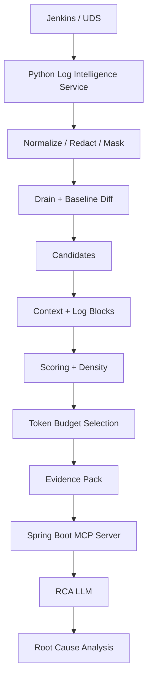
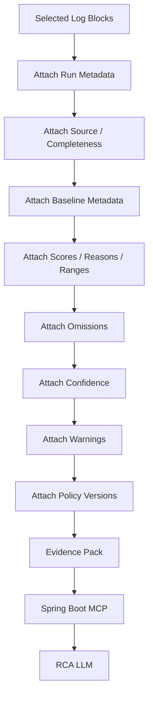
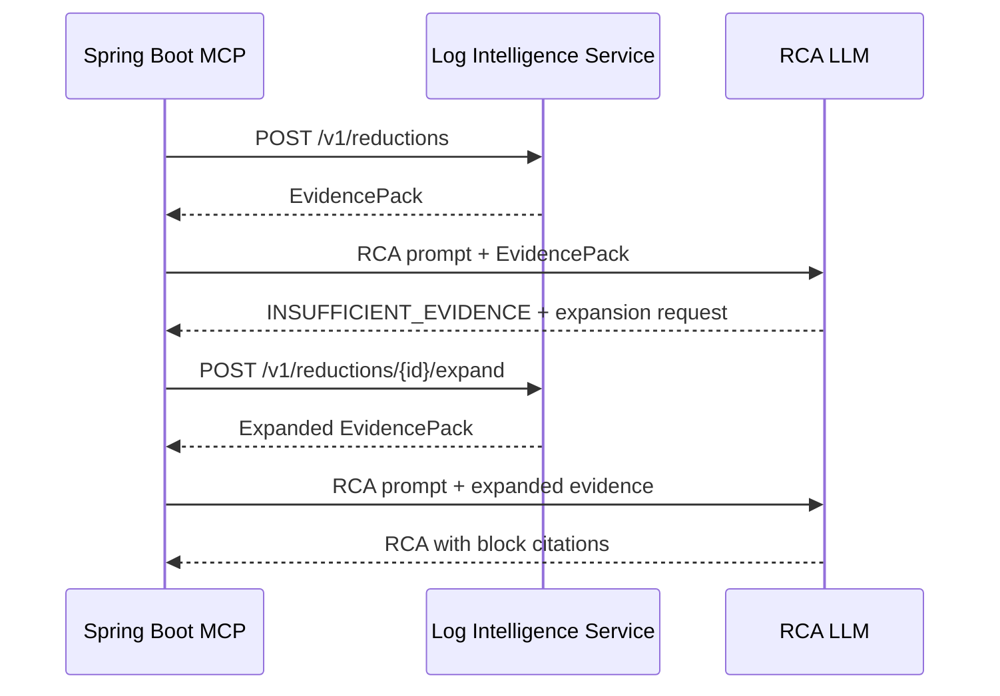
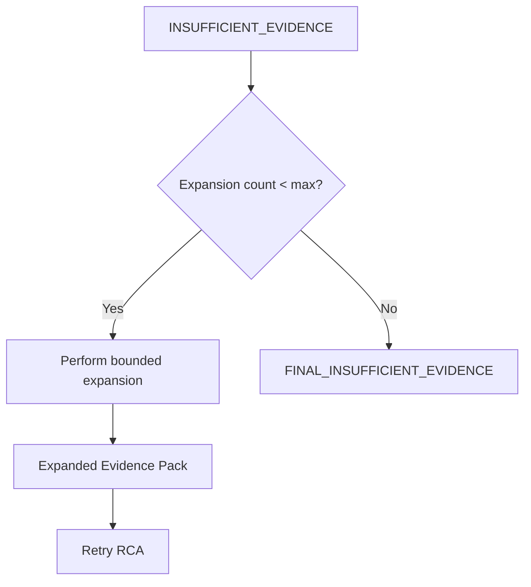
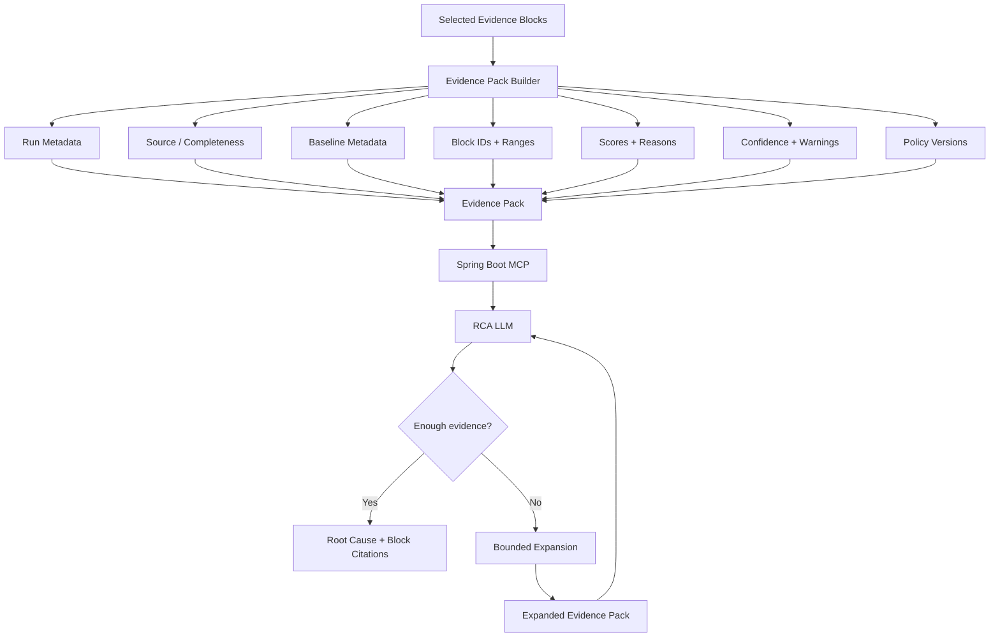

# Evidence Pack Design + Bounded Expansion / Insufficient-Evidence Handling

> A junior-engineer deep dive into the final output contract of our CI/CD Log Intelligence Service.
>
> This chapter starts **after** success-baseline creation, normalization/masking/Drain, log diffing, candidate selection, deduplication, context expansion, LogBlock construction, weighting/scoring/density, and token-budget selection.
>
> At this point the Python Log Intelligence Service already knows which blocks are important, which ones fit the token budget, which ones were omitted, and what confidence it has.
>
> Now we need a clean contract for:
>
> ```text
> Python Log Intelligence Service
>          ↓
> Spring Boot MCP Server
>          ↓
> RCA LLM
> ```
>
> That contract is the **Evidence Pack**.

This chapter covers the Evidence Pack contract, block provenance, confidence, warnings, policy versions, `INSUFFICIENT_EVIDENCE`, bounded expansion, fallback behavior, and how MCP passes evidence to the RCA LLM.

---

# 1. Where This Fits



The Evidence Pack is the output of the reduction pipeline.

---

# 2. What Is an Evidence Pack?

An Evidence Pack is:

> **A compact, structured, explainable package containing the exact log evidence selected for RCA.**

It should contain:

```text
run identity
pipeline/stage metadata
log-source information
baseline information
selected log blocks
line ranges
selection reasons
scores
token statistics
confidence
warnings
omission information
algorithm/policy versions
```

The LLM should not receive a random text blob.

It should receive a structured evidence package.

---

# 3. Why Not Just Return a String?

Bad API:

```json
{
  "logs": ".... giant reduced text ...."
}
```

Problems:

```text
no provenance
no block identity
no line ranges
no confidence
no selection reasons
no baseline metadata
no omission information
no versioning
```

Better:

```json
{
  "run": {},
  "source": {},
  "baseline": {},
  "blocks": [],
  "omissions": {},
  "statistics": {},
  "confidence": {},
  "warnings": [],
  "versions": {}
}
```

---

# 4. Evidence Pack Is an API Contract

The MCP server should not know how we implement:

```text
Drain
masking
scoring
density
token selection
```

It should only know:

```text
POST /v1/reductions
        ↓
EvidencePack
```

That lets us change the reducer internals without changing the MCP integration every time.

---

# 5. High-Level Evidence Pack Shape

```json
{
  "reductionId": "...",

  "run": {},

  "source": {},

  "baseline": {},

  "blocks": [],

  "omissions": {},

  "statistics": {},

  "confidence": {},

  "warnings": [],

  "versions": {}
}
```

---

# 6. Run Metadata

The pack needs enough run information so the RCA LLM knows what failed.

```json
{
  "run": {
    "tenant": "payments",
    "repository": "payment-service",
    "pipelineId": "main-ci",
    "jobId": "build-and-test",
    "runId": "9899",
    "commitSha": "abc123...",
    "branch": "feature/payment-retry",
    "status": "FAILED",
    "failedStage": "integration-test"
  }
}
```

Do not include huge unrelated metadata.

---

# 7. Stage and DAG Metadata

For DAG pipelines, include:

```text
failed stage
DAG node
parallel branch
stage resolution confidence
```

Example:

```json
{
  "stage": {
    "stageId": "integration-test",
    "dagNodeId": "integration-test-3",
    "parallelBranch": "db-tests",
    "resolutionConfidence": "HIGH"
  }
}
```

---

# 8. Source Metadata

We fetch logs from Jenkins first, then UDS fallback.

The pack should say which source actually provided evidence.

```json
{
  "source": {
    "primarySource": "JENKINS",
    "fallbackUsed": false,
    "complete": true,
    "contentType": "text/plain",
    "originalLineCount": 118220
  }
}
```

Or:

```json
{
  "source": {
    "primarySource": "UDS",
    "fallbackUsed": true,
    "complete": false,
    "warning": "Only retained tail region was available"
  }
}
```

---

# 9. Why Completeness Matters

If we have:

```text
full Jenkins console
```

confidence is higher.

If we only have:

```text
last 100 KB from UDS
```

important earlier context may be missing.

The LLM should know the evidence is partial.

---

# 10. Baseline Metadata

If we used a success baseline, include:

```text
baseline ID
baseline version
supporting success-run count
compatibility status
freshness
```

Example:

```json
{
  "baseline": {
    "status": "FOUND",
    "baselineId": "baseline-812",
    "baselineVersion": 17,
    "successRunIds": ["9811", "9822", "9837"],
    "supportRunCount": 3,
    "compatibility": "EXACT",
    "freshness": "RECENT"
  }
}
```

If no baseline:

```json
{
  "baseline": {
    "status": "MISSING"
  }
}
```

If incompatible:

```json
{
  "baseline": {
    "status": "INCOMPATIBLE",
    "reason": "MASKING_POLICY_VERSION_MISMATCH"
  }
}
```

---

# 11. Block IDs

Every selected block must have a stable ID inside the reduction.

Example:

```text
b-001
b-002
b-003
```

Why?

Because the LLM can say:

```text
Root cause is supported by [block:b-003].
```

Instead of:

```text
"Somewhere in the logs..."
```

---

# 12. Example Block

```json
{
  "blockId": "b-003",

  "stageId": "integration-test",
  "dagNodeId": "integration-test-3",

  "sourceRanges": [
    {
      "startLine": 80210,
      "endLine": 80235
    }
  ],

  "category": "DATABASE_CONNECTION_FAILURE",

  "reasons": [
    "NOVEL_VS_SUCCESS",
    "EXCEPTION",
    "FAILED_TEST",
    "FAILED_STAGE"
  ],

  "score": 12.3,

  "tokenCount": 320,

  "text": "..."
}
```

---

# 13. Why Source Ranges Matter

If `block:b-003` contains evidence from:

```text
lines 80210–80235
```

then an engineer can trace it back to the source log.

This is important for trust and evaluation.

---

# 14. Non-Contiguous Source Ranges

A compressed retry block may represent a first and last occurrence.

```json
{
  "sourceRanges": [
    {"startLine": 1200, "endLine": 1208},
    {"startLine": 8400, "endLine": 8408}
  ],

  "repetitionCount": 600
}
```

Do not pretend those ranges were contiguous.

---

# 15. Reason Codes

Every block should explain why it was selected.

Examples:

```text
NOVEL_VS_SUCCESS
RARE_IN_SUCCESS
FAILURE_KEYWORD
EXCEPTION
FAILED_TEST
NONZERO_EXIT
FAILED_STAGE
NEAR_TAIL
FREQUENCY_ANOMALY
COMPILER_ERROR
INFRASTRUCTURE_ERROR
TERMINAL_FAILURE
```

These help with debugging, scoring, evaluation, and engineer trust.

---

# 16. Score and Token Metadata

Include:

```text
diagnostic score
token count
score-per-token
mandatory flag
```

Example:

```json
{
  "score": 12.3,
  "tokenCount": 320,
  "scorePerToken": 0.0384,
  "mandatory": false
}
```

This is selection metadata, not probability.

---

# 17. Should the LLM See Every Internal Score?

Not necessarily.

We have two consumers:

```text
MCP/service debugging
LLM RCA
```

The full Evidence Pack may contain scores.

The rendered LLM prompt can simplify to:

```text
block ID
stage
line range
reason summary
log text
```

---

# 18. Omissions

The Evidence Pack should say that evidence was intentionally omitted.

```json
{
  "omissions": {
    "candidateBlockCount": 39,
    "selectedBlockCount": 11,
    "omittedBlockCount": 28,
    "omissionReasons": {
      "BUDGET_EXHAUSTED": 20,
      "REPETITION_COMPRESSED": 6,
      "LOW_SCORE": 2
    }
  }
}
```

This makes reduction transparent.

---

# 19. Confidence Types

Do not use one giant confidence value for everything.

Use separate confidence fields.

---

# 20. Diff Confidence

Answers:

> **How reliable was the failed-vs-success comparison?**

Affected by:

```text
baseline found?
baseline compatible?
baseline fresh?
stage resolved?
source complete?
```

---

# 21. Context Confidence

Answers:

> **How confident are we that the blocks preserve the right surrounding context?**

Affected by:

```text
stack trace complete?
stage boundary known?
source truncated?
window cut?
```

---

# 22. Selection Confidence

Answers:

> **How confident are we that the token-budget selector retained the strongest available evidence?**

Affected by:

```text
did mandatory evidence fit?
were critical blocks omitted?
was budget pressure high?
were oversized blocks sliced?
```

---

# 23. Reduction Confidence

This is the overall reduction-level confidence.

Possible states:

```text
HIGH
MEDIUM
LOW
REJECTED
```

`REJECTED` can mean the intelligent reduction path should not be trusted and the service should use a safe fallback.

---

# 24. Example Confidence Object

```json
{
  "confidence": {
    "reduction": "HIGH",
    "diff": "HIGH",
    "context": "HIGH",
    "selection": "MEDIUM"
  }
}
```

---

# 25. Warnings

Warnings should be explicit and machine-readable.

Examples:

```text
SOURCE_PARTIAL
BASELINE_MISSING
BASELINE_STALE
BASELINE_INCOMPATIBLE
STAGE_UNKNOWN
CONTEXT_TRUNCATED
OVERSIZED_BLOCK_SLICED
BUDGET_PRESSURE_HIGH
TOKENIZER_FALLBACK_USED
UDS_FALLBACK_USED
```

---

# 26. Policy / Version Metadata

Every major processing layer should be versioned.

```json
{
  "versions": {
    "normalizer": "v3",
    "redactionPolicy": "v7",
    "maskingPolicy": "v4",
    "drainConfig": "v2",
    "dagSegmenter": "v1",
    "candidatePolicy": "v2",
    "contextPolicy": "v1",
    "scoringPolicy": "v3",
    "tokenSelectionPolicy": "v1"
  }
}
```

This helps answer:

```text
Why did the same run produce different evidence after a deployment?
```

---

# 27. Full Example Evidence Pack

```json
{
  "reductionId": "red-72819",

  "run": {
    "tenant": "payments",
    "repository": "payment-service",
    "pipelineId": "main-ci",
    "runId": "9899",
    "status": "FAILED",
    "failedStage": "integration-test"
  },

  "source": {
    "primarySource": "JENKINS",
    "fallbackUsed": false,
    "complete": true,
    "originalLineCount": 118220
  },

  "baseline": {
    "status": "FOUND",
    "baselineId": "baseline-812",
    "baselineVersion": 17,
    "supportRunCount": 3,
    "compatibility": "EXACT"
  },

  "blocks": [
    {
      "blockId": "b-001",
      "stageId": "integration-test",
      "dagNodeId": "integration-test-3",

      "sourceRanges": [
        {
          "startLine": 80210,
          "endLine": 80235
        }
      ],

      "category": "DATABASE_CONNECTION_FAILURE",

      "reasons": [
        "NOVEL_VS_SUCCESS",
        "EXCEPTION",
        "FAILED_TEST",
        "FAILED_STAGE"
      ],

      "score": 12.3,
      "tokenCount": 320,
      "mandatory": false,

      "text": "Connecting payment-db...\nConnection refused..."
    },

    {
      "blockId": "b-002",
      "stageId": "integration-test",

      "sourceRanges": [
        {
          "startLine": 80300,
          "endLine": 80305
        }
      ],

      "category": "TERMINAL_FAILURE",

      "reasons": [
        "TERMINAL_FAILURE",
        "NONZERO_EXIT",
        "NEAR_TAIL"
      ],

      "score": 10.8,
      "tokenCount": 82,
      "mandatory": true,

      "text": "BUILD FAILURE\nProcess exited with code 1"
    }
  ],

  "omissions": {
    "candidateBlockCount": 28,
    "selectedBlockCount": 2,
    "omittedBlockCount": 26
  },

  "statistics": {
    "originalTokenEstimate": 148000,
    "selectedTokens": 402,
    "reductionRatio": 0.9973
  },

  "confidence": {
    "reduction": "HIGH",
    "diff": "HIGH",
    "context": "HIGH",
    "selection": "HIGH"
  },

  "warnings": [],

  "versions": {
    "normalizer": "v3",
    "redactionPolicy": "v7",
    "maskingPolicy": "v4",
    "drainConfig": "v2",
    "scoringPolicy": "v3",
    "tokenSelectionPolicy": "v1"
  }
}
```

---

# 28. MCP Integration

The Spring Boot MCP server calls:

```http
POST /v1/reductions
```

Request:

```json
{
  "tenant": "payments",
  "repository": "payment-service",
  "pipelineId": "main-ci",
  "runId": "9899",
  "budgetProfile": "STANDARD"
}
```

Response:

```text
EvidencePack
```

Then MCP renders the selected evidence for the RCA LLM.

---

# 29. MCP Should Not Re-Reduce the Logs

Once the Python service returns an Evidence Pack, the MCP server should not:

```text
trim again
take tail again
re-score blocks
remove blocks
```

That would break reproducibility.

MCP should mainly:

```text
render the pack
add RCA instructions
call the LLM
```

---

# 30. Rendering the Evidence Pack for the LLM

Example:

```text
Pipeline: payment-service / main-ci
Failed stage: integration-test
Baseline: compatible recent-success profile available
Reduction confidence: HIGH

[block:b-001]
Stage: integration-test
Lines: 80210-80235
Reasons: novel-vs-success, exception, failed-test

Connecting to payment-db.internal:5432
Connection refused
org.postgresql.util.PSQLException
PaymentServiceIT FAILED


[block:b-002]
Stage: integration-test
Lines: 80300-80305
Reasons: terminal-failure, nonzero-exit

BUILD FAILURE
Process exited with code 1
```

---

# 31. LLM Citation Contract

The RCA prompt should require:

> **Every diagnosis must cite the evidence block IDs that support it.**

Example:

```text
Root cause:
The integration tests failed because the pipeline could not connect
to the payment database. Evidence: [block:b-001].

The build then terminated with a non-zero exit status:
[block:b-002].
```

---

# 32. Why Block Citations Matter

They create:

```text
RCA claim
    ↓
specific evidence
```

This supports trust, debugging, evaluation, and feedback.

---

# 33. What Is INSUFFICIENT_EVIDENCE?

Sometimes the selected blocks are not enough to confidently diagnose the root cause.

The LLM should be allowed to return:

```text
INSUFFICIENT_EVIDENCE
```

instead of guessing.

---

# 34. Example Insufficient Evidence

Evidence only shows:

```text
BUILD FAILURE
Process exited with code 1
```

but no causal message.

A good response is:

```text
INSUFFICIENT_EVIDENCE
```

with a request for more context from the failed stage.

---

# 35. Structured Insufficient-Evidence Response

```json
{
  "status": "INSUFFICIENT_EVIDENCE",

  "reason": "Terminal failure is present but no clear causal exception or failed command is included.",

  "requestedExpansion": {
    "mode": "MORE_STAGE_CONTEXT",
    "stageId": "integration-test",
    "additionalTokens": 2000
  }
}
```

This is better than:

```text
"send more logs"
```

---

# 36. Why Expansion Must Be Bounded

Do not allow:

```text
ask for more
ask for more
ask for more
```

until the entire raw log is sent.

Expansion needs:

```text
maximum attempts
maximum extra tokens
allowed modes
auditability
```

---

# 37. Recommended Expansion Limits

A reasonable starting point:

```text
max expansion requests = 2
max total extra tokens = 6000
```

Example:

```text
Initial STANDARD pack = 12K
Expansion 1 = +2K
Expansion 2 = +4K
Maximum total = 18K
```

These values should remain configurable.

---

# 38. Expansion API

```http
POST /v1/reductions/{reductionId}/expand
```

Example request:

```json
{
  "mode": "AROUND_BLOCK",
  "blockId": "b-003",
  "additionalTokens": 2000
}
```

Response:

```text
expanded EvidencePack
```

or an `EvidencePackDelta`.

---

# 39. Expansion Modes

Useful controlled modes:

```text
AROUND_BLOCK
MORE_BEFORE
MORE_AFTER
MORE_STAGE_CONTEXT
MORE_STACK_TRACE
NEXT_BEST_BLOCKS
```

---

# 40. AROUND_BLOCK

Meaning:

```text
show more nearby evidence around one selected block
```

The service should prefer the same stage when stage metadata is reliable.

---

# 41. MORE_BEFORE

Useful when the block shows a failure symptom but not the command or setup that caused it.

---

# 42. MORE_AFTER

Useful when the visible block contains an error header but later lines contain `Caused by` or a failure summary.

---

# 43. MORE_STAGE_CONTEXT

Useful when the failed stage is known but the selected blocks are too narrow.

The service should add the next-best evidence from that stage.

---

# 44. MORE_STACK_TRACE

Useful when an oversized trace was structurally sliced.

The service can reveal more frames or nested causes.

---

# 45. NEXT_BEST_BLOCKS

The safest generic expansion mode.

Meaning:

```text
return the next-highest-ranked omitted evidence
```

without widening one particular block.

---

# 46. Expansion Should Reuse the Same Reduction State

The service should keep enough state to know:

```text
all candidate blocks
ranking
omitted blocks
source ranges
selection decisions
```

Then expansion stays deterministic.

---

# 47. Expansion State

Example internal state:

```text
reduction_id
selected_block_ids
omitted_ranked_block_ids
token_budget_used
expansion_count
total_extra_tokens
```

---

# 48. Expansion Idempotency

If MCP retries an expansion because of a network timeout, the same request should return the same result.

Use an idempotency key.

```json
{
  "idempotencyKey": "exp-req-991"
}
```

---

# 49. Auditability

For every expansion, record:

```text
who requested it
why
which block/stage
how many tokens
what evidence was added
which policy version
```

Example:

```json
{
  "expansionId": "exp-2",
  "mode": "AROUND_BLOCK",
  "targetBlock": "b-003",
  "extraTokens": 1800,
  "addedBlocks": ["b-011", "b-012"]
}
```

---

# 50. Expansion Must Never Bypass Redaction

Initial reduction is redacted.

Expansion must use the same redaction boundary.

Never expose raw Jenkins text just because the LLM asked for more.

---

# 51. Expansion Must Respect Source Permissions

Expansion stays inside the same authorized run/source scope.

It cannot become a backdoor for unrelated logs.

---

# 52. Expansion Confidence

After new evidence is added, confidence can improve or worsen.

The expanded pack should contain updated confidence values.

---

# 53. What If Expansion Still Is Not Enough?

After the maximum allowed expansions:

```text
still insufficient
```

return:

```text
FINAL_INSUFFICIENT_EVIDENCE
```

Example:

```json
{
  "status": "FINAL_INSUFFICIENT_EVIDENCE",
  "reason": "Source log is incomplete and maximum bounded expansion has been reached."
}
```

Do not automatically send the full raw log.

---

# 54. Fallback Evidence Pack

If the intelligent reducer degrades because of:

```text
Drain unavailable
baseline DB unavailable
parser failure
tokenizer failure
```

we still need a safe fallback.

The fallback should still use the Evidence Pack schema.

---

# 55. Example Fallback Pack

```json
{
  "reductionId": "red-fallback-12",

  "mode": "FALLBACK",

  "blocks": [
    {
      "blockId": "b-fallback-1",
      "category": "FALLBACK_TAIL",
      "sourceRanges": [
        {
          "startLine": 116000,
          "endLine": 118220
        }
      ],
      "text": "..."
    }
  ],

  "confidence": {
    "reduction": "LOW"
  },

  "warnings": [
    "INTELLIGENT_REDUCTION_UNAVAILABLE",
    "FALLBACK_TAIL_USED"
  ]
}
```

---

# 56. Why a Stable Schema Matters

MCP should not need separate parsing logic for:

```text
intelligent mode
fallback mode
```

Both return:

```text
EvidencePack
```

Only mode, confidence, warnings, and content differ.

---

# 57. Partial Jenkins / UDS Handling

If Jenkins and UDS provide different partial regions, the pack should preserve which source contributed which evidence.

Do not blindly merge ambiguous ranges.

---

# 58. Source Range Provenance

Example:

```json
{
  "sourceRanges": [
    {
      "source": "JENKINS",
      "startLine": 80210,
      "endLine": 80235
    }
  ]
}
```

If combining sources is trustworthy:

```json
{
  "sourceRanges": [
    {
      "source": "JENKINS",
      "startLine": 1,
      "endLine": 90000
    },
    {
      "source": "UDS",
      "startLine": 90001,
      "endLine": 118220
    }
  ]
}
```

---

# 59. Do Not Merge Ambiguous Partial Logs Blindly

If Jenkins and UDS offsets cannot be reconciled reliably:

```text
keep separate provenance
add warning
lower confidence
```

Correct uncertainty is better than fake precision.

---

# 60. Evidence Pack Generation Flow



---

# 61. Insufficient-Evidence Sequence



---

# 62. Expansion-Limit Flow



---

# 63. Suggested RCA Output Contract

Successful diagnosis:

```json
{
  "status": "DIAGNOSED",

  "rootCause": "The integration tests failed because the pipeline could not establish a PostgreSQL connection.",

  "evidenceBlocks": [
    "b-001",
    "b-002"
  ]
}
```

Insufficient evidence:

```json
{
  "status": "INSUFFICIENT_EVIDENCE",

  "reason": "The terminal failure is visible, but the command or exception that caused it is missing.",

  "requestedExpansion": {
    "mode": "MORE_BEFORE",
    "blockId": "b-002",
    "additionalTokens": 1500
  }
}
```

---

# 64. LLM Must Not Invent Block IDs

The prompt should say:

```text
Only cite block IDs present in the Evidence Pack.
```

If the model returns:

```text
[block:b-999]
```

and that block does not exist, citation validation should fail.

---

# 65. Citation Validation

After the LLM response:

```text
extract cited block IDs
```

Then validate:

```text
all IDs exist?
```

If not, treat the output as invalid or request a corrected answer.

---

# 66. Why Citation Validation Helps

It lets us measure:

```text
Did the model use selected evidence?
Which blocks are most often cited?
Which selected blocks were never useful?
```

That can later improve ranking.

---

# 67. Evidence Pack as a Feedback Unit

After RCA completes, record:

```text
selected blocks
cited blocks
whether RCA was accepted
whether expansion was needed
```

Example:

```json
{
  "reductionId": "red-72819",
  "citedBlocks": ["b-001", "b-002"],
  "expansionCount": 0,
  "rcaAccepted": true
}
```

---

# 68. Suggested API Surface

## Create reduction

```http
POST /v1/reductions
```

## Get reduction

```http
GET /v1/reductions/{reductionId}
```

## Expand evidence

```http
POST /v1/reductions/{reductionId}/expand
```

## Submit feedback/outcome

```http
POST /v1/reductions/{reductionId}/feedback
```

---

# 69. Example Feedback API

```json
{
  "rcaStatus": "CORRECT",
  "citedBlockIds": [
    "b-001",
    "b-002"
  ],
  "humanVerified": true,
  "rootCauseCategory": "DATABASE_CONNECTIVITY"
}
```

---

# 70. Evidence Pack State Machine

```text
CREATED
  ↓
SENT_TO_RCA
  ↓
DIAGNOSED
```

or:

```text
CREATED
  ↓
INSUFFICIENT_EVIDENCE
  ↓
EXPANDED
  ↓
DIAGNOSED
```

or:

```text
EXPANDED
  ↓
FINAL_INSUFFICIENT_EVIDENCE
```

---

# 71. Idempotent Reduction Requests

If MCP retries `POST /v1/reductions` after a timeout, we should avoid rebuilding the same reduction unnecessarily.

Use:

```text
tenant
pipeline
run ID
budget profile
policy versions
```

or an explicit idempotency key.

---

# 72. Evidence Pack Retention

We probably do not need to retain every pack forever.

A bounded retention window can support:

```text
debugging
audit
feedback
evaluation
```

The exact period is a company-policy decision.

---

# 73. Evidence Pack Security

The pack is already redacted, but it may still contain internal hostnames, repo paths, service names, and test names.

So:

```text
redacted
≠
public
```

Normal authorization still applies.

---

# 74. Logging the Evidence Pack

Avoid writing the full Evidence Pack text into ordinary service logs.

Prefer:

```text
reduction ID
run ID
selected block count
selected token count
confidence
warnings
```

---

# 75. Example Service Log

Good:

```text
reduction_id=red-72819
run_id=9899
selected_blocks=11
selected_tokens=10942
reduction_confidence=HIGH
expansion_count=0
```

Avoid dumping the full selected stack traces into service logs.

---

# 76. Evidence Pack Validation

Before returning a pack, validate:

```text
all block IDs unique
all source ranges valid
selected token count within budget
no secret scan violations
all required versions present
confidence values valid
warnings recognized
```

If validation fails, use a safe fallback or error path.

---

# 77. Pseudocode — Build Evidence Pack

```python
def build_evidence_pack(
    run,
    source_info,
    baseline,
    selected_blocks,
    omitted_blocks,
    stats,
    confidence,
    warnings,
    versions
):

    pack = EvidencePack(
        reduction_id=create_reduction_id(),

        run=run,

        source=source_info,

        baseline=baseline,

        blocks=selected_blocks,

        omissions=summarize_omissions(
            omitted_blocks
        ),

        statistics=stats,

        confidence=confidence,

        warnings=warnings,

        versions=versions
    )

    validate_evidence_pack(pack)

    return pack
```

---

# 78. Pseudocode — Expansion

```python
def expand_evidence(
    reduction_id,
    request,
    state
):

    reduction = state.load(reduction_id)

    if reduction.expansion_count >= MAX_EXPANSIONS:
        return final_insufficient_evidence()

    if (
        reduction.extra_tokens_used
        + request.additional_tokens
        > MAX_EXTRA_TOKENS
    ):
        return reject_expansion_limit()

    new_blocks = expansion_strategy(
        reduction=reduction,
        request=request
    )

    expanded_pack = merge_and_rebudget(
        existing=reduction.evidence_pack,
        additional_blocks=new_blocks
    )

    expanded_pack.expansion_count += 1

    state.save(expanded_pack)

    return expanded_pack
```

---

# 79. What Should the LLM See About Omissions?

Do not overwhelm it with every omitted block.

A small summary is enough:

```text
28 additional candidate blocks were omitted due to token budget.
```

If budget pressure is high:

```text
Evidence may be incomplete.
```

---

# 80. What Should the LLM See About Confidence?

Useful concise context:

```text
Reduction confidence: HIGH
Source completeness: COMPLETE
Baseline status: COMPATIBLE
```

The detailed confidence object can remain in the API/telemetry layer.

---

# 81. Rendering vs Storage Representation

Distinguish:

```text
EvidencePack JSON
```

from:

```text
LLM-rendered evidence text
```

JSON is the service contract.

A renderer converts it into prompt-friendly text.

---

# 82. Suggested Renderer Interface

Conceptually:

```text
EvidenceRenderer

render(pack, target_model)
    -> prompt_evidence_text
```

The renderer should preserve:

```text
block IDs
chronology
line ranges
concise reason summaries
```

while avoiding repeated run metadata.

---

# 83. Final Whiteboard



---

# 84. Junior-Engineer Mental Model

Think of the Evidence Pack like a police case file.

It does not contain every recording and every document.

It contains:

```text
case identity
important evidence
where evidence came from
why it matters
what is missing
how confident we are
```

If the investigator needs more:

```text
request one bounded piece of additional evidence
```

not:

```text
dump the whole archive
```

That is what bounded expansion does.

---

# 85. The One Rule to Remember

> **The Evidence Pack is not just reduced logs. It is a traceable contract that explains what evidence was selected, where it came from, why it matters, and how much confidence we have in it.**

---

# 86. What Should We Deep-Dive Next?

The next major topic should be:

# **LLM RCA Prompt + Citation Contract + Feedback Loop**

Why?

Because after this chapter we have a stable Evidence Pack.

The next questions are:

```text
How should MCP prompt the RCA model?
How should the model distinguish root cause from symptom?
How should it cite block IDs?
What output JSON schema should it follow?
When should it return INSUFFICIENT_EVIDENCE?
How do we validate citations?
How do we measure RCA correctness?
How do we submit feedback to improve scoring?
How do we stop the model from inventing unsupported explanations?
```

After that, the next system topic should be:

# **Validation + Evaluation Framework**

covering:

```text
critical evidence recall
evidence precision
token reduction
RCA correctness
cost per correct diagnosis
latency
baseline quality
ablation tests
shadow rollout
```

The learning path is now:

```text
1. Normalize / Mask / Drain / Baseline             ✅

2. Log Diff + Candidate Selection                  ✅

3. Dedup + Context Expansion + Log Blocks          ✅

4. Weighting + Scoring + Density                   ✅

5. Token Budget Selection                          ✅

6. Evidence Pack + Bounded Expansion               ✅ this document

7. LLM RCA Prompt + Citation + Feedback            ← NEXT

8. Validation / Evaluation Framework
```
