# LogSage Explained for a Junior Engineer

> A beginner-friendly guide to understanding how LogSage reduces huge CI/CD logs, finds the most useful evidence, and gives better input to an LLM.

---

# 1. The Main Problem

Imagine a Jenkins build produces a log with:

```text
120,000 lines
```

Inside those 120,000 lines there may be only:

```text
20–100 lines
```

that really explain the failure.

If we send the complete log directly to an LLM:

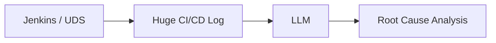

we have several problems:

- high token cost
- slower response
- lots of useless noise
- misleading WARNING / ERROR lines
- important error can get lost in the middle
- larger context does not always mean better reasoning

The central LogSage idea is:

> **Do not ask the LLM to search the entire forest. First find the suspicious trees.**

---

# 2. Our Current Implementation

Our current implementation is already better than sending the full log.

The approximate flow is:

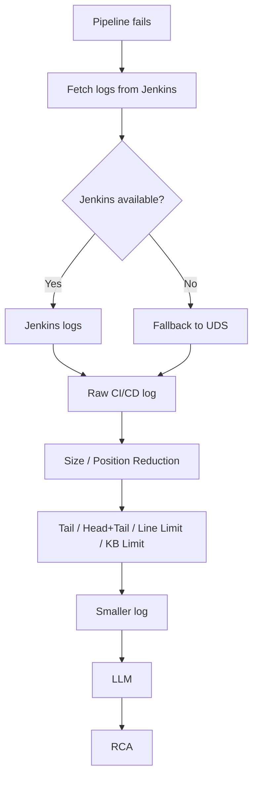

Examples of the current reduction:

```text
take last 1500 lines
```

or:

```text
first 100 lines
+
last 300 lines
```

or:

```text
last ~100 KB
```

or:

```text
around 2000 lines
```

This is useful because it reduces cost.

But the logic is mostly:

> "How much log should I keep?"

not:

> "Which lines actually explain this failure?"

That is the major difference between our current implementation and LogSage.

---

# 3. One-Sentence Difference

## Our current design

```text
Huge log
   ↓
Keep a smaller portion
   ↓
LLM
```

## LogSage

```text
Huge log
   ↓
Understand what is normal
   ↓
Find what is unusual / failure-related
   ↓
Keep context around those lines
   ↓
Rank the strongest evidence
   ↓
Fit into token budget
   ↓
LLM
```

A simple mental model:

> **Our system reduces by size and position.  
> LogSage reduces by diagnostic value.**

---

# 4. LogSage Big Picture

LogSage has two major stages.

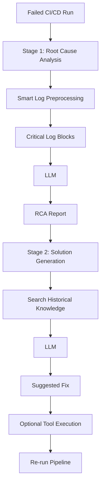

The part most relevant to our use case is **Stage 1**.

---

# 5. Stage 1 — How LogSage Finds Useful Logs

The smart preprocessing pipeline looks like this:

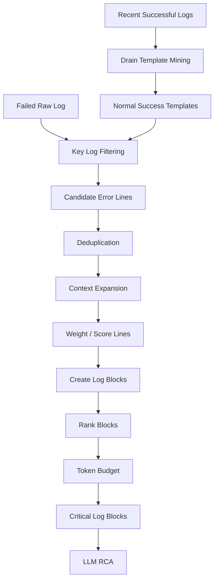

Now let's make every box easy.

---

# 6. Failure-Aware Filtering

Suppose this is a failed build:

```text
1  Starting agent
2  Loading environment variables
3  WARNING cache server unavailable
4  Downloading Maven dependencies
5  Compiling payment-service
6  Running PaymentServiceTest
7  Connecting to payment-db
8  Connection refused
9  SQLException: connection failed
10 PaymentServiceTest FAILED
11 BUILD FAILED
```

A size-based system may simply take:

```text
last 300 lines
```

That works sometimes.

But LogSage asks three separate questions.

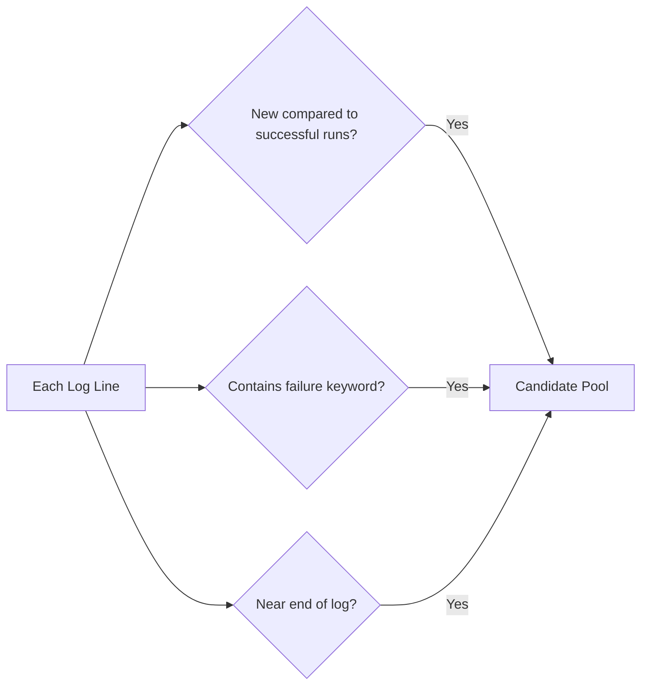

So LogSage uses **three signals**:

1. Log diff against successful runs
2. Failure keyword matching
3. Tail prioritization

This is important because no single technique is enough.

---

# 7. Why Not Just Grep ERROR?

A beginner might think:

```bash
grep -Ei "error|failed|exception"
```

Problem solved.

Not quite.

Consider:

```text
WARNING cache connection failed
Using local cache instead
Compilation started
Compilation completed
Tests started
Database connection refused
PaymentServiceTest FAILED
```

The first warning contains `failed`, but it did not cause the pipeline to fail.

On the other hand:

```text
Database connection refused
```

might be the actual root problem even if the line does not literally contain `ERROR`.

That is why LogSage combines multiple signals.

---

# 8. Historical Successful Comparison

This is probably the most powerful LogSage idea.

Imagine the last three successful builds contain:

```text
Starting agent
WARNING cache server unavailable
Using local cache
Downloading dependencies
Compiling service
Running tests
BUILD SUCCESS
```

Today's failed build contains:

```text
Starting agent
WARNING cache server unavailable
Using local cache
Downloading dependencies
Compiling service
Running tests
Connection refused
SQLException
BUILD FAILED
```

Compare them.

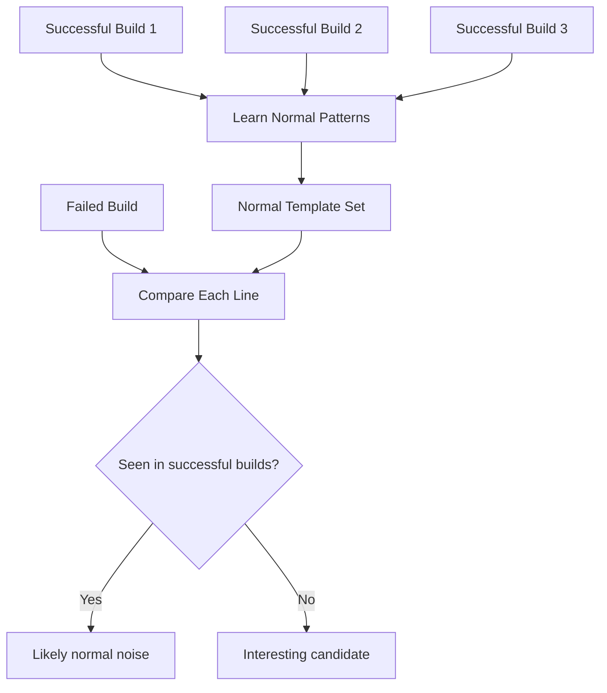

Now:

```text
WARNING cache server unavailable
```

appears in successful builds.

So LogSage says:

```text
Probably normal.
```

But:

```text
Connection refused
SQLException
```

do not appear in the normal success patterns.

So LogSage says:

```text
Interesting. Keep these.
```

This is what makes the system **history-aware**.

---

# 9. But Exact String Comparison Would Fail

Suppose successful runs contain:

```text
Downloaded artifact abc123 in 420ms
Downloaded artifact def456 in 510ms
Downloaded artifact xyz789 in 470ms
```

These strings are different.

But structurally they mean the same thing.

We want the machine to learn:

```text
Downloaded artifact <*> in <*>ms
```

That is where **Drain** comes in.

---

# 10. Drain Algorithm — Super Simple Explanation

Drain is a **log template miner**.

Its job is not to understand the meaning of logs like an LLM.

Its job is:

> Find repeated shapes in log lines.

Example:

```text
User 123 connected from 10.0.0.1
User 456 connected from 10.0.0.2
User 999 connected from 10.0.0.3
```

Drain learns a template like:

```text
User <*> connected from <*>
```

Another example:

```text
Downloaded commons-lang3-3.12.jar in 420ms
Downloaded jackson-core-2.15.jar in 502ms
Downloaded junit-5.10.jar in 330ms
```

Drain may generalize that into:

```text
Downloaded <*> in <*>ms
```

Think of Drain like a librarian saying:

> "These sentences look different, but they belong to the same pattern."

---

# 11. Drain Analogy

Imagine you see:

```text
Rahul bought coffee for ₹120
Priya bought coffee for ₹150
Aman bought coffee for ₹100
```

A human immediately sees:

```text
<PERSON> bought coffee for <PRICE>
```

Drain does something similar for log lines.

It converts noisy changing values into stable templates.

---

# 12. Why Drain Helps LogSage

Successful runs may contain thousands of slightly different lines:

```text
Fetching artifact build-1982
Fetching artifact build-1983
Fetching artifact build-1984
```

Without templates:

```text
all appear different
```

With Drain:

```text
Fetching artifact <*>
```

Now LogSage can store one normal pattern instead of thousands of variations.

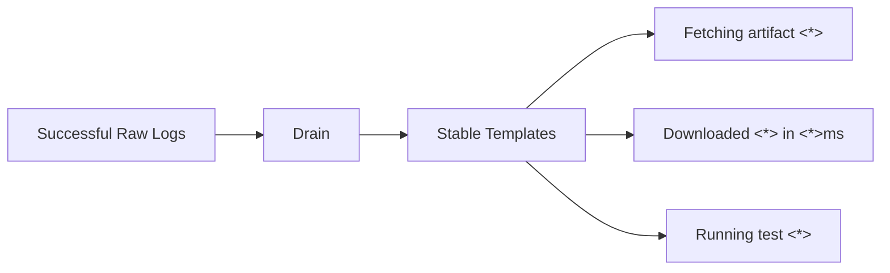

The paper uses recent successful logs for each pipeline and reports that **the latest three successful runs** gave a useful balance in their environment.

---

# 13. Offline vs Online Processing

LogSage separates some work into **offline** and **online** phases.

## Offline

This work can happen before a failure occurs.

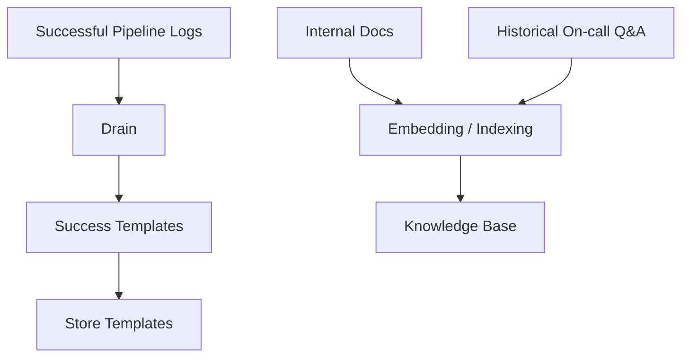

## Online

This happens when a pipeline fails.

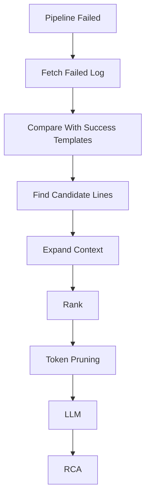

Why do this?

Because we do not want to run expensive preparation work every time a build fails.

---

# 14. Key Log Filtering in Detail

For every failed log line, LogSage checks:

```text
Signal 1:
Is this template absent from successful-run templates?

Signal 2:
Does it contain a failure-related keyword?

Signal 3:
Is it near the tail of the log?
```

Pseudo-code:

```python
candidate_pool = []

for line in failed_log:

    if template(line) not in successful_templates:
        candidate_pool.append(line)

    if contains_failure_keyword(line):
        candidate_pool.append(line)

    if line_is_near_log_tail(line):
        candidate_pool.append(line)

candidate_pool = deduplicate(candidate_pool)
```

The paper's keyword set includes terms such as:

```text
fatal
fail
panic
error
exit
kill
no such file
missing
exception
cannot
```

The exact keyword list should not be treated as universal. In our system we would tune it for Jenkins, Maven, Gradle, Docker, Kubernetes, npm, etc.

---

# 15. Why Tail Prioritization Still Matters

You may ask:

> If LogSage is so intelligent, why does it still look at the tail?

Because CI/CD failures commonly stop execution.

Example:

```text
...
...
Running integration tests
PaymentServiceTest failed
BUILD FAILURE
Process exited with code 1
```

The end of the log often contains highly useful information.

So LogSage does not throw away the simple idea of tailing logs.

It **combines tail position with smarter signals**.

This is important for us because our current tail-based logic is not useless.

It is actually one piece of a more intelligent design.

---

# 16. Deduplication

A candidate line may be selected by more than one rule.

Example:

```text
BUILD FAILED
```

could be selected because:

- it contains `FAILED`
- it is not part of normal successful templates
- it is near the end

We do not want three copies.

So:

```text
Candidate Pool
    ↓
Deduplicate
    ↓
Unique candidate lines
```

Example:

```text
Before:
BUILD FAILED
BUILD FAILED
BUILD FAILED

After:
BUILD FAILED
```

---

# 17. Why Candidate Lines Alone Are Dangerous

Suppose LogSage finds:

```text
Connection refused
```

If we send only that line to an LLM, the LLM may ask:

```text
Connection to what?
Database?
Docker registry?
GitHub?
Redis?
Internal API?
```

So LogSage adds context.

---

# 18. Context Expansion

LogSage uses:

```text
4 lines before
+
important line
+
6 lines after
```

Example raw log:

```text
101 Running PaymentServiceTest
102 Loading DB configuration
103 host=payment-db.internal
104 port=5432
105 Connecting to database
106 Connection refused
107 org.postgresql.util.PSQLException
108 Connection attempt failed
109 PaymentRepository initialization failed
110 PaymentServiceTest FAILED
111 Tests run: 12, Failures: 1
112 BUILD FAILURE
```

Important line:

```text
106 Connection refused
```

Instead of sending only line 106:

```text
Connection refused
```

LogSage keeps approximately:

```text
102 Loading DB configuration
103 host=payment-db.internal
104 port=5432
105 Connecting to database
106 Connection refused
107 org.postgresql.util.PSQLException
108 Connection attempt failed
109 PaymentRepository initialization failed
110 PaymentServiceTest FAILED
111 Tests run: 12, Failures: 1
112 BUILD FAILURE
```

Now the LLM can reason:

```text
This is probably PostgreSQL connectivity during the test stage.
```

not:

```text
Something somewhere refused a connection.
```

---

# 19. Why More Lines After Than Before?

LogSage uses:

```text
m = 4 before
n = 6 after
```

The reasoning is simple.

Lines before an error often explain:

```text
What operation was happening?
```

Lines after an error often contain:

```text
stack trace
exception
nested cause
failed test
exit status
```

Example:

```text
Connecting database          ← before
Connection refused           ← key line
SQLException                 ← after
Caused by SocketException    ← after
PaymentServiceTest FAILED    ← after
```

So slightly more post-error context is useful.

---

# 20. Overlapping Context Blocks Are Merged

Suppose important lines are:

```text
100 Connection refused
103 SQLException
```

Their context windows overlap.

Instead of:

```text
Block A: lines 96–106
Block B: lines 99–109
```

LogSage merges them:

```text
Combined block: lines 96–109
```

Why?

Because the LLM should see one continuous story.

---

# 21. What If We Still Have Too Much Log?

This is where LogSage becomes more interesting.

Imagine filtering and context expansion still produces:

```text
40,000 tokens
```

But our target is:

```text
22,000 tokens
```

A simple implementation might do:

```text
take first 22,000 tokens
```

or:

```text
take last 22,000 tokens
```

LogSage instead asks:

> Which blocks contain the highest concentration of useful failure evidence?

---

# 22. Line Weighting — Think of It Like Points

LogSage gives different lines different importance.

A simplified mental model:

```text
Normal line              0 points
Interesting candidate    1–3 points
Failure keyword          extra points
Strong failure marker    very high points
```

The actual paper uses a more specific weighting scheme.

For intuition, think:

```text
"Downloading dependency"                 score 0

"WARNING cache unavailable"              score 1

"Connection refused"                     score 3

"--- FAIL: PaymentServiceTest"            score 10
```

The exact numbers are less important than the idea:

> Stronger failure evidence gets higher priority.

---

# 23. A Fun Analogy for Ranking

Imagine you have a backpack that can carry only 10 kg.

You have:

```text
Laptop           2 kg   very useful
Water            1 kg   useful
20 books        15 kg   maybe useful
Gaming console   3 kg   not useful for hiking
First-aid kit    1 kg   extremely useful
```

You cannot take everything.

So you prioritize **value per space**.

LogSage does something similar with log blocks.

```text
Useful diagnostic evidence
---------------------------
number of lines / tokens
```

That is essentially the idea behind its block **weight density**.

---

# 24. Block Density Explained Without Math

Imagine:

## Block A

```text
50 lines
1 useful error
49 noise lines
```

## Block B

```text
10 lines
4 useful failure signals
```

Block B is much denser with useful information.

So even though Block A is larger, Block B should be sent first.

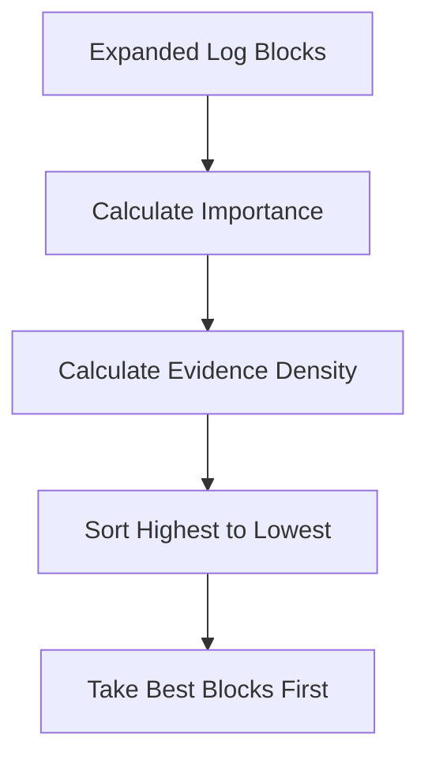

---

# 25. Token Optimization

LLMs consume **tokens**, not lines.

These:

```text
1000 short lines
```

and:

```text
1000 huge stacktrace lines
```

may have very different token counts.

So LogSage controls the **token budget**.

The paper reports a predefined RCA limit of:

```text
22,000 tokens
```

The idea is:

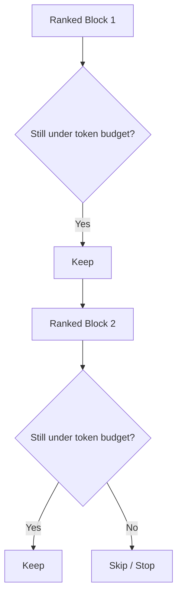

This is much smarter than:

```text
last 100KB
```

because the selected data is based on importance.

---

# 26. Complete RCA Preprocessing Flow

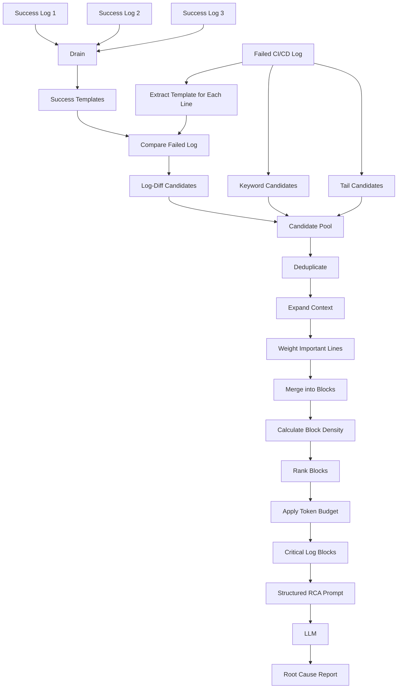

---

# 27. Worked Example — Start to Finish

Suppose Jenkins gives us:

```text
1   Starting Jenkins agent
2   Workspace /build/payment
3   WARNING cache unavailable
4   Using local cache
5   Downloading Maven dependencies
6   Downloaded junit.jar
7   Downloaded jackson.jar
8   Compiling payment-service
9   Compilation complete
10  Starting integration tests
11  Loading test configuration
12  DB host payment-db.internal
13  Connecting to DB
14  Connection refused
15  org.postgresql.util.PSQLException
16  Caused by java.net.ConnectException
17  PaymentRepository initialization failed
18  PaymentServiceTest FAILED
19  Tests run: 14, Failures: 1
20  Maven Surefire plugin failed
21  BUILD FAILURE
22  Process exited with code 1
```

Recent successful builds normally contain:

```text
Starting Jenkins agent
Workspace <*>
WARNING cache unavailable
Using local cache
Downloading Maven dependencies
Downloaded <*>
Compiling payment-service
Compilation complete
Starting integration tests
Loading test configuration
DB host <*>
Connecting to DB
Tests passed
BUILD SUCCESS
```

## Step 1 — Drain templates

```text
Workspace /build/payment
```

becomes:

```text
Workspace <*>
```

and:

```text
Downloaded junit.jar
Downloaded jackson.jar
```

becomes:

```text
Downloaded <*>
```

---

# 28. Step 2 — Compare With Normal Success Patterns

Likely normal:

```text
Starting Jenkins agent
WARNING cache unavailable
Using local cache
Downloading Maven dependencies
Downloaded junit.jar
Compiling payment-service
Starting integration tests
Connecting to DB
```

Interesting because not part of the successful pattern:

```text
Connection refused
org.postgresql.util.PSQLException
Caused by java.net.ConnectException
PaymentRepository initialization failed
PaymentServiceTest FAILED
Maven Surefire plugin failed
BUILD FAILURE
Process exited with code 1
```

Already much smaller.

---

# 29. Step 3 — Keyword + Tail Signals

Keyword matching finds things such as:

```text
failed
failure
exception
```

Tail prioritization also catches:

```text
BUILD FAILURE
Process exited with code 1
```

Now we have several signals pointing to the same area.

---

# 30. Step 4 — Add Context

Instead of:

```text
Connection refused
```

we keep something like:

```text
Starting integration tests
Loading test configuration
DB host payment-db.internal
Connecting to DB
Connection refused
org.postgresql.util.PSQLException
Caused by java.net.ConnectException
PaymentRepository initialization failed
PaymentServiceTest FAILED
Tests run: 14, Failures: 1
Maven Surefire plugin failed
```

That is a complete diagnostic story.

---

# 31. Step 5 — Rank

Suppose another block contains:

```text
WARNING cache unavailable
Using local cache
```

while the DB block contains:

```text
Connection refused
SQLException
ConnectException
Test FAILED
BUILD FAILURE
```

The DB block gets much higher importance.

So if there is not enough token budget:

```text
DB failure block      KEEP
cache warning block   DROP
```

---

# 32. Step 6 — LLM Input

Instead of giving the LLM:

```text
120,000 lines
```

we may give it only high-value blocks like:

```text
[Block 1]
Starting integration tests
Loading test configuration
DB host payment-db.internal
Connecting to DB
Connection refused
org.postgresql.util.PSQLException
Caused by java.net.ConnectException
PaymentRepository initialization failed
PaymentServiceTest FAILED

[Block 2]
Tests run: 14, Failures: 1
Maven Surefire plugin failed
BUILD FAILURE
Process exited with code 1
```

Then ask:

```text
Identify the key error lines and explain the most likely root cause.
```

That is where the LLM is strong: **reasoning over selected evidence**.

---

# 33. Why This Is Better Than Asking the LLM to Find Everything

Bad architecture:

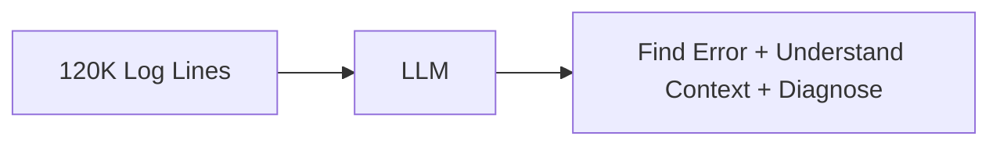

The LLM has three jobs:

1. search
2. filter
3. reason

LogSage architecture:

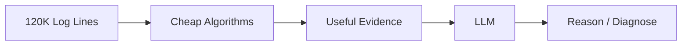

Now the LLM mainly does the job it is best at:

> reasoning.

---

# 34. Stage 2 — What Happens After RCA?

LogSage does not stop at:

```text
Root cause = database connection failure
```

It also tries to help solve the problem.

The Stage 2 mental model:

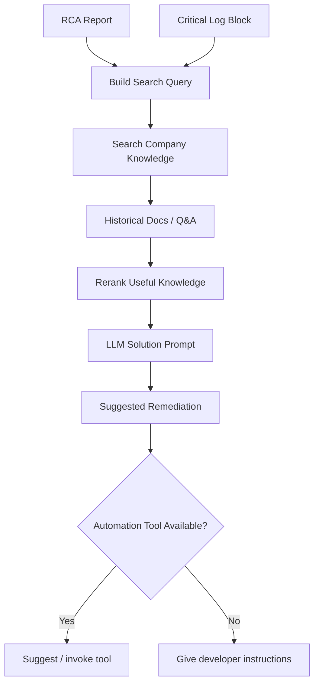

---

# 35. RAG in Simple Words

RAG means:

> Before asking the LLM to answer, search our trusted knowledge and give that information to the LLM.

Without RAG:

```text
LLM:
"I think maybe increase memory."
```

With RAG:

```text
Internal incident:
Payment tests fail with ConnectionException when DB test environment expires.

Fix:
Recreate test DB allocation using internal resource tool.
```

Then the LLM can generate a solution grounded in real company history.

---

# 36. Historical Success Logs vs Historical Failure Knowledge

These two ideas are easy to confuse.

They have different purposes.

## Successful logs

Used during **log filtering**.

Question:

> What is normal?

```text
Success logs
   ↓
Drain templates
   ↓
normal patterns
   ↓
remove normal noise
```

## Historical fixes / Q&A / documents

Used during **solution generation**.

Question:

> How did we solve a similar problem before?

```text
RCA
   ↓
search knowledge
   ↓
similar old incident
   ↓
suggest fix
```

So:

```text
Successful history = helps FIND the problem.

Failure-resolution history = helps FIX the problem.
```

---

# 37. Our Current Implementation vs LogSage

| Capability | Our Current Implementation | LogSage |
|---|---|---|
| Jenkins log fetch | Yes | CI/CD integration |
| Fallback source | UDS | Platform dependent |
| Avoid full log | Yes | Yes |
| Tail selection | Yes | Yes, as one signal |
| Fixed line/KB limit | Yes | Uses token budget |
| Head + tail | Yes | Not core strategy |
| Failure keywords | Limited / tool-driven | Yes |
| Compare with successful builds | No | Yes |
| Learn normal templates | No | Yes, Drain |
| Detect unusual lines | Limited | Yes |
| Deduplicate candidates | Not a core step | Yes |
| Add context around key lines | Not systematic | Yes |
| Rank diagnostic blocks | No | Yes |
| Importance-based pruning | No | Yes |
| Token-aware pruning | Limited | Yes |
| LLM RCA | Yes | Yes |
| Historical knowledge for fixes | Depends on our knowledge system | Yes |
| Automated remediation tools | Limited / separate | Yes |

---

# 38. How We Can Relate LogSage to Our Architecture

Our current log retrieval should stay.

We already have:

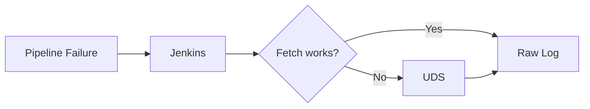

That part is not the problem.

The new idea is to insert an **Intelligent Log Service** after fetching.

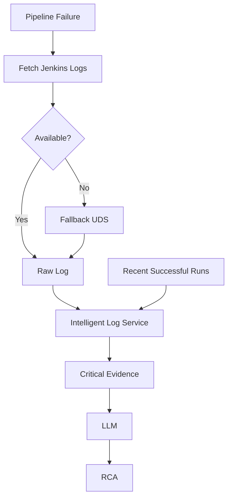

---

# 39. What Should the Intelligent Log Service Do?

Conceptually:

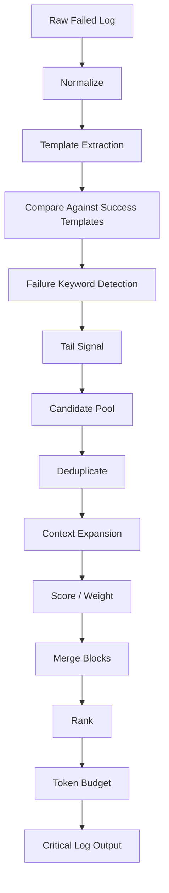

This service should ideally be deterministic and cheap.

The LLM comes **after** this.

---

# 40. Possible Service Boundary

```text
POST /logs/analyze
```

Input:

```json
{
  "pipelineId": "payment-service-main",
  "runId": "9812",
  "status": "FAILED",
  "rawLog": "...",
  "tokenBudget": 12000
}
```

Output:

```json
{
  "originalLines": 120000,
  "selectedLines": 420,
  "criticalBlocks": [
    {
      "startLine": 80210,
      "endLine": 80228,
      "score": 8.7,
      "reasons": [
        "not_seen_in_success_templates",
        "failure_keyword",
        "near_log_tail"
      ],
      "content": "..."
    }
  ]
}
```

This gives us visibility into **why** a line was selected.

That is very useful for debugging the intelligent service itself.

---

# 41. Beginner-Friendly Implementation Strategy

Do not try to recreate the entire paper at once.

## Version 1

```text
Failed log
↓
failure keywords
↓
tail
↓
deduplicate
↓
± context
↓
token budget
↓
LLM
```

## Version 2

Add:

```text
last successful logs
↓
Drain templates
↓
success-vs-failure diff
```

## Version 3

Add:

```text
weights
↓
block ranking
↓
importance-based token pruning
```

## Version 4

Add:

```text
historical RCA / fixes
↓
RAG
↓
automated remediation tools
```

---

# 42. Very Simple Pseudocode

```python
def create_llm_evidence(failed_log, success_logs, token_budget):

    success_templates = drain(success_logs)

    candidates = []

    for line in failed_log:

        reasons = []

        if drain_template(line) not in success_templates:
            reasons.append("new_vs_success")

        if contains_failure_keyword(line):
            reasons.append("failure_keyword")

        if is_near_tail(line):
            reasons.append("tail")

        if reasons:
            candidates.append((line, reasons))

    candidates = deduplicate(candidates)

    blocks = expand_context(
        candidates,
        before=4,
        after=6
    )

    blocks = score_blocks(blocks)

    blocks = rank_by_density(blocks)

    return keep_within_token_budget(
        blocks,
        token_budget
    )
```

This is not the exact production LogSage code.

It is a beginner-friendly representation of the design.

---

# 43. The Most Important Mental Model

When a junior engineer debugs a failed Jenkins job, they usually do something like:

```text
1. Look near the bottom.
2. Search ERROR / FAILED / Exception.
3. Ignore warnings they know happen every day.
4. Read a few lines around suspicious errors.
5. Decide which error looks most important.
6. Search old tickets / docs for the same problem.
```

LogSage is basically trying to automate that workflow.

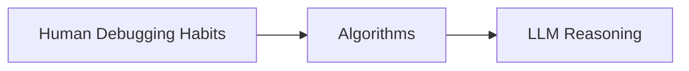

That is the easiest way to understand the whole paper.

---

# 44. Mapping Human Behavior to LogSage

| Human Engineer Does | LogSage Does |
|---|---|
| "I've seen this warning before." | Success-log comparison |
| "These lines look structurally the same." | Drain templates |
| "Search ERROR / FAIL." | Keyword matching |
| "Check the bottom." | Tail prioritization |
| "Show me lines around this error." | Context expansion |
| "This error looks more serious." | Weighting |
| "Focus on this block first." | Density ranking |
| "I can't read 100K lines." | Token pruning |
| "Have we solved this before?" | RAG |
| "Use our standard fix." | Tool calling |

---

# 45. What LogSage Is NOT

It is not:

```text
"Use a giant LLM and hope it understands everything."
```

It is also not:

```text
"grep ERROR and throw away everything else."
```

It is a hybrid system:

```text
cheap deterministic processing
+
historical patterns
+
LLM reasoning
+
knowledge retrieval
+
optional automation
```

That hybrid design is the key lesson.

---

# 46. Research Parameters vs Our Parameters

The paper reports parameters such as:

```text
recent successful logs: 3
context before: 4 lines
context after: 6 lines
token limit: 22,000
```

These should be treated as **starting references**, not universal values.

Our environment may need different numbers.

Example:

```text
Jenkins Maven builds:
before=8
after=15

Kubernetes deploy failures:
before=10
after=20

token budget:
8K / 12K / 20K depending on model
```

We should measure accuracy and cost before choosing final values.

---

# 47. How We Know Whether Our Intelligent Reduction Is Good

We should not only measure:

```text
How many tokens did we remove?
```

We also need:

```text
Did we keep the actual root-cause evidence?
```

Important metrics:

```text
Original tokens
Selected tokens
Reduction percentage
RCA accuracy
Key-error recall
Latency
LLM cost per diagnosis
```

Example:

```text
Original tokens:    140,000
Selected tokens:     11,000
Reduction:              92%

Actual root cause retained: YES
Correct RCA:               YES
```

That is a useful reduction.

This:

```text
Original tokens: 140,000
Selected tokens:   2,000
Reduction:            98%

Actual error removed: YES
```

is terrible even though the token reduction looks amazing.

---

# 48. Final Architecture for Our Context

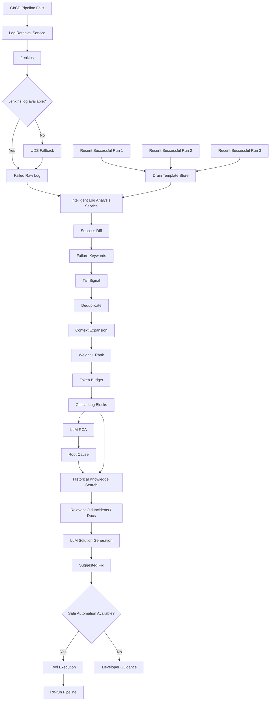

---

# 49. Final Takeaway

If you remember only one thing, remember this:

## Our current implementation

```text
"Make the log smaller."
```

## LogSage

```text
"Understand what normal looks like,
find what changed,
find failure signals,
keep their context,
prioritize the strongest evidence,
then spend LLM tokens only on that."
```

That is why LogSage is much more than a log truncation system.

It is an **evidence-selection system for CI/CD failures**.

---

# 50. Glossary

### RCA
Root Cause Analysis.

Finding the real reason a pipeline failed.

### LLM
Large Language Model.

The AI model that reasons over selected evidence.

### Drain
A log parsing algorithm that groups similar log lines into reusable templates.

### Log Template
A generalized log pattern.

Example:

```text
Downloaded <*> in <*>ms
```

### Candidate Line
A log line that may be related to the failure.

### Log Diff
Comparing failed-log templates against successful-run templates.

### Context Expansion
Keeping lines before and after an important line.

### Deduplication
Removing repeated candidate lines.

### Weight
A score representing how important a line appears.

### Block
A continuous group of related log lines.

### Density
How much important evidence exists inside a block relative to its size.

### Token Budget
Maximum amount of LLM input we are willing to spend.

### RAG
Retrieval-Augmented Generation.

Search trusted historical knowledge first, then give the retrieved information to the LLM.

### Tool Calling
Allowing the LLM to choose a predefined safe automation tool.

---

# 51. Primary Reference

LogSage paper:

**Weiyuan Xu et al., “LogSage: An LLM-Based Framework for CI/CD Failure Detection and Remediation with Industrial Validation.”**

arXiv:

https://arxiv.org/abs/2506.03691

The key concepts in this guide are based on the paper's methodology, including:

- successful-log templates generated with Drain
- failed-vs-success log diff
- keyword matching
- log-tail prioritization
- candidate deduplication
- 4-line-before / 6-line-after context expansion
- weighted block ranking
- 22,000-token RCA pruning budget used in their experiments/deployment
- structured RCA prompting
- historical-knowledge RAG
- LLM-based remediation tool selection

---

# 52. One Final Picture

```mermaid
flowchart LR
    A["Huge Jenkins / UDS Log"] --> B["What is normal?"]
    B --> C["What is new?"]
    C --> D["What looks like failure?"]
    D --> E["What context belongs to it?"]
    E --> F["Which blocks matter most?"]
    F --> G["What fits our token budget?"]
    G --> H["LLM"]
    H --> I["Root Cause"]
    I --> J["Have we solved this before?"]
    J --> K["Fix"]
```

> **Don't pay the LLM to read noise.  
> Use cheap log intelligence to find evidence, then use the LLM to reason.**
