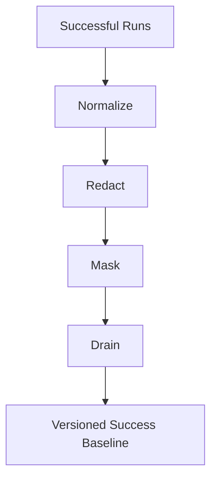
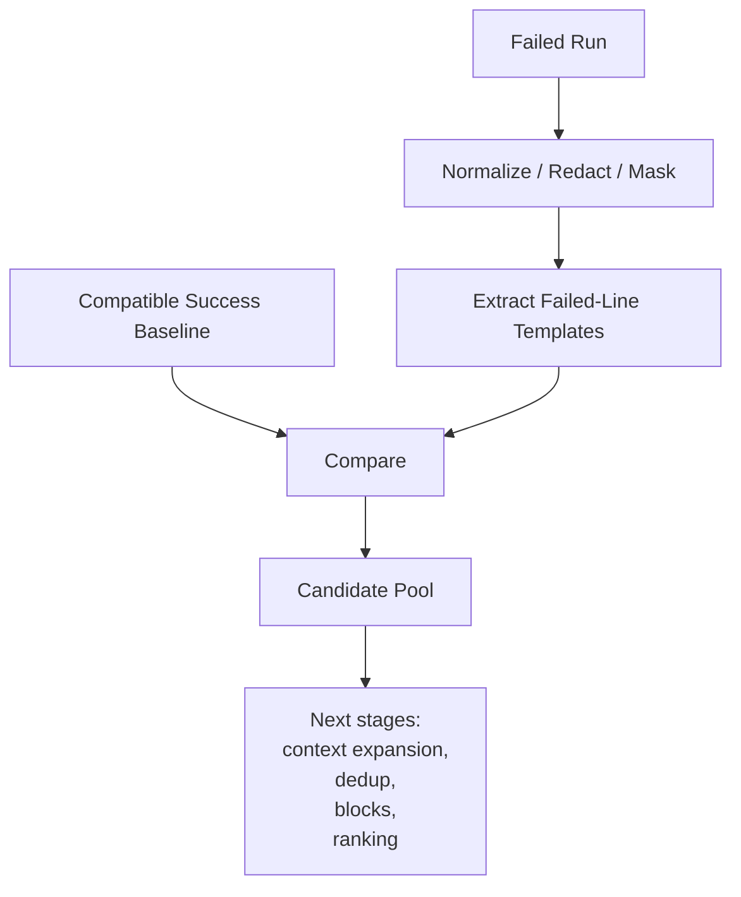
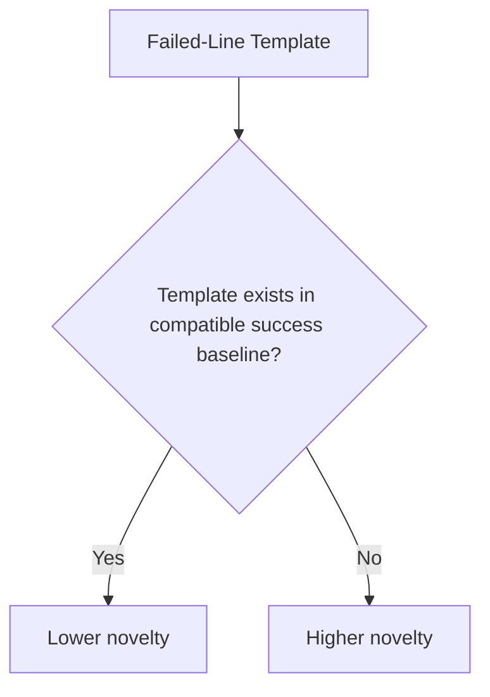
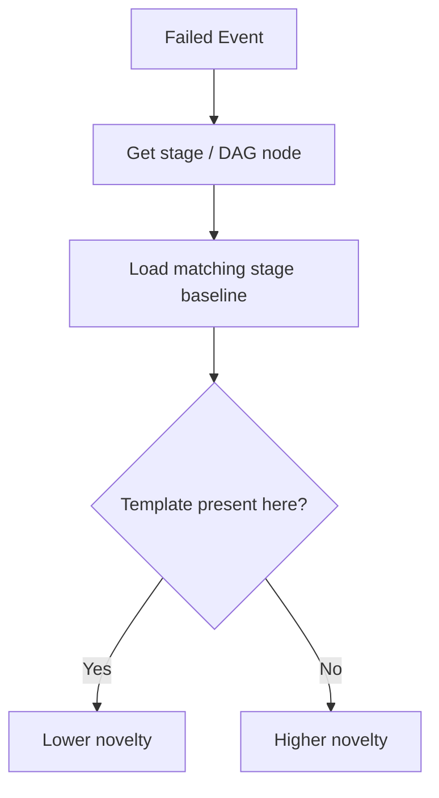
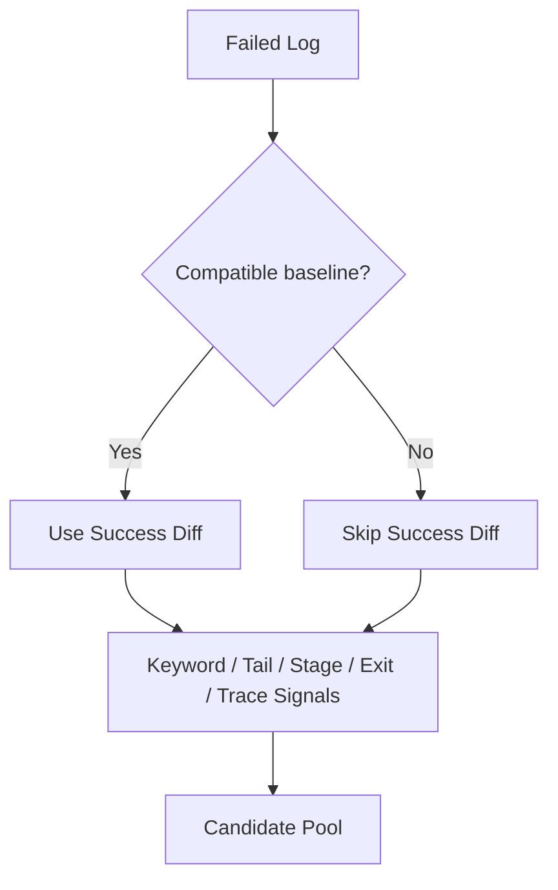
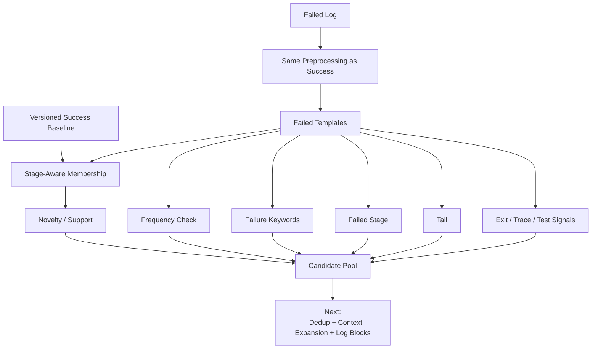

# Log Diffing + Candidate Selection Deep Dive

> A junior-engineer guide to the next stage of our CI/CD Log Intelligence Service.
>
> This starts **after** we already have:
>
> - normalized successful logs,
> - masked dynamic values,
> - Drain-generated reusable templates,
> - versioned preprocessing,
> - DAG/stage metadata,
> - and a compatible success baseline.

The question now is:

> **Given a failed log and a versioned success baseline, how do we decide which failed-run lines are normal, novel, suspicious, or important?**

This chapter explains:

1. failed-line template extraction;
2. success-template membership;
3. novelty;
4. stage-aware comparison;
5. frequency anomalies;
6. why "seen in success" does **not** mean "delete";
7. how failure-keyword and tail signals join the diff;
8. no-baseline behavior;
9. candidate-pool creation;
10. diff confidence.

At the end, we will identify the next deep dive.

---

# 1. Where This Fits in Our Architecture

We already have the offline side:



Now a pipeline fails:



This chapter is about the **Compare → Candidate Pool** part.

---

# 2. Start With a Simple Example

Recent successful baseline for `payment-service / integration-test` contains templates like:

```text
Starting integration tests
Connecting to <HOST>:<PORT>
Running <NUM> test cases
Tests run: <NUM>, Failures: 0
BUILD SUCCESS
```

Now the failed run contains:

```text
Starting integration tests
Connecting to payment-db.internal:5432
Connection refused
org.postgresql.util.PSQLException
PaymentServiceIT FAILED
Tests run: 124, Failures: 1
BUILD FAILURE
```

After preprocessing + Drain/template extraction:

```text
Starting integration tests
Connecting to <HOST>:<PORT>
Connection refused
org.postgresql.util.PSQLException
PaymentServiceIT FAILED
Tests run: <NUM>, Failures: <NON_ZERO_NUM>
BUILD FAILURE
```

Now we compare each failed-run event against the successful baseline.

---

# 3. Failed-Line Template Extraction

Before diffing, every failed log line should go through the **same compatible preprocessing stack** used for success baselines:

```text
raw failed line
   ↓
normalize
   ↓
redact
   ↓
mask
   ↓
Drain/template matching
   ↓
failed-line template
```

Example:

```text
RAW:
2026-08-15 15:20:17 [integration-4]
Connecting to payment-db.internal:5432
```

becomes:

```text
stage = integration-test
dag_node = integration-4

template:
Connecting to <HOST>:<PORT>
```

Another failed line:

```text
Connection refused
```

may remain:

```text
Connection refused
```

because there is nothing dynamic to mask.

---

# 4. Why Failed-Line Templates Matter

Exact strings can differ even when the event is normal.

Success run:

```text
Connecting to db-01.internal:5432
```

Failed run:

```text
Connecting to db-03.internal:5432
```

Exact-string diff says:

```text
DIFFERENT
```

Template-level diff says:

```text
Connecting to <HOST>:<PORT>
=
Connecting to <HOST>:<PORT>
```

So:

```text
probably normal structural event
```

That is the value of Drain in the online path.

---

# 5. Success-Template Membership

The first comparison question is:

> **Does this failed-run template exist in the compatible success baseline?**

Example:

```text
Failed template:
Connecting to <HOST>:<PORT>
```

Baseline contains:

```text
Connecting to <HOST>:<PORT>
```

Result:

```text
membership = YES
```

Another line:

```text
Failed template:
Connection refused
```

Baseline does not contain it.

Result:

```text
membership = NO
```

Conceptually:



Important wording:

> We say **lower novelty**, not **normal = delete**.

That distinction matters a lot.

---

# 6. What Is Novelty?

Novelty means:

> **How unusual is this event compared with recent compatible successful runs?**

A very simple V1 novelty signal:

```text
template seen in success
    ↓
novelty = low

template not seen in success
    ↓
novelty = high
```

But novelty is not the same as "root cause".

Example:

```text
Uploading diagnostics.zip
```

may be new but harmless.

And:

```text
ERROR cache lookup failed
```

may be seen in successful builds and still look scary.

So novelty is only **one signal**.

---

# 7. Four Useful Mental Categories

For a junior engineer, classify failed-log events conceptually into four buckets:

## A. Normal-looking

```text
seen frequently in successful baseline
no failure signal
expected stage
expected count
```

Example:

```text
Downloading dependency <*>
```

## B. Novel

```text
not seen in compatible successful runs
```

Example:

```text
Connection refused
```

## C. Suspicious

```text
novel
or
contains failure markers
or
appears in failed stage
or
has abnormal frequency
```

Example:

```text
Retrying connection
```

appearing 2000 times.

## D. Important

```text
strong evidence likely worth keeping
```

Examples:

```text
--- FAIL: PaymentServiceIT
BUILD FAILURE
OutOfMemoryError
Process exited with code 137
```

The transition is:

```text
normal/novel
    ↓
combine more signals
    ↓
suspicious
    ↓
candidate evidence
    ↓
later ranking decides importance
```

---

# 8. Novelty Is Not Binary in Our Production Design

LogSage's central idea is template membership against successful logs.

For our safer production design, we should eventually make novelty richer.

Possible novelty inputs:

```text
template absent from success profile
template seen rarely in success profile
template appears in unexpected stage
template frequency much higher than success
template only seen in old baseline versions
template appears near failure boundary
```

So later:

```text
novelty_score ∈ [0, 1]
```

Example:

```text
template seen in all 3 success runs
novelty = 0.1
```

```text
template never seen in success
novelty = 1.0
```

```text
template seen once in 3 runs
novelty = 0.5
```

Exact scoring comes later.

---

# 9. Stage-Aware Comparison

This is extremely important for our DAG-based CI.

Imagine the same template appears in different stages:

```text
Downloading artifact <*>
```

In:

```text
compile
integration-test
docker-build
```

If our success baseline is stage-aware, we should compare:

```text
failed stage = integration-test
```

against:

```text
integration-test success templates
```

not blindly against the entire pipeline.

---

# 10. Why Stage-Aware Diff Is Better

Suppose:

```text
"Starting PostgreSQL"
```

is normal in:

```text
integration-test
```

but has never appeared in:

```text
unit-test
```

Failed run prints it in:

```text
unit-test
```

Global baseline says:

```text
seen before → normal
```

Stage-aware baseline says:

```text
not normal for unit-test
```

That is much more useful.

Conceptually:



---

# 11. DAG-Aware Comparison

Parallel pipelines make global ordering unreliable.

Healthy run A:

```text
unit
lint
integration
```

Healthy run B:

```text
integration
unit
lint
```

So online diff should prefer:

```text
stage/node membership
```

over:

```text
global exact sequence
```

We can still keep sequence/order as an optional weak signal later.

But V1 should not say:

```text
line order changed
=
failure
```

for parallel DAGs.

---

# 12. What If the Stage Is Unknown?

If Jenkins/UDS does not give reliable stage metadata:

```text
stage = unknown
```

Then use:

```text
run-level baseline
```

and lower diff confidence.

Do not invent stage identity.

Example:

```json
{
  "comparison_scope": "RUN_LEVEL",
  "stage_resolution": "UNKNOWN",
  "diff_confidence": "MEDIUM"
}
```

---

# 13. Frequency Anomalies

This is one of the most valuable extensions beyond basic template membership.

Suppose successful runs contain:

```text
Retrying dependency download
```

Counts:

```text
success #101 = 1
success #102 = 2
success #103 = 1
```

Failed run:

```text
Retrying dependency download
```

appears:

```text
8,000 times
```

Template membership says:

```text
seen in success
```

But frequency says:

```text
very abnormal
```

That is suspicious.

---

# 14. Why Frequency Matters

Some failures are not caused by a brand-new message.

They are caused by:

```text
normal event happening too many times
```

Examples:

```text
retry loops
polling loops
repeated auth failures
network reconnects
OOM precursor warnings
repeated dependency fetch attempts
```

So we may store success-baseline statistics:

```text
template
typical count
minimum
maximum
mean / median
stage
supporting runs
```

V1 can stay simple:

```text
median count across recent success runs
```

Then compare failed count.

---

# 15. Simple Frequency-Anomaly Example

Success baseline:

```json
{
  "template": "Retrying connection to <HOST>",
  "counts": [1, 0, 2],
  "median": 1
}
```

Failed run:

```text
count = 87
```

Simple ratio:

```text
failed_count / max(success_median, 1)
=
87
```

This is clearly abnormal.

We might produce:

```text
reason = REPETITION_ANOMALY
```

---

# 16. Frequency Needs Context

Do not blindly compare counts.

Example:

Successful run:

```text
test shards = 20
"Starting JVM" count = 20
```

Failed run after legitimate scale change:

```text
test shards = 40
"Starting JVM" count = 40
```

That may be healthy.

So frequency comparison should consider:

```text
compatibility fingerprint
DAG shape
shard count
pipeline parameters
```

This is why baseline compatibility remains important.

---

# 17. The Critical Rule: "Seen in Success" Does NOT Mean Delete

This is probably the most important safety rule in the entire log-diff design.

Do **not** implement:

```python
if template in success_baseline:
    discard(line)
```

Why?

Because a template can appear in successful runs and still matter in a failed run.

---

# 18. Example: Benign Error That Becomes Relevant

Successful build:

```text
ERROR cache lookup failed
Using local fallback
BUILD SUCCESS
```

So:

```text
ERROR cache lookup failed
```

is part of the success baseline.

Failed build:

```text
ERROR cache lookup failed
Using local fallback
...
fallback cache corrupted
...
BUILD FAILURE
```

If we delete the first line just because it appears in success history, we may remove useful context.

Better:

```text
success match
    ↓
lower novelty
```

but keep other signals available.

---

# 19. Example: Over-Masking Can Make Failure Look Normal

Success:

```text
HTTP status 200
```

Failed:

```text
HTTP status 500
```

Bad mask:

```text
HTTP status <NUM>
```

Same template.

If "seen in success = delete", we lose the failure.

If success membership only lowers novelty:

```text
HTTP 5xx detector
failed stage
tail
exit code
```

can still rescue the line.

---

# 20. Better Mental Model

Think of a detective.

A witness says:

```text
"I've seen this person here before."
```

That does not mean:

```text
"Ignore them completely."
```

It means:

```text
"This fact is less surprising."
```

Same with baseline membership.

---

# 21. Failure-Keyword Signal Joins the Diff

Now add another detector.

A failed line may contain:

```text
fatal
failed
failure
panic
error
exception
cannot
missing
kill
exit
no such file
```

Example:

```text
PaymentServiceIT FAILED
```

Even if something structurally similar was seen before, the keyword signal makes it suspicious.

Conceptually:

```text
Novelty signal
      +
Failure-keyword signal
      ↓
candidate likelihood
```

---

# 22. Why Keyword Matching Alone Is Not Enough

Example:

```text
WARNING cache connection failed
Using local cache
```

This may appear in healthy builds.

Keyword:

```text
failed
```

fires.

But baseline history says:

```text
common successful event
```

So:

```text
keyword = suspicious
baseline = lowers novelty
context = fallback succeeded
```

Together we get a better judgment.

---

# 23. Tail Signal Joins the Diff

The tail is:

```text
the final bounded region of the log
```

Why keep it as a signal?

Because abrupt failures often end with:

```text
BUILD FAILURE
Process exited with code 1
Killed
OOMKilled
test summary
```

So an event near the end gets a small priority boost.

Conceptually:

```text
novelty
+
failure keyword
+
tail proximity
=
stronger candidate
```

---

# 24. Tail Is a Signal, Not a Final Selection Strategy

Our old/current design often does:

```text
take last 1500 lines
```

The new design does:

```text
is this line near the tail?
    ↓
add one reason / score
```

That is much smarter.

We keep the useful intuition of tailing without throwing away the middle of the log.

---

# 25. Combine Multiple Signals

For every failed log line or structural unit, we can build a reason set.

Example:

```text
Connection refused
```

might get:

```json
{
  "reasons": [
    "NOVEL_VS_SUCCESS",
    "FAILED_STAGE",
    "NEAR_TAIL"
  ]
}
```

Another line:

```text
BUILD FAILURE
```

might get:

```json
{
  "reasons": [
    "NOVEL_VS_SUCCESS",
    "FAILURE_KEYWORD",
    "NEAR_TAIL",
    "TERMINAL_FAILURE"
  ]
}
```

Another:

```text
WARNING cache unavailable
```

might get:

```json
{
  "reasons": [
    "FAILURE_KEYWORD"
  ],
  "baseline": {
    "seen_in_success": true,
    "support": "3/3"
  }
}
```

Later scoring determines how important these are.

---

# 26. Candidate Pool Creation

The candidate pool should favor **recall**.

That means:

> It is okay to keep a few extra suspicious lines now.

Missing the true root cause is much worse.

For each failed-log line/unit:

```text
if ANY useful detector fires
    ↓
add to candidate pool
```

Possible detectors:

```text
novel_vs_success
failure_keyword
tail
failed_stage
non_zero_exit
stack_trace
failed_test
compiler_error
infrastructure_error
frequency_anomaly
timeout
OOM
```

---

# 27. Candidate-Pool Pseudocode

Simplified:

```python
candidates = []

for event in failed_log_events:
    reasons = []

    if not success_baseline.contains(event.template, event.stage):
        reasons.append("NOVEL_VS_SUCCESS")

    if event.has_failure_keyword:
        reasons.append("FAILURE_KEYWORD")

    if event.is_near_tail:
        reasons.append("NEAR_TAIL")

    if event.is_in_failed_stage:
        reasons.append("FAILED_STAGE")

    if event.has_nonzero_exit:
        reasons.append("NONZERO_EXIT")

    if event.is_frequency_anomaly:
        reasons.append("FREQUENCY_ANOMALY")

    if reasons:
        candidates.append(
            Candidate(event=event, reasons=reasons)
        )
```

This is intentionally high recall.

---

# 28. LogSage-Inspired Core vs Our Extensions

We should keep this distinction clear.

## LogSage-inspired core

The main filtering ideas are:

```text
success-template diff
+
failure keywords
+
log tail
```

These create the candidate set.

## Our production extensions

We are proposing additional signals such as:

```text
stage/DAG awareness
non-zero exits
stack trace grouping
test-failure awareness
compiler/linter signals
infrastructure failures
frequency anomalies
baseline compatibility/confidence
```

These are our design additions to make the system safer and more suitable for our Jenkins environment.

---

# 29. No-Baseline Behavior

What if:

```text
new repo
first pipeline run fails
```

or:

```text
pipeline changed
old baseline incompatible
```

or:

```text
baseline worker is down
```

We still need diagnosis.

So:

```text
No success baseline
    !=
No reduction
```

We simply lose the novelty signal.

---

# 30. Candidate Creation Without Baseline

Use:

```text
failure keywords
tail
failed-stage information
exit/termination
stack trace
failed test
compiler error
infrastructure patterns
repetition compression
```

Example:



Response metadata:

```json
{
  "baseline_status": "MISSING",
  "diff_confidence": "MEDIUM"
}
```

---

# 31. Why No-Baseline Confidence Should Be Lower

Without success history we do not know:

```text
which warnings are routine
which retries are normal
which informational lines are expected
```

We can still detect strong failures.

But we have less context.

So the reduction layer should report that uncertainty.

---

# 32. Diff Confidence

Diff confidence answers:

> **How much should downstream logic trust the success-vs-failure comparison?**

It is not the same as:

```text
RCA confidence
```

It only describes the quality of the comparison.

---

# 33. Possible Diff-Confidence Inputs

## Baseline exists?

```text
yes / no
```

## Baseline compatible?

```text
same pipeline fingerprint
same preprocessing versions
same stage identity
```

## Baseline fresh?

```text
recent success runs
or
very old baseline
```

## Support count?

```text
3 compatible success runs
vs
only 1
```

## Stage resolution?

```text
exact stage
vs
run-level fallback
```

## Source complete?

```text
full Jenkins log
vs
truncated UDS data
```

---

# 34. Example Confidence States

## HIGH

```text
compatible baseline available
3 recent success runs
same preprocessing versions
exact failed stage known
complete log
```

## MEDIUM

```text
baseline exists
but only 1 recent run
or
stage unknown
```

## LOW

```text
partial log
stale baseline
weak compatibility
```

## NONE / UNAVAILABLE

```text
no compatible baseline
```

---

# 35. Example Diff-Confidence Object

```json
{
  "diff_confidence": "HIGH",
  "reasons": [
    "BASELINE_FOUND",
    "3_RECENT_SUCCESS_RUNS",
    "PREPROCESSING_VERSION_MATCH",
    "EXACT_STAGE_MATCH",
    "COMPLETE_SOURCE_LOG"
  ]
}
```

Or:

```json
{
  "diff_confidence": "LOW",
  "reasons": [
    "STALE_BASELINE",
    "STAGE_UNKNOWN",
    "PARTIAL_UDS_LOG"
  ]
}
```

---

# 36. Success Membership Should Also Have Support Strength

Instead of storing only:

```text
template exists = true
```

store:

```text
seen in 3/3 success runs
```

or:

```text
seen in 1/3 success runs
```

These mean different things.

Example:

```text
BUILD environment initialized
seen 3/3
```

very normal.

```text
Retrying cache
seen 1/3
```

less strongly normal.

This can later influence novelty score.

---

# 37. Novelty With Support

Simple mental model:

```text
seen 3/3
    ↓
very low novelty

seen 2/3
    ↓
low novelty

seen 1/3
    ↓
medium novelty

seen 0/3
    ↓
high novelty
```

We should not lock these values yet.

The important idea is:

> **Baseline support strength gives more information than a boolean membership flag.**

---

# 38. Stage + Support Together

Example:

Template:

```text
Starting PostgreSQL
```

Global support:

```text
3/3 runs
```

But stage support:

```text
integration-test = 3/3
unit-test = 0/3
```

Failed run prints:

```text
Starting PostgreSQL
```

in:

```text
unit-test
```

Stage-aware novelty should still be high.

This is why stage-local baselines matter.

---

# 39. Frequency + Membership Together

Example:

```text
Retrying registry request
```

Success membership:

```text
3/3
```

So structurally normal.

Frequency:

```text
success typical = 1–2
failed = 500
```

So operationally abnormal.

The resulting candidate reason can be:

```text
FREQUENCY_ANOMALY
```

even though:

```text
NOVEL_VS_SUCCESS = false
```

---

# 40. What About "BUILD FAILURE"?

It will almost never exist in a success baseline.

So:

```text
novel = yes
keyword = yes
tail = yes
terminal failure = yes
```

Very strong candidate.

But note:

```text
BUILD FAILURE
```

often tells us **that** the pipeline failed, not **why**.

So it should be retained but later ranking/context needs to find the causal evidence before it.

This is why candidate generation and root-cause ranking are separate stages.

---

# 41. What About the First Error?

A failed log may contain:

```text
ERROR cache lookup failed
fallback enabled
...
Connection refused
...
BUILD FAILURE
```

The first `ERROR` is not necessarily root cause.

Candidate generation should keep both:

```text
cache error
database error
```

Then later context + ranking decide which is more diagnostic.

Do not try to solve root cause too early.

---

# 42. Unit of Comparison: Line vs Structural Unit

Some errors span multiple lines.

Java:

```text
java.sql.SQLException: connection failed
    at ...
    at ...
Caused by: java.net.ConnectException
```

Compiler error:

```text
PaymentService.java:81: cannot find symbol
    paymentClient.charge()
                 ^
```

Test failure:

```text
Expected: 200
Actual: 500
```

Comparing only individual lines can be fragile.

Our design should eventually operate on:

```text
line
or
recognized structural unit
```

For candidate discovery, an exception header may trigger the candidate.

Later context/block construction keeps the full multi-line structure together.

---

# 43. Example Full Walkthrough

Success baseline for `integration-test`:

```text
Starting PostgreSQL
Connecting to <HOST>:<PORT>
Running <NUM> integration tests
Tests run: <NUM>, Failures: 0
Stopping PostgreSQL
```

Failed run:

```text
1 Starting PostgreSQL
2 Connecting to payment-db:5432
3 Running 124 integration tests
4 Retrying connection to payment-db
5 Retrying connection to payment-db
6 Retrying connection to payment-db
...
80 Retrying connection to payment-db
81 Connection refused
82 org.postgresql.util.PSQLException
83 PaymentServiceIT FAILED
84 Tests run: 124, Failures: 1
85 BUILD FAILURE
```

---

# 44. Step A — Extract templates

```text
Starting PostgreSQL
Connecting to <HOST>:<PORT>
Running <NUM> integration tests
Retrying connection to <HOST>
Connection refused
org.postgresql.util.PSQLException
PaymentServiceIT FAILED
Tests run: <NUM>, Failures: <NON_ZERO_NUM>
BUILD FAILURE
```

---

# 45. Step B — Compare membership

```text
Starting PostgreSQL
→ seen in success

Connecting to <HOST>:<PORT>
→ seen in success

Running <NUM> integration tests
→ seen in success

Retrying connection to <HOST>
→ not seen in success

Connection refused
→ not seen in success

PSQLException
→ not seen in success

PaymentServiceIT FAILED
→ not seen in success

Failures: <NON_ZERO_NUM>
→ not seen in success

BUILD FAILURE
→ not seen in success
```

---

# 46. Step C — Frequency check

Suppose:

```text
Retrying connection to <HOST>
```

success count:

```text
0
```

failed count:

```text
77
```

This is both:

```text
novel
+
frequency anomaly
```

Strong candidate.

---

# 47. Step D — Add keyword/tail/stage signals

`PaymentServiceIT FAILED`:

```text
NOVEL_VS_SUCCESS
FAILURE_KEYWORD
FAILED_STAGE
NEAR_TAIL
```

`BUILD FAILURE`:

```text
NOVEL_VS_SUCCESS
FAILURE_KEYWORD
TERMINAL_FAILURE
NEAR_TAIL
```

`Connection refused`:

```text
NOVEL_VS_SUCCESS
FAILED_STAGE
```

`PSQLException`:

```text
NOVEL_VS_SUCCESS
EXCEPTION
FAILED_STAGE
NEAR_TAIL
```

Now we have a rich candidate pool.

---

# 48. Example Candidate Object

```json
{
  "candidate_id": "c-102",
  "line_number": 82,
  "stage": "integration-test",
  "template": "org.postgresql.util.PSQLException",
  "redacted_text": "org.postgresql.util.PSQLException",
  "baseline": {
    "membership": false,
    "support_count": 0,
    "success_run_count": 3
  },
  "reasons": [
    "NOVEL_VS_SUCCESS",
    "EXCEPTION",
    "FAILED_STAGE",
    "NEAR_TAIL"
  ]
}
```

Later:

```text
context expansion
```

will turn this isolated candidate into a useful evidence block.

---

# 49. Candidate Pool Should Be Explainable

Every candidate should record:

```text
why it entered the pool
```

Possible reason codes:

```text
NOVEL_VS_SUCCESS
RARE_IN_SUCCESS
FAILURE_KEYWORD
TERMINAL_FAILURE
NONZERO_EXIT
FAILED_STAGE
STACK_TRACE
FAILED_TEST
COMPILER_ERROR
INFRASTRUCTURE_ERROR
FREQUENCY_ANOMALY
NEAR_TAIL
```

This is useful for:

```text
debugging
tuning
auditability
engineer trust
evaluation
```

---

# 50. Candidate Generation Is Not Ranking

Important distinction.

Candidate generation asks:

> **"Should we consider this evidence?"**

Ranking later asks:

> **"How important is this evidence compared with everything else?"**

So candidate generation should be broad.

Ranking can be stricter.

---

# 51. Candidate Generation Is Not RCA

Also:

```text
candidate ≠ root cause
```

Example:

```text
BUILD FAILURE
```

is definitely a candidate.

But it may not be root cause.

That is okay.

The LLM/ranking stages handle diagnosis later.

---

# 52. Suggested V1 Comparison Logic

For our first production version:

```text
For each failed event:

1. identify stage / DAG node
2. extract template
3. load matching baseline scope
4. check success membership
5. calculate support strength
6. check simple frequency anomaly
7. check failure keywords
8. check failed-stage relation
9. check tail
10. check exit / exception / test failure
11. if any signal fires → candidate
```

No LLM call needed.

Deterministic and explainable.

---

# 53. Suggested V1 Candidate Pseudocode

```python
def classify_failed_event(event, baseline, failed_stage, tail_region):
    reasons = []

    membership = baseline.lookup(
        stage=event.stage,
        template=event.template
    )

    if membership is None:
        reasons.append("NOVEL_VS_SUCCESS")
    elif membership.support_ratio < 0.5:
        reasons.append("RARE_IN_SUCCESS")

    if frequency_is_abnormal(event, baseline):
        reasons.append("FREQUENCY_ANOMALY")

    if contains_failure_marker(event.redacted_text):
        reasons.append("FAILURE_KEYWORD")

    if event.stage == failed_stage:
        reasons.append("FAILED_STAGE")

    if event.line_number in tail_region:
        reasons.append("NEAR_TAIL")

    if event.is_exception:
        reasons.append("EXCEPTION")

    if event.nonzero_exit:
        reasons.append("NONZERO_EXIT")

    if event.failed_test:
        reasons.append("FAILED_TEST")

    return reasons
```

Then:

```python
if reasons:
    add_candidate(event, reasons)
```

---

# 54. What If Membership Matches but Strong Failure Evidence Exists?

Example:

```text
template seen in success
+
NONZERO_EXIT
```

Keep it.

Example:

```text
template seen in success
+
HTTP 500
```

Keep it.

Example:

```text
template seen in success
+
Failures = 9
```

Keep it.

This reinforces:

> **Success history modifies priority; it does not erase evidence.**

---

# 55. What If Everything Is Novel?

This can happen when:

```text
pipeline definition changed
wrong baseline selected
masking version mismatched
toolchain changed
stage parsing failed
```

If:

```text
90% of failed lines are "novel"
```

that is a warning that the baseline may be poor.

Diff confidence should drop.

Example:

```json
{
  "diff_confidence": "LOW",
  "warning": "NOVELTY_RATE_TOO_HIGH"
}
```

Then rely more on:

```text
keyword
tail
stage
exception
exit
```

---

# 56. What If Almost Nothing Is Novel?

Also possible.

Maybe:

```text
failure is frequency-based
over-masking hides differences
same warning becomes fatal due to context
test summary only changes parameter value
```

So:

```text
0 novel lines
```

does not mean:

```text
no failure evidence
```

Other signals must still run.

---

# 57. Diff Statistics We Should Return

Useful response metadata:

```json
{
  "baseline_status": "FOUND",
  "baseline_version": 17,
  "diff_confidence": "HIGH",

  "statistics": {
    "failed_events": 118220,
    "templates_seen_in_success": 111900,
    "novel_templates": 121,
    "novel_event_occurrences": 530,
    "frequency_anomalies": 4,
    "keyword_candidates": 72,
    "tail_candidates": 300,
    "final_candidate_count": 612
  }
}
```

This makes the service observable.

---

# 58. Why This Helps Cost Reduction

Suppose:

```text
raw failed log = 120,000 lines
```

The diff/candidate layer may reduce the search space to:

```text
600 candidate lines/events
```

But we still should **not send 600 isolated lines directly to the LLM**.

Why?

Because they lack context.

This leads naturally to the next stage.

---

# 59. Big Mental Model

Human engineer debugging:

```text
"I've seen this line in healthy builds."
       ↓
less surprising

"I've never seen this before."
       ↓
interesting

"This normally appears once,
but now it appears 500 times."
       ↓
very interesting

"This says FAILED."
       ↓
suspicious

"This is in the failed stage."
       ↓
more suspicious

"This is at the end."
       ↓
more suspicious
```

Our candidate system automates those judgments.

---

# 60. Whiteboard Summary



---

# 61. The One Rule to Remember

If you remember only one thing:

> **The success baseline tells us what is less surprising. It does not tell us what we are allowed to delete.**

The new system should say:

```text
"Seen in success"
    ↓
lower novelty
```

not:

```text
"Seen in success"
    ↓
throw away
```

That keeps the system much safer.

---

# 62. What Should We Deep-Dive Next?

The next topic should be:

# **Deduplication + Context Expansion + Log Block Construction**

Why this next?

Because at the end of this chapter we have:

```text
candidate line 1
candidate line 2
candidate line 3
...
```

But an isolated line like:

```text
Connection refused
```

is not enough for the LLM.

We need to transform:

```text
candidate points
```

into:

```text
complete diagnostic stories
```

The next deep dive should cover:

```text
1. candidate-line deduplication
2. overlapping candidates
3. why context is required
4. 4-before / 6-after idea
5. why context may need to be dynamic
6. stack-trace preservation
7. test failure section preservation
8. compiler diagnostic preservation
9. stage-boundary behavior
10. merging overlapping windows
11. merging nearby related windows
12. defining a LogBlock data model
13. preserving original line ranges
14. deduplicating repeated blocks
15. handling huge repeated retry sections
16. how candidate reasons roll up to a block
```

After that, we will have:

```text
Failed Log
   ↓
Candidates
   ↓
Contextual Log Blocks
```

Then the next major topic after **that** will be:

# **Weighting + Block Scoring + Density + Token Budgeting**

So our learning sequence is now:

```text
1. Normalize / Mask / Drain / Baseline       ✅

2. Log Diff + Candidate Selection            ✅ this document

3. Dedup + Context Expansion + Log Blocks    ← NEXT

4. Weighting + Scoring + Density

5. Token Budget Selection

6. Evidence Pack

7. LLM RCA
```

That is the cleanest progression.
