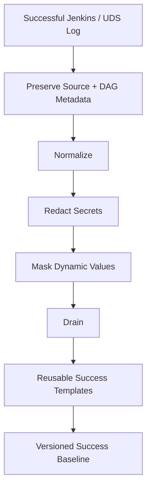
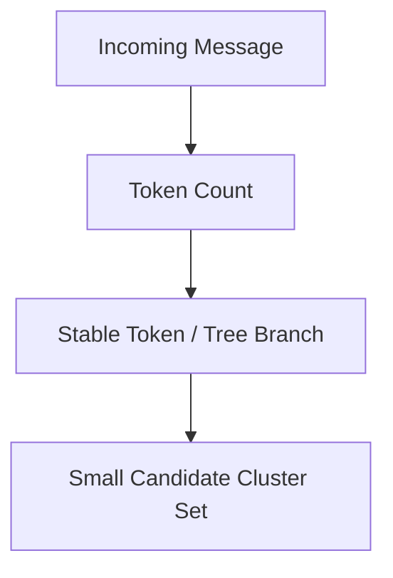
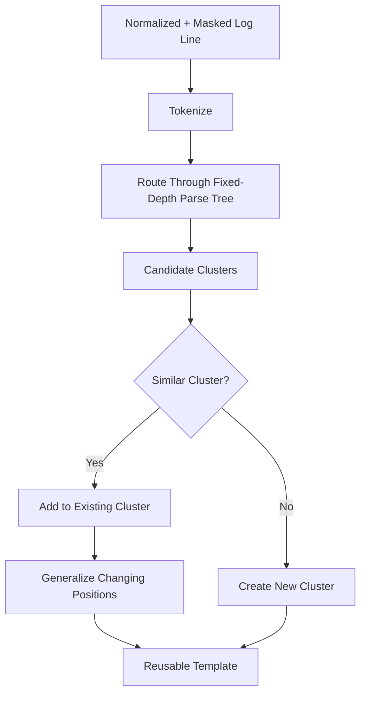
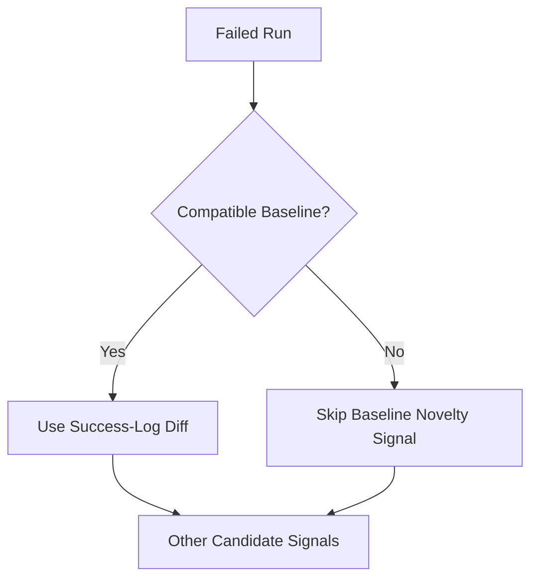
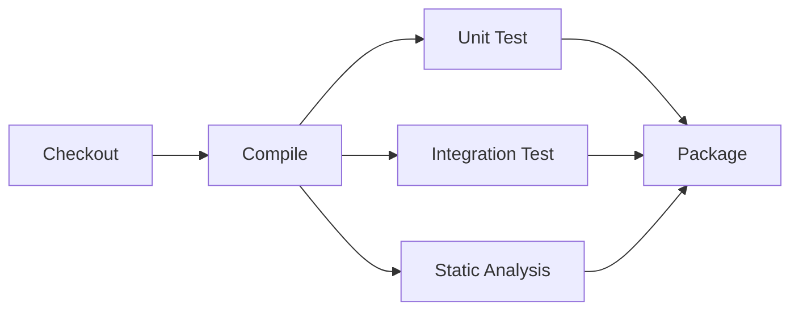
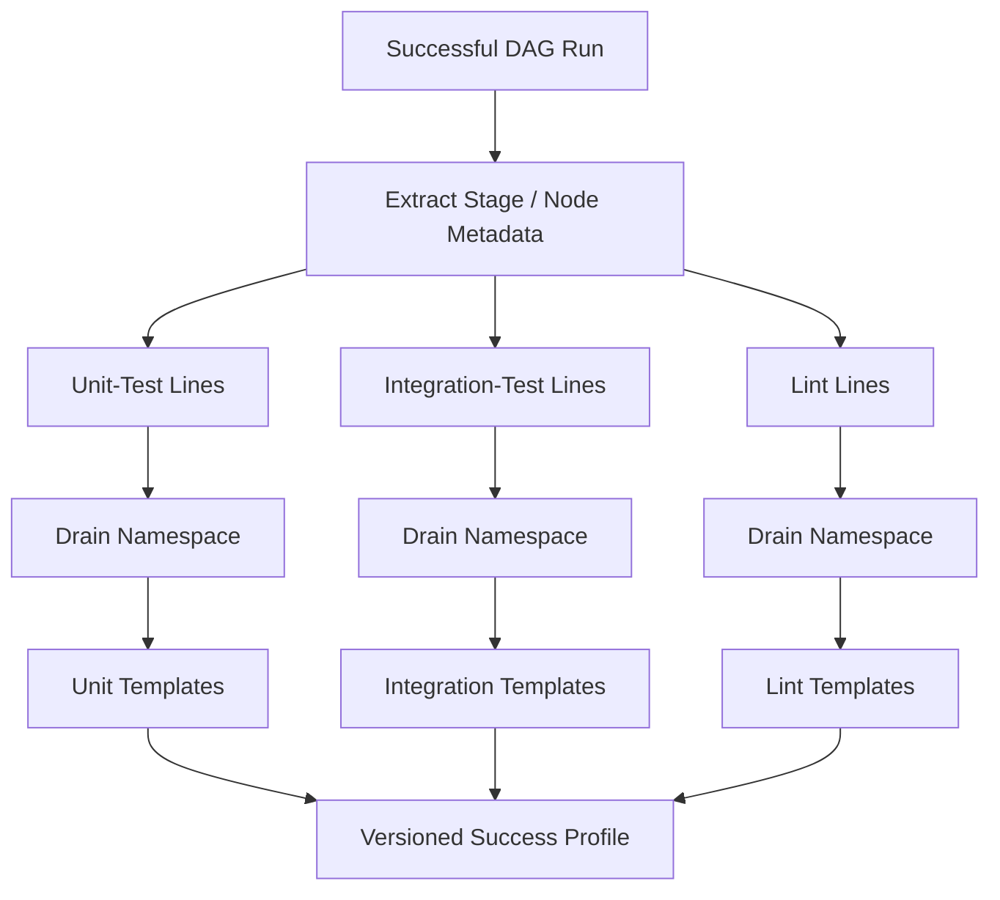
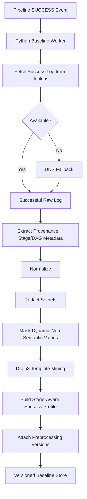

# Success-Log Preprocessing Before Log Diffing

> A junior-engineer deep dive into the five foundations we need before comparing a failed CI/CD run with successful runs:
>
> 1. how success logs are normalized;
> 2. how dynamic values are masked;
> 3. how Drain creates reusable templates;
> 4. how preprocessing is versioned;
> 5. how DAG/stage metadata is preserved.

---

# 1. Why We Need This Layer

Our future Log Intelligence Service wants to answer:

> **"What is normal in a successful pipeline, and what is unusual in a failed pipeline?"**

But we cannot compare raw Jenkins text directly.

A successful run may contain:

```text
2026-08-15 14:21:11 [integration-test-2]
Build 98127 started on agent-42
Connecting to 10.42.1.7:5432
```

Another healthy run may contain:

```text
2026-08-15 15:02:44 [integration-test-5]
Build 98201 started on agent-19
Connecting to 10.42.1.9:5432
```

A human says:

```text
"These are basically the same events."
```

Exact text comparison says:

```text
timestamp changed
DAG node changed
build number changed
agent changed
IP changed
```

So before Log Diffing, we need to convert successful logs into a stable representation.

The flow is:



The key idea:

> **Clean the log without destroying useful meaning.**

---

# 2. Foundation One — How Success Logs Are Normalized

## 2.1 What does "normalization" mean?

Normalization means:

> **Take log text that may be represented differently and convert it into one stable internal form.**

Normalization is mostly about **presentation noise**, not business meaning.

For example, Jenkins may print ANSI terminal colors:

```text
\u001b[32m[INFO]\u001b[0m Compiling payment-service
```

A human effectively sees:

```text
[INFO] Compiling payment-service
```

Drain should work with the clean form too.

---

## 2.2 What should normalization do?

A conservative V1 normalizer can handle:

```text
text encoding → UTF-8
Windows/Linux line endings → one representation
ANSI escape sequences → removed
non-semantic control characters → removed
carriage-return progress output → bounded representation
very long terminal-refresh lines → handled safely
stable original line numbers → preserved
timestamps → extracted when confidently recognized
stage / DAG markers → extracted into metadata
```

Example:

```text
RAW

\u001b[32m2026-08-15 14:22:10 [INFO]\u001b[0m Compiling payment-service\r
```

Normalized message:

```text
[INFO] Compiling payment-service
```

Structured metadata may contain:

```json
{
  "timestamp": "2026-08-15T14:22:10",
  "originalLineNumber": 9182
}
```

---

## 2.3 Normalization should not destroy provenance

Suppose the raw line is:

```text
2026-08-15 14:32:17 [integration-test-3] Connecting payment-db
```

Do not simply transform it into:

```text
Connecting payment-db
```

and throw everything else away.

Internally, keep something closer to:

```json
{
  "originalLineNumber": 81220,
  "timestamp": "2026-08-15T14:32:17",
  "stageId": "integration-test",
  "dagNodeId": "integration-test-3",
  "redactedText": "Connecting payment-db",
  "templateInput": "Connecting payment-db"
}
```

Why?

Because later we may need to answer:

```text
Which stage produced this?
Which DAG node produced this?
Where was it in the original log?
What timestamp did it have?
What exact redacted text should the LLM see?
```

So:

```text
Normalization ≠ deleting metadata
```

Instead:

```text
raw line
   ↓
extract useful metadata
   +
create stable message text
```

---

# 3. Foundation Two — How Dynamic Values Are Masked

## 3.1 What does masking mean?

Masking means:

> **Replace values that naturally change between runs with stable placeholders, when those values do not define the meaning of the event.**

Example:

```text
Build 98127 started
Build 98201 started
Build 98244 started
```

becomes:

```text
Build <BUILD_ID> started
```

Another example:

```text
Connecting to 10.20.1.4
Connecting to 10.20.1.8
```

becomes:

```text
Connecting to <IP>
```

Another:

```text
request 550e8400-e29b-41d4-a716-446655440000
```

becomes:

```text
request <UUID>
```

---

## 3.2 Why do we mask before Drain?

Without masking:

```text
Downloaded payment-api-a81fd9.jar in 420ms
Downloaded payment-api-c71ba2.jar in 515ms
Downloaded payment-api-f19cd1.jar in 391ms
```

Drain has to discover that:

```text
artifact hash changes
duration changes
```

With masking:

```text
Downloaded payment-api-<HASH>.jar in <DURATION>
Downloaded payment-api-<HASH>.jar in <DURATION>
Downloaded payment-api-<HASH>.jar in <DURATION>
```

the event shape is already much clearer.

Potential reusable template:

```text
Downloaded payment-api-<HASH>.jar in <DURATION>
```

or a Drain-generalized form such as:

```text
Downloaded <*> in <DURATION>
```

---

## 3.3 Why named masks are useful

Compare:

```text
Connecting to <*> port <*>
```

with:

```text
Connecting to <HOST> port <PORT>
```

The second one is easier for engineers to understand.

Useful mask names may include:

```text
<UUID>
<IP>
<HOST>
<PORT>
<BUILD_ID>
<RUN_ID>
<HASH>
<DURATION>
<TRACE_ID>
<REQUEST_ID>
```

Named masks also make future debugging and parameter extraction easier.

---

# 4. The Most Important Masking Rule

> **Mask variability, not meaning.**

This is the central rule.

Not every changing value should be hidden.

---

## 4.1 Under-masking

Under-masking means:

> We leave too many random values untouched.

Example:

```text
Request c7ab12 started
Request 89de01 started
Request f921ab started
```

If the IDs stay literal, we may create too many different clusters/templates.

This can make normal success output look "new" later.

Result:

```text
template explosion
false novelty
too many candidate lines
```

---

## 4.2 Over-masking

Over-masking is more dangerous.

Successful run:

```text
HTTP response status 200
```

Failed run:

```text
HTTP response status 500
```

Bad masking:

```text
HTTP response status <NUM>
```

Now the healthy and unhealthy event look identical.

But:

```text
200 = success
500 = server failure
```

We just destroyed meaning.

---

## 4.3 Test-summary example

Successful:

```text
Tests run: 124, Failures: 0
```

Failed:

```text
Tests run: 124, Failures: 9
```

Bad:

```text
Tests run: <NUM>, Failures: <NUM>
```

Better:

```text
Tests run: <NUM>, Failures: 0
```

versus:

```text
Tests run: <NUM>, Failures: <NON_ZERO_NUM>
```

Or parse structured values separately:

```json
{
  "testsRun": 124,
  "failures": 9
}
```

Then candidate generation can later use:

```text
failures > 0
```

as a strong failure signal.

---

# 5. What Should We Mask?

A starting mental model:

| Usually safe to generalize | Needs context | Usually preserve semantically |
|---|---|---|
| UUID | Generic numbers | ERROR / FAIL / Exception |
| Request IDs | Ports | Exception class |
| Build IDs | HTTP status code | Exit code |
| Timestamps | Version numbers | Failure count |
| Random hashes | Retry count | Failed test name |
| Trace/span IDs | Duration | Compiler diagnostic |
| Temporary path suffixes | IP addresses | Meaningful source filename |
| Ephemeral agent IDs | Shard numbers | Important config value |

This is not a perfect universal table.

The rule is always:

```text
Does changing this value change the meaning of the event?
```

If yes:

```text
preserve it
or
classify it intelligently
```

If no:

```text
good masking candidate
```

---

# 6. File Paths Need Special Care

Temporary workspace:

```text
/jenkins/workspace/payment/tmp/a81/output.log
/jenkins/workspace/payment/tmp/b92/output.log
```

can reasonably become:

```text
/jenkins/workspace/payment/tmp/<*>/output.log
```

But:

```text
src/main/java/PaymentService.java:81
```

may be crucial diagnostic information.

Do not blindly turn it into:

```text
<PATH>:<NUM>
```

A better model is:

```text
template representation:
<SOURCE_FILE>:<LINE_NUM>

structured metadata:
sourceFile = PaymentService.java
lineNumber = 81

evidence text:
src/main/java/PaymentService.java:81
```

So the template stays reusable while the final RCA still sees the useful file name.

---

# 7. Redaction and Masking Are Different

We should keep one security concept clear.

Suppose a log contains:

```text
Authorization: Bearer eyJhbGciOi...
```

Masking is about template quality.

Redaction is about security.

We need:

```text
Authorization: Bearer <REDACTED:TOKEN>
```

before anything can be persisted into:

```text
Drain state
success baseline
debug logs
derived files
LLM input
```

So:

```text
REDACTION
= security boundary

MASKING
= log-template quality
```

Correct conceptual order:

```text
Normalize
   ↓
Redact
   ↓
Mask
   ↓
Drain
```

---

# 8. Foundation Three — How Drain Creates Templates

Now assume the successful log has been:

```text
normalized
redacted
masked
```

Drain receives stable log messages.

Drain's job is:

> **Group lines with similar structure and generalize changing positions into reusable templates.**

---

## 8.1 Example

Drain receives:

```text
User rahul logged in
User priya logged in
User aman logged in
```

A human sees:

```text
User <PERSON> logged in
```

Drain does something conceptually similar.

---

## 8.2 Step 1 — tokenize the message

```text
User rahul logged in
```

becomes approximately:

```text
["User", "rahul", "logged", "in"]
```

---

## 8.3 Step 2 — route through a fixed-depth tree

Drain does not compare every incoming line with every template ever created.

It routes the message through a bounded parse tree.

Simplified mental model:



Think of:

```text
supermarket
   ↓
aisle
   ↓
shelf
   ↓
small group of products
```

This makes matching efficient.

---

## 8.4 Step 3 — compare with candidate templates

Suppose Drain already has:

```text
User rahul logged in
```

New line:

```text
User priya logged in
```

Position comparison:

```text
User     = User
rahul    ≠ priya
logged   = logged
in       = in
```

Most positions match.

If similarity is high enough:

```text
same cluster
```

---

## 8.5 Step 4 — generalize changing positions

The cluster template becomes:

```text
User <*> logged in
```

Now:

```text
User aman logged in
```

matches the same template.

---

# 9. Drain's Complete Mental Model



Junior-engineer shortcut:

> **Route → Compare → Cluster → Generalize**

---

# 10. A Success Baseline Contains Many Templates

Do not picture:

```text
one pipeline
    ↓
one giant Drain template
```

A successful pipeline produces a **set of templates**.

Example:

```text
T001  Starting agent <*>
T002  Workspace <*>
T003  Downloading <*> from <HOST>
T004  Compiling payment-service
T005  Running <NUM> tests
T006  Tests run: <NUM>, Failures: 0
T007  BUILD SUCCESS
```

Our baseline can store metadata with each one:

```json
{
  "templateId": "T005",
  "template": "Running <NUM> tests",
  "stage": "unit-test",
  "runSupportCount": 3,
  "supportingRuns": ["101", "102", "103"]
}
```

So:

> **Drain creates clusters/templates. Our service turns those templates into a versioned success baseline.**

---

# 11. Foundation Four — How Preprocessing Is Versioned

This is critical and easy to miss.

Suppose the success baseline was built when our masking rule did **not** mask IP addresses:

```text
Connecting to 10.1.2.7
```

One month later we update masking.

A failed run becomes:

```text
Connecting to <IP>
```

Now:

```text
success template:
Connecting to 10.1.2.7

failed template:
Connecting to <IP>
```

They may not match.

The pipeline behavior did not change.

Our preprocessing changed.

---

# 12. Therefore Every Baseline Needs Preprocessing Versions

Store at least:

```text
normalizer_version
redaction_policy_version
masking_policy_version
Drain_config_version
DAG_segmenter_version
```

Example:

```json
{
  "baselineId": "baseline-812",
  "versions": {
    "normalizer": "3",
    "redaction": "7",
    "masking": "4",
    "drainConfig": "2",
    "dagSegmenter": "1"
  }
}
```

Then online failure processing checks:

```text
Are the baseline and failed log using compatible preprocessing?
```

If yes:

```text
safe to compare
```

If no:

```text
do not silently trust the comparison
```

---

# 13. Offline and Online Must Be Symmetrical

Successful path:

```text
SUCCESS LOG
   ↓
Normalizer v3
   ↓
Redaction v7
   ↓
Masking v4
   ↓
Drain v2
   ↓
Baseline
```

Failed path:

```text
FAILED LOG
   ↓
Normalizer v3
   ↓
Redaction v7
   ↓
Masking v4
   ↓
Drain v2
   ↓
Compare with baseline
```

Bad architecture:

```text
success uses masking v2

failure uses masking v9
```

That becomes an apples-to-oranges comparison.

---

# 14. What If Versions Are Incompatible?

Do not fail the entire RCA system.

Instead:

```text
baseline_status = INCOMPATIBLE
```

and fall back to other evidence-selection signals later:

```text
failure keywords
failed stage
stack trace
exit code
tail
test failure
infrastructure signal
```

Conceptually:



No baseline is better than a misleading baseline.

---

# 15. Versioned Masking Policy

Our masking rules should not be scattered randomly through Python code.

Think:

```text
MaskingPolicy v1
MaskingPolicy v2
MaskingPolicy v3
```

A policy can contain:

```text
global masks
tool-specific masks
controlled pipeline overrides
```

Example:

```yaml
masking_policy: v4

global:
  - name: UUID
    pattern: "..."

  - name: TRACE_ID
    pattern: "..."

jenkins:
  - name: BUILD_ID
    pattern: "..."

maven:
  - name: DURATION
    pattern: "..."
```

Then the baseline records:

```text
masking_policy_version = v4
```

This makes the whole system reproducible.

---

# 16. Foundation Five — How DAG Metadata Is Preserved

Our pipelines are not always simple linear logs.

We may have:



`Unit Test`, `Integration Test`, and `Static Analysis` may run in parallel.

Their logs can interleave.

Example:

```text
[unit] Running PaymentTest
[lint] Running Checkstyle
[integration] Starting PostgreSQL
[unit] Test passed
[integration] Connecting DB
[lint] 0 violations
```

Another healthy run may print the same events in a completely different order.

So:

> **Global line order is not a reliable definition of normal for a parallel DAG.**

---

# 17. Preserve DAG Metadata Separately From Message Text

For this raw line:

```text
[integration-test-3] Connecting payment-db
```

we may create:

```json
{
  "stageId": "integration-test",
  "dagNodeId": "integration-test-3",
  "message": "Connecting payment-db"
}
```

Drain learns from:

```text
Connecting payment-db
```

inside the appropriate stage/node namespace.

But our system still knows:

```text
this came from integration-test-3
```

---

# 18. Stage-Local Templates Are Safer Than One Global Template Pool

Instead of:

```text
all pipeline lines
       ↓
one giant template set
```

prefer:

```text
unit-test
   ↓
unit-test templates

integration-test
   ↓
integration templates

lint
   ↓
lint templates
```

Conceptually:



This makes us much less sensitive to parallel execution order.

---

# 19. What If Jenkins Gives Structured Stage Metadata?

Best case:

```text
stage ID
step ID
parallel branch
node ID
job ID
```

Use that directly.

Priority should generally be:

```text
1. Jenkins structured stage/step metadata
2. pipeline/plugin annotations
3. explicit textual prefixes
4. textual stage boundaries
5. heuristics
6. unknown/run-level fallback
```

We should prefer strong structured evidence over guessing from text.

---

# 20. What If We Only Have an Interleaved Console Log?

Then stage recovery becomes less certain.

Example:

```text
Running tests...
Starting scanner...
Connecting database...
```

If we cannot reliably tell which branch emitted which line:

```text
stage = unknown
dag_node = unknown
```

That is acceptable.

Do not invent a stage.

The resulting baseline can be:

```text
RUN_LEVEL
```

with lower confidence.

---

# 21. Dynamic DAG Shards

Imagine:

```text
test-shard-1
test-shard-2
...
test-shard-20
```

We may eventually normalize these to a logical stage family such as:

```text
test-shard-<NUM>
```

but only if the shards genuinely have the same:

```text
command
environment
toolchain
expected logging behavior
```

Do not merge unrelated DAG nodes merely because their names look similar.

---

# 22. Proposed Internal Object

A useful internal representation before Drain might look like:

```text
NormalizedLogLine
```

Example:

```json
{
  "source": "jenkins",
  "originalLineNumber": 81820,
  "originalByteStart": 971281,
  "originalByteEnd": 971340,

  "timestamp": "2026-08-15T14:32:17Z",

  "stageId": "integration-test",
  "dagNodeId": "integration-test-3",

  "redactedText": "Connecting to payment-db.internal:5432",

  "templateInput": "Connecting to <HOST>:<PORT>",

  "maskedParameters": {
    "HOST": "payment-db.internal",
    "PORT": "5432"
  }
}
```

After Drain:

```json
{
  "templateId": "t-817",
  "template": "Connecting to <HOST>:<PORT>"
}
```

That gives later Log Diffing everything it needs.

---

# 23. Complete Success-Log Preprocessing Flow

Here is the full offline flow we currently want:



This happens asynchronously after successful runs.

---

# 24. Example End to End

Raw success line:

```text
2026-08-15T14:21:19Z [integration-4]
Build 98127 connecting to 10.42.1.7:5432
```

## Preserve metadata

```text
timestamp = 2026-08-15T14:21:19Z
stage = integration
dag_node = integration-4
```

## Normalized message

```text
Build 98127 connecting to 10.42.1.7:5432
```

## Masked input

```text
Build <BUILD_ID> connecting to <IP>:<PORT>
```

## Drain template

```text
Build <BUILD_ID> connecting to <IP>:<PORT>
```

or, depending on learned clustering:

```text
Build <*> connecting to <IP>:<PORT>
```

## Stored profile metadata

```json
{
  "team": "payments",
  "repo": "payment-service",
  "pipeline": "main-ci",
  "stage": "integration-test",

  "templateId": "t-902",
  "template": "Build <*> connecting to <IP>:<PORT>",

  "versions": {
    "normalizer": "3",
    "redaction": "7",
    "masking": "4",
    "drainConfig": "2",
    "dagSegmenter": "1"
  }
}
```

Now we have a reusable, traceable definition of a normal log event.

---

# 25. What Can Go Wrong?

## Problem 1 — Bad normalization

```text
same event appears different because ANSI/timestamp noise remained
```

Result:

```text
extra templates
```

## Problem 2 — Under-masking

```text
every UUID/hash creates a different cluster
```

Result:

```text
template explosion
```

## Problem 3 — Over-masking

```text
HTTP 200 and HTTP 500 become the same template
```

Result:

```text
failure may look normal
```

## Problem 4 — Version mismatch

```text
success baseline uses masking v2
failed run uses masking v8
```

Result:

```text
false novelty
```

## Problem 5 — DAG metadata lost

```text
unit/integration/lint lines are mixed together
```

Result:

```text
poor template quality and unstable comparison
```

---

# 26. Safety Rules We Should Carry Forward

1. **Keep original provenance.**
2. **Normalize presentation, not meaning.**
3. **Redact secrets before persistence.**
4. **Mask variability, not semantics.**
5. **Use named masks where useful.**
6. **Do not treat every number the same.**
7. **Keep stage/DAG metadata separately from template text.**
8. **Version all preprocessing that affects template shape.**
9. **Do not compare incompatible baselines silently.**
10. **A success-template match must never automatically delete a line later.**

That last rule becomes critical when we study Log Diffing.

---

# 27. Junior-Engineer Summary

Think of the process like preparing documents for a filing system.

## Normalization

```text
"Make formatting consistent."
```

## Redaction

```text
"Remove confidential information."
```

## Masking

```text
"Replace changing IDs with stable labels."
```

## Drain

```text
"Group sentences with the same shape."
```

## Versioning

```text
"Remember exactly which cleaning rules created this template."
```

## DAG metadata

```text
"Remember which pipeline branch/stage produced the sentence."
```

Together:

```text
messy successful log
        ↓
stable structured events
        ↓
reusable success baseline
```

---

# 28. What Comes Next?

We are now ready for the next major concept:

# **Log Diffing**

We will answer:

> **Given a failed log and this versioned success baseline, how do we decide which failed-run lines are normal, novel, suspicious, or important?**

The next deep dive should cover:

```text
failed-line template extraction
success-template membership
novelty
stage-aware comparison
frequency anomalies
why "seen in success" does not mean "delete"
how keyword and tail signals join the diff
no-baseline behavior
candidate-pool creation
diff confidence
```

That is the natural next step.
