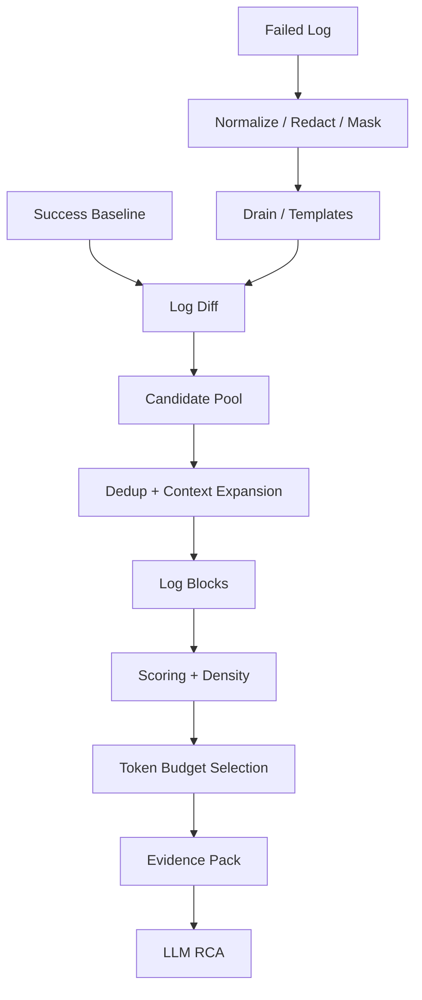
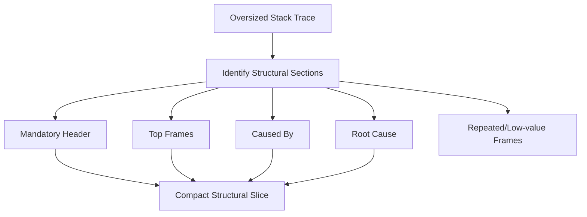
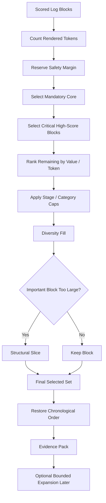

# Token Budget Selection Deep Dive

> A junior-engineer guide to how our CI/CD Log Intelligence Service chooses the **best evidence blocks** when the LLM can only receive a limited number of tokens.
>
> This chapter starts **after**:
>
> - success-baseline creation,
> - normalization / masking / Drain,
> - log diffing,
> - candidate selection,
> - deduplication,
> - context expansion,
> - LogBlock construction,
> - weighting,
> - block scoring,
> - and density calculation.
>
> At this point each block may already have:
>
> ```text
> diagnostic score
> token count
> score-per-token
> stage
> category
> mandatory flag
> reason codes
> provenance
> ```
>
> Now the question is:
>
> > **Given a hard token budget, which blocks should we actually send to the LLM?**

This chapter covers:

1. what a token budget is;
2. why token counting must use the actual model tokenizer;
3. evidence budget vs full model context;
4. mandatory evidence;
5. budget profiles such as 4K / 12K / 22K;
6. greedy selection;
7. score vs score-per-token;
8. diversity reserve;
9. stage/category caps;
10. oversized blocks;
11. structural slicing;
12. safety margins;
13. bounded expansion reserve;
14. chronological output ordering;
15. what happens when the budget is too small;
16. deterministic pseudocode;
17. alternatives such as knapsack;
18. observability and metrics;
19. failure modes;
20. what comes next.

---

# 1. Where This Fits

Our pipeline now looks like this:



This chapter is about:

```text
Scored Log Blocks
       ↓
Which ones fit?
       ↓
Evidence Pack
```

---

# 2. What Is a Token Budget?

An LLM does not think in:

```text
lines
characters
KB
```

It consumes:

```text
tokens
```

A token is roughly a small chunk of text.

For example:

```text
Connection refused to payment-db.internal
```

might use several tokens.

A 50-line stack trace can use hundreds or thousands.

So when we say:

```text
12K evidence budget
```

we mean approximately:

```text
12,000 model tokens
```

available for log evidence.

---

# 3. Evidence Budget Is NOT the Full Model Context

Suppose the model supports:

```text
32K tokens
```

We should not spend all 32K on logs.

The final LLM request also needs:

```text
system instructions
RCA instructions
pipeline metadata
repository/change context
evidence block headers
output schema
possibly conversation/tool context
space for model output
```

So:

```text
model context
≠
log evidence budget
```

Example:

```text
Model context capacity:      32,000
Prompt/instructions:          3,000
Metadata/context:             2,000
Output reserve:               5,000
Safety margin:                2,000
-----------------------------------
Available evidence:          20,000
```

Our selector should receive the already-decided:

```text
evidence_token_budget
```

rather than assuming the entire context window is available.

---

# 4. Use the Actual Model Tokenizer

Do not estimate using:

```text
characters / 4
```

for final production selection.

That can be useful for rough planning, but tokenization varies.

Examples that may tokenize differently:

```text
Java stack traces
UUIDs
long paths
JSON
base64-like strings
Unicode
compiler diagnostics
```

So our service should have something like:

```text
Tokenizer
```

with:

```text
countTokens(text, model)
```

The selector should use the tokenizer compatible with the target RCA model.

---

# 5. Why Tokenizer Version Should Be Recorded

If we change:

```text
model
or
tokenizer
```

the same block may have a different token count.

So the Evidence Pack should know:

```text
target_model
tokenizer_name
tokenizer_version
```

Example:

```json
{
  "tokenizer": {
    "model_family": "target-rca-model",
    "version": "v1"
  }
}
```

This helps reproducibility.

---

# 6. Input to the Token Selector

Imagine we have these blocks:

| Block | Score | Tokens | Score/Token | Category |
|---|---:|---:|---:|---|
| A | 12.4 | 300 | 0.041 | DB failure |
| B | 10.0 | 80 | 0.125 | Terminal failure |
| C | 9.2 | 1,500 | 0.006 | Stack trace |
| D | 7.0 | 200 | 0.035 | Dependency |
| E | 6.8 | 150 | 0.045 | Infrastructure |

Budget:

```text
2,000 tokens
```

We cannot simply include everything:

```text
300 + 80 + 1500 + 200 + 150
=
2230
```

We need selection logic.

---

# 7. First Principle — Mandatory Evidence

Some evidence should be reserved before normal ranking.

Examples:

```text
failed stage identity
terminal failure marker
process exit status
primary exception header
failed test summary
```

if present.

Why?

Because downstream RCA should always know:

```text
what failed?
how did the process terminate?
```

So the selector can first allocate:

```text
mandatory budget
```

---

# 8. Mandatory Evidence Is a Reservation, Not Unlimited Access

Suppose a stack trace is:

```text
12,000 tokens
```

We should not say:

```text
mandatory = true
therefore include all 12K
```

Instead:

```text
mandatory core
```

might be:

```text
exception header
first frames
Caused by
terminal exception
```

while the rest remains:

```text
ranked optional context
```

This distinction is important.

---

# 9. Proposed Budget Profiles

A useful initial design:

```text
FAST      = 4K evidence tokens
STANDARD  = 12K evidence tokens
DEEP      = 22K evidence tokens
CUSTOM    = caller-defined
```

These are evidence budgets, not total model context.

Example request from MCP:

```json
{
  "run_id": "9899",
  "budget_profile": "STANDARD"
}
```

Resolved by the service:

```text
evidence_token_budget = 12,000
```

---

# 10. Why Multiple Budget Profiles?

Different use cases need different tradeoffs.

## FAST

```text
small latency
small cost
quick RCA
```

## STANDARD

```text
default production diagnosis
```

## DEEP

```text
complex incident
more context
higher cost
```

This also lets us measure:

```text
Does 22K actually improve RCA enough over 12K?
```

---

# 11. Example Budget Allocation

For a 12K evidence budget, a starting design could reserve:

```text
Metadata / block headers     5%
Mandatory evidence          15%
Ranked evidence             65%
Diversity reserve           10%
Safety margin                5%
```

For 12,000 tokens:

```text
metadata/header reserve      600
mandatory reserve          1,800
ranked evidence            7,800
diversity reserve          1,200
safety margin                600
```

These are **starting design values**, not fixed truths.

---

# 12. Why Reserve a Safety Margin?

Exact final prompt construction adds tokens for:

```text
block IDs
stage labels
line ranges
reason codes
separators
JSON syntax
instructions
```

If we fill the budget to:

```text
12,000 / 12,000
```

then packaging may overflow.

So keep a margin.

Example:

```text
usable selector budget:
11,400

reserved safety:
600
```

---

# 13. Basic Greedy Selection

The simplest practical algorithm:

```text
1. include mandatory evidence
2. rank remaining blocks
3. iterate best → worst
4. add block if it fits
5. stop when budget is full
```

This is greedy selection.

---

# 14. But Rank by What?

We already have:

```text
diagnostic_score
```

and:

```text
score_per_token
```

Which should selection use?

Answer:

> **Usually both.**

---

# 15. Why Score Alone Is Not Enough

Block A:

```text
score = 12
tokens = 2,500
```

Block B:

```text
score = 10
tokens = 200
```

If we always choose score:

```text
A first
```

But B gives almost the same diagnostic value for far less budget.

That may be a better choice.

---

# 16. Why Score-per-Token Alone Is Not Enough

Block A:

```text
BUILD FAILURE
score = 8
tokens = 20
score/token = very high
```

Block B:

```text
40-line PSQLException stack trace
score = 12
tokens = 700
score/token = lower
```

Pure efficiency might prefer A.

But B is more useful for root cause.

So:

```text
score_per_token
```

cannot replace:

```text
diagnostic importance
```

---

# 17. Recommended V1 Strategy

Use categories:

```text
mandatory
high diagnostic score
efficient evidence
diversity evidence
```

A practical order:

```text
1. mandatory blocks/core ranges
2. very-high-score blocks
3. remaining blocks sorted by score-per-token
4. diversity fill
5. optional low-priority fill if space remains
```

This is simpler and safer than one magic formula.

---

# 18. Example Selection

Budget:

```text
2,000 tokens
```

Blocks:

```text
B terminal failure
80 tokens
mandatory

A DB failure
300 tokens
score 12.4

C stack trace
1500 tokens
score 9.2

D dependency error
200 tokens
score 7.0

E infrastructure warning
150 tokens
score 6.8
```

Step 1:

```text
select B
remaining = 1920
```

Step 2:

```text
select A
remaining = 1620
```

Step 3:

```text
C fits
remaining = 120
```

Then:

```text
D does not fit
E does not fit
```

Selected:

```text
B + A + C
```

---

# 19. But Maybe C Is Too Expensive

Suppose C is:

```text
1,900 tokens
```

Then after B + A:

```text
remaining = 1620
```

C does not fit.

We could choose:

```text
D + E
```

instead.

This is why oversized blocks need special handling.

---

# 20. Oversized Blocks

A block may be important but larger than the remaining budget.

Options:

```text
skip it
slice it
compress repeated sections
select mandatory core
reserve for expansion
```

We should not silently cut arbitrary text in the middle.

---

# 21. Structural Slicing

Suppose a Java exception block is:

```text
2,400 tokens
```

Remaining budget:

```text
900 tokens
```

Instead of raw head truncation, preserve structure:

```text
exception header
top frames
Caused by section
root cause exception
bottom relevant frames
```

Conceptually:



This is much better than:

```text
first 900 tokens
```

---

# 22. Head + Tail Inside an Oversized Block

When structural parsing is unavailable:

```text
head + tail
```

is a safe fallback.

Example:

```text
900-token allowance
```

Use:

```text
first 500 tokens
last 300 tokens
80 tokens for omission marker/header
```

Result:

```text
[first portion]

... 1,500 tokens omitted ...

[last portion]
```

Record:

```text
block_truncated = true
```

and original token count.

---

# 23. Do Not Lose Provenance During Slicing

If the original block is:

```text
lines 100–500
```

and selected slice contains:

```text
100–150
450–500
```

store:

```json
{
  "source_ranges": [
    {"start_line": 100, "end_line": 150},
    {"start_line": 450, "end_line": 500}
  ]
}
```

Do not pretend it is one continuous range.

---

# 24. Diversity Reserve

Suppose the top-ranked blocks are:

```text
Maven
Maven
Maven
Maven
Maven
```

but there is also:

```text
OOMKilled
```

slightly lower.

A diversity reserve prevents one category from consuming the entire budget.

Possible dimensions:

```text
stage
category
template family
failure type
```

---

# 25. Category Caps

Example:

```text
DEPENDENCY_RESOLUTION
```

can consume at most:

```text
40% of ranked evidence budget
```

Then another category gets room.

Possible config:

```yaml
category_caps:
  dependency_resolution: 0.40
  retry_noise: 0.20
```

These are optional V1 guardrails.

---

# 26. Stage Caps

DAG pipelines may have one very noisy stage.

Example:

```text
integration-test
```

generates 50 high-scoring blocks.

If we use all budget there, we may miss:

```text
upstream compile failure
terminal runner failure
infrastructure event
```

A stage cap can say:

```text
one stage cannot consume more than X%,
unless it contains mandatory evidence.
```

Again:

```text
mandatory evidence can override caps.
```

---

# 27. Diversity Does Not Mean Equal Allocation

If:

```text
integration-test clearly failed
```

we should not force equal tokens for:

```text
lint
compile
docker
```

Diversity is:

```text
avoid pathological domination
```

not:

```text
every stage gets the same budget.
```

---

# 28. Selection Order vs Output Order

Internally, select by:

```text
mandatory
score
score-per-token
diversity
```

But final evidence should usually be ordered by:

```text
original chronology
```

Example:

Selection order:

```text
Block C
Block A
Block F
```

Original log order:

```text
A line 100
C line 900
F line 1200
```

Final Evidence Pack:

```text
A
C
F
```

because chronology helps the LLM understand causality.

---

# 29. Why Chronology Matters

Failure story:

```text
connection retry
      ↓
connection refused
      ↓
exception
      ↓
test failed
      ↓
build failure
```

If we reorder purely by score:

```text
build failure
exception
retry
```

the narrative becomes harder to follow.

So:

> **Ranking order is for selection. Chronological order is for presentation.**

---

# 30. Bounded Expansion Reserve

Sometimes the first evidence pack is not enough.

The LLM may respond:

```text
INSUFFICIENT_EVIDENCE
```

We should allow bounded expansion.

Therefore we may intentionally reserve some capacity or support a second call.

Example:

```text
STANDARD initial evidence = 12K
expansion allowance       = +4K
maximum total             = 16K
```

The service can fetch:

```text
more context around specific blocks
or
next-best ranked blocks
```

without sending the full log.

---

# 31. Why Expansion Must Be Bounded

Do not allow:

```text
give me more
give me more
give me more
```

until the full 500K-token log is sent.

Set limits:

```text
max expansion requests
max additional tokens
max source ranges
```

Example:

```text
max_expansions = 2
max_extra_tokens = 6000
```

---

# 32. Expansion Strategies

If the LLM needs more evidence, possible expansion modes:

```text
NEXT_BEST_BLOCKS
AROUND_BLOCK
MORE_STACK_TRACE
MORE_STAGE_CONTEXT
MORE_BEFORE
MORE_AFTER
```

Example request:

```json
{
  "reduction_id": "red-829",
  "mode": "AROUND_BLOCK",
  "block_id": "b-003",
  "additional_tokens": 2000
}
```

---

# 33. What If the Budget Is Extremely Small?

Example:

```text
evidence budget = 500 tokens
```

We cannot include everything.

Priority becomes:

```text
1. terminal failure summary
2. primary strongest causal block
3. failed stage metadata
4. exit code / exception header
```

Do not attempt diversity if the budget is too small for basics.

The response should warn:

```text
budget_pressure = HIGH
```

---

# 34. What If Mandatory Evidence Alone Exceeds Budget?

Possible causes:

```text
huge stack trace marked mandatory
too many mandatory categories
very small custom budget
```

Then:

```text
mandatory blocks must be compacted
```

Use:

```text
mandatory core extraction
structural slicing
repetition compression
```

If still impossible:

```text
selection_status = DEGRADED
```

Do not silently violate the budget.

---

# 35. What If All Blocks Fit?

Great.

Then:

```text
selected_blocks = all_blocks
```

No need to prune just because the system has a ranking algorithm.

Token reduction is a means, not the goal.

If evidence is small:

```text
keep it.
```

---

# 36. What If No Useful Blocks Exist?

Possible causes:

```text
partial log
bad parser
new failure pattern
candidate rules too weak
```

Then fall back to safe evidence:

```text
failed-stage tail
terminal summary
non-zero exit
last bounded region
```

Return:

```text
selection_confidence = LOW
```

---

# 37. Greedy Selection Pseudocode

A simplified V1:

```python
def select_blocks(blocks, budget, tokenizer):

    selected = []
    used_tokens = 0

    mandatory = [b for b in blocks if b.mandatory]
    optional = [b for b in blocks if not b.mandatory]

    for block in compact_if_needed(mandatory, budget):
        cost = tokenizer.count(block.rendered_text)

        if used_tokens + cost <= budget:
            selected.append(block)
            used_tokens += cost

    optional = sorted(
        optional,
        key=lambda b: (
            b.high_priority_bucket,
            b.score_per_token,
            b.score
        ),
        reverse=True
    )

    for block in optional:

        if violates_stage_or_category_cap(block, selected):
            continue

        cost = tokenizer.count(block.rendered_text)

        if used_tokens + cost <= budget:
            selected.append(block)
            used_tokens += cost

    selected = apply_diversity_fill(
        selected=selected,
        remaining_candidates=optional,
        remaining_budget=budget - used_tokens
    )

    return sorted(
        selected,
        key=lambda b: b.original_start_line
    )
```

Real implementation should include:

```text
safety margin
header token cost
structural slicing
expansion reserve
provenance
selection reasons
```

---

# 38. Better V1 Selection Buckets

Instead of one sort list:

```text
Bucket 1 = mandatory
Bucket 2 = critical score
Bucket 3 = high score-per-token
Bucket 4 = diversity fill
Bucket 5 = optional fill
```

This is easier to understand and debug.

Example thresholds:

```text
critical score >= configured threshold
```

should be configuration-driven.

---

# 39. Why Not Solve It as Knapsack?

Mathematically, this resembles:

```text
0/1 knapsack
```

Each block has:

```text
value = diagnostic score
cost  = token count
```

Goal:

```text
maximize total value
under token budget
```

That sounds perfect.

But real evidence selection has extra constraints:

```text
mandatory blocks
stage caps
category diversity
overlapping context
structural slicing
chronology
block dependencies
```

So plain knapsack is not the whole problem.

---

# 40. Why Greedy Is a Good V1

Greedy selection is:

```text
fast
deterministic
easy to explain
easy to debug
easy to tune
```

For our initial service, that is valuable.

Later we can compare:

```text
greedy
vs
knapsack-like optimizer
vs
learning-to-rank selector
```

using evaluation data.

---

# 41. LogSage-Inspired Behavior

The LogSage design:

```text
creates weighted blocks
ranks by weight density
greedily appends high-density blocks
until the token budget is exhausted
```

The paper reports a reference token limit of:

```text
22,000 tokens
```

for its experimental setup.

That is the research inspiration.

---

# 42. Our Production Extensions

Our proposed service extends that idea with:

```text
actual model tokenizer
multiple budget profiles
mandatory evidence reserve
score-per-token
stage/category caps
diversity reserve
safety margin
oversized-block slicing
chronological final ordering
bounded expansion
budget-pressure/confidence metadata
```

These are our engineering decisions for a more production-safe system.

---

# 43. Do Not Blindly Copy 22K

The paper's:

```text
22K
```

worked in its setup.

Our environment may use:

```text
different RCA model
different prompt size
different log shapes
different cost target
```

So:

```text
4K / 12K / 22K
```

should be test profiles.

Measure:

```text
RCA correctness
critical evidence recall
cost
latency
```

Then decide default.

---

# 44. Budget Profile Configuration

Example:

```yaml
token_budgets:

  fast:
    evidence_tokens: 4000
    safety_margin_ratio: 0.05
    max_expansions: 1

  standard:
    evidence_tokens: 12000
    safety_margin_ratio: 0.05
    max_expansions: 2

  deep:
    evidence_tokens: 22000
    safety_margin_ratio: 0.05
    max_expansions: 2
```

And:

```text
policy_version = token-selection-v1
```

---

# 45. Selection Policy Must Be Versioned

Just like:

```text
normalization
masking
Drain
scoring
```

token selection must be versioned.

Why?

If we change:

```text
stage cap
mandatory reserve
sorting logic
budget allocation
```

the same run may produce a different Evidence Pack.

Store:

```text
token_selection_policy_version
```

---

# 46. Example Selection Result

```json
{
  "budget_profile": "STANDARD",

  "token_budget": 12000,

  "tokens_used": 10942,

  "safety_margin": 600,

  "selected_block_count": 11,

  "omitted_block_count": 28,

  "mandatory_tokens": 1310,

  "ranked_tokens": 8120,

  "diversity_tokens": 1512,

  "selection_policy_version": "v1"
}
```

---

# 47. Per-Block Selection Reason

Selected block:

```json
{
  "block_id": "b-003",
  "selected": true,
  "selection_reason": "HIGH_DIAGNOSTIC_SCORE",
  "score": 12.3,
  "token_count": 320
}
```

Another:

```json
{
  "block_id": "b-010",
  "selected": true,
  "selection_reason": "DIVERSITY_FILL",
  "category": "INFRASTRUCTURE"
}
```

Omitted:

```json
{
  "block_id": "b-021",
  "selected": false,
  "omission_reason": "BUDGET_EXHAUSTED"
}
```

Excellent for debugging.

---

# 48. Evidence Budget Should Include Block Headers

If final rendering is:

```text
[block:b-003]
Stage: integration-test
Lines: 80210-80235
Reasons: exception, failed-test, novelty

<log text>
```

token cost includes:

```text
header
metadata
log text
separator
```

So selector should count the **rendered block**, not only raw text.

---

# 49. Avoid Expensive Metadata Repetition

Do not repeat huge metadata for every block.

Example bad:

```text
repo
commit
pipeline
Jenkins URL
team
runner
toolchain
...
```

inside all 15 blocks.

Put run-level metadata once.

Per block keep only:

```text
block ID
stage
line range
reason summary
```

Saves tokens.

---

# 50. Block Dependency

Sometimes:

```text
Block B
```

only makes sense with:

```text
Block A
```

Example:

```text
A = command being executed
B = error summary
```

Our context merge should already combine them when close.

If they remain separate, we may support:

```text
related_block_ids
```

Then selector can avoid keeping B without A when necessary.

This can be a V2 feature.

---

# 51. Stage Priority

If failure metadata says:

```text
failed_stage = integration-test
```

then blocks from that stage can get more selection priority.

But scoring already encodes:

```text
failed_stage_relevance
```

So avoid double-counting too aggressively.

Use stage caps mainly as safety/diversity, not as another huge score boost.

---

# 52. Category Diversity Example

Budget:

```text
1,500 tokens
```

Candidate blocks:

```text
A dependency      300t score 10
B dependency      300t score 9.8
C dependency      300t score 9.5
D dependency      300t score 9.2
E infrastructure  250t score 9.0
F test failure    250t score 8.9
```

Pure score might choose:

```text
A B C D
```

Diversity-aware selection may choose:

```text
A B E F
```

because it covers:

```text
dependency
infrastructure
test failure
```

That may improve RCA.

We need evaluation to validate how much diversity helps.

---

# 53. Diversity Must Not Push Out Critical Evidence

If:

```text
A = PSQLException root cause score 13
B = failed test score 12
C = BUILD FAILURE score 11
```

do not remove B just to include:

```text
low-value lint warning
```

for diversity.

So diversity applies after:

```text
mandatory
+
critical/high-score evidence
```

---

# 54. Selection Confidence

We can report:

```text
HIGH
MEDIUM
LOW
```

based on:

```text
did mandatory evidence fit?
did top critical blocks fit?
how much high-score evidence was omitted?
was source complete?
were oversized blocks truncated?
```

Example:

```json
{
  "selection_confidence": "HIGH",
  "critical_blocks_covered": 4,
  "critical_blocks_total": 4
}
```

---

# 55. Budget Pressure

Another useful field:

```text
LOW
MEDIUM
HIGH
```

Example:

```text
budget = 12K
selected = 10.5K
high-score omitted = 0
```

Pressure:

```text
LOW
```

But:

```text
budget = 4K
high-score evidence available = 15K
```

Pressure:

```text
HIGH
```

This tells downstream RCA:

```text
evidence may be incomplete
```

---

# 56. What Statistics Should We Return?

Useful:

```text
original log token estimate
candidate block tokens
selected block tokens
reduction ratio

mandatory blocks selected
critical blocks omitted

category distribution
stage distribution

oversized blocks sliced
repeated blocks compressed

budget pressure
selection confidence
```

---

# 57. Token Reduction Ratio

Example:

```text
original failed log estimate = 160,000 tokens
selected evidence = 12,000 tokens
```

Reduction ratio:

```text
1 - 12000/160000
=
92.5%
```

Good.

But remember:

> **Reduction ratio alone is not success.**

If the root-cause block was omitted:

```text
92.5% reduction
```

is bad.

Measure evidence recall too.

---

# 58. Key Evaluation Metric — Evidence Recall Under Budget

Suppose human gold evidence includes:

```text
Block B
Block C
```

Our 4K selection includes:

```text
B only
```

Recall lower.

12K selection includes:

```text
B + C
```

better.

This helps decide whether:

```text
STANDARD = 12K
```

is enough.

---

# 59. Metrics to Compare Budget Profiles

For:

```text
4K
12K
22K
```

measure:

```text
critical evidence recall
RCA correctness
LLM cost
latency
average selected tokens
bounded expansion frequency
cost per correct diagnosis
```

Then choose defaults from real data.

---

# 60. Failure Mode — Tiny High-Density Noise

Example:

```text
ERROR
```

1 token.

Score-per-token may be huge.

But it carries little context.

Our previous block construction + scoring should reduce this risk.

Still, selector should not blindly trust efficiency.

---

# 61. Failure Mode — Huge Root-Cause Block

Example:

```text
large stack trace
```

high score but expensive.

Mitigation:

```text
structural slice
mandatory core
bounded expansion
```

---

# 62. Failure Mode — One Category Dominates

Mitigation:

```text
category caps
diversity fill
repetition compression
```

---

# 63. Failure Mode — Mandatory Set Is Too Big

Mitigation:

```text
mandatory core extraction
hard cap
structural slicing
selection degradation warning
```

---

# 64. Failure Mode — Tokenizer Count Mismatch

If selector uses:

```text
approximate tokenizer
```

but final LLM uses a different tokenizer, request may overflow.

Mitigation:

```text
model-specific tokenizer
safety margin
final recount before request
```

---

# 65. Failure Mode — Output Reserve Forgotten

If evidence uses the entire context window:

```text
model has no room to answer
```

Always reserve output tokens before deciding evidence budget.

---

# 66. Failure Mode — Chronology Lost

If final blocks are ordered by score:

```text
symptom
then root cause
then setup
```

can confuse RCA.

Restore chronological order after selection.

---

# 67. Failure Mode — Expansion Becomes Full-Log Retrieval

Mitigation:

```text
bounded expansion count
bounded extra tokens
specific expansion modes
audit
```

---

# 68. Recommended V1 Policy

A reasonable starting strategy:

```text
1. Resolve evidence budget profile.

2. Reserve 5% safety margin.

3. Render and count mandatory cores.

4. Include mandatory evidence.

5. Include very-high-score blocks if they fit.

6. Rank remaining blocks primarily by score-per-token,
   with diagnostic score as a guardrail.

7. Apply simple stage/category caps.

8. Use a small diversity reserve.

9. Structurally slice important oversized blocks.

10. Stop when usable budget is exhausted.

11. Restore chronological order.

12. Record omissions and budget pressure.

13. Support at most bounded evidence expansions.
```

This is deterministic and explainable.

---

# 69. Suggested Policy Configuration

```yaml
token_selection_policy: v1

profiles:
  fast:
    evidence_tokens: 4000

  standard:
    evidence_tokens: 12000

  deep:
    evidence_tokens: 22000

safety_margin_ratio: 0.05

mandatory:
  max_ratio: 0.20

diversity:
  reserve_ratio: 0.10

caps:
  max_stage_ratio: 0.70
  max_category_ratio: 0.50

oversized_block:
  allow_structural_slice: true
  fallback_head_ratio: 0.60
  fallback_tail_ratio: 0.30

expansion:
  max_requests: 2
  max_total_extra_tokens: 6000
```

These values are starting points only.

---

# 70. Full Whiteboard Flow



---

# 71. Junior-Engineer Mental Model

Imagine you have:

```text
one page
```

to brief an engineer about a production incident.

You have 20 notes.

You ask:

```text
Which notes are essential?
Which notes are strongest?
Which give the most information per line?
Are all notes about the same thing?
Am I missing another failure category?
Can I shorten a giant note without losing the key facts?
```

That is token-budget selection.

The LLM context window is simply our limited page.

---

# 72. The One Rule to Remember

> **Token budgeting is not "take the shortest evidence." It is "fit the highest-value diagnostic story into a limited space without dropping critical facts."**

---

# 73. What Comes Next?

The next deep dive should be:

# **Evidence Pack Design + Bounded Expansion / Insufficient-Evidence Handling**

Why?

After Token Budget Selection, we finally have:

```text
the exact blocks we want the LLM to see
```

Now we need a stable contract between:

```text
Python Log Intelligence Service
```

and:

```text
Spring Boot MCP Server / RCA LLM
```

The next chapter should cover:

```text
1. EvidencePack JSON schema
2. run metadata
3. baseline metadata
4. block IDs
5. stage/DAG information
6. source line ranges
7. reason codes
8. block score / token statistics
9. omissions
10. reduction confidence
11. selection confidence
12. warnings
13. preprocessing/scoring/selection versions
14. how the LLM cites blocks
15. INSUFFICIENT_EVIDENCE response
16. bounded expansion API
17. expansion modes
18. auditability
19. fallback evidence pack
20. how MCP passes the pack to the RCA prompt
```

The learning sequence is now:

```text
1. Normalize / Mask / Drain / Baseline       ✅

2. Log Diff + Candidate Selection            ✅

3. Dedup + Context Expansion + Log Blocks    ✅

4. Weighting + Scoring + Density             ✅

5. Token Budget Selection                    ✅ this document

6. Evidence Pack + Bounded Expansion         ← NEXT

7. LLM RCA
```

That is the clean next step.

---

# 74. Research vs Our Production Design

## LogSage-inspired core

The research design uses:

```text
weighted blocks
density ranking
greedy selection
token budget
```

and reports:

```text
22K tokens
```

as its experimental pruning budget.

## Our proposed production extensions

We add:

```text
actual model tokenizer
evidence-budget profiles
mandatory reservations
score-per-token
stage/category caps
diversity reserve
safety margin
oversized structural slicing
chronological final ordering
budget-pressure metadata
bounded expansion
selection-policy versioning
```

These extensions are our engineering design for the separate CI/CD Log Intelligence Service.
