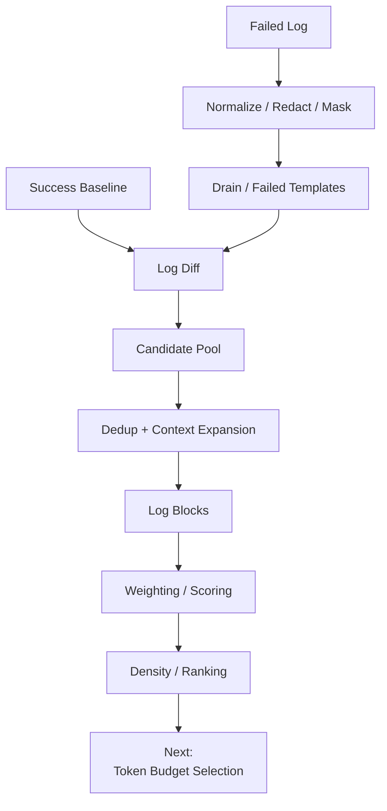
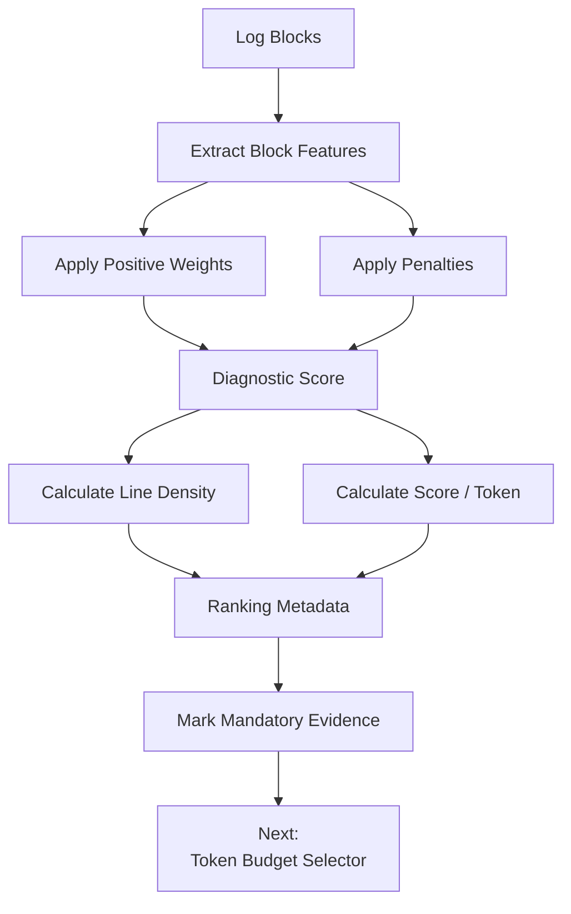

# Weighting + Block Scoring + Density Deep Dive

> A junior-engineer deep dive into how our CI/CD Log Intelligence Service decides **which log blocks are more important than others**.
>
> This chapter starts **after**:
>
> - success-baseline creation,
> - normalization / masking / Drain,
> - log diffing,
> - candidate selection,
> - deduplication,
> - context expansion,
> - and LogBlock construction.
>
> At this point we may have:
>
> ```text
> Block A
> Block B
> Block C
> Block D
> ...
> ```
>
> All of them contain potentially useful evidence.
>
> Now we need to answer:
>
> > **Which blocks deserve the most attention?**
>
> This chapter covers:
>
> 1. weighting vs scoring;
> 2. how LogSage weights candidate lines;
> 3. strong failure markers;
> 4. how our candidate reason codes become scoring features;
> 5. baseline novelty/support;
> 6. failed-stage relevance;
> 7. exception/test/exit signals;
> 8. tail prior;
> 9. known-noise and repetition penalties;
> 10. block scoring;
> 11. density;
> 12. score-per-line vs score-per-token;
> 13. why score alone is not enough;
> 14. mandatory evidence;
> 15. diversity;
> 16. ranking order vs final chronological order;
> 17. configuration-driven weights;
> 18. calibration and tuning;
> 19. explainability;
> 20. edge cases;
> 21. V1 pseudocode;
> 22. what comes next.

---

# 1. Where We Are in the Pipeline

Our pipeline now looks like this:



This chapter is about:

```text
Log Blocks
    ↓
How important is each one?
```

---

# 2. Why We Need Weighting

Imagine our reducer produces these four blocks.

## Block A

```text
Downloading Maven dependencies
Downloaded junit.jar
Downloaded jackson.jar
```

## Block B

```text
WARNING cache server unavailable
Using local cache fallback
```

## Block C

```text
Connecting to payment-db
Connection refused
PSQLException
PaymentServiceIT FAILED
```

## Block D

```text
BUILD FAILURE
Process exited with code 1
```

All four may have entered the candidate pipeline.

But clearly:

```text
C and D
```

look much more useful than:

```text
A and B
```

We need a deterministic way to express that.

---

# 3. Weighting vs Scoring

These words are related but we should use them carefully.

## Line/Event Weighting

A line or candidate gets importance points.

Example:

```text
Connection refused        → 3 points
PSQLException             → 5 points
--- FAIL: PaymentTest     → 10 points
```

This is close to how LogSage explains its pruning logic.

## Block Scoring

A whole contextual block gets one diagnostic score based on all evidence inside it.

Example:

```text
Block C:
Connection refused
PSQLException
PaymentServiceIT FAILED

score = 9.2
```

Our service will mostly **rank blocks**, not isolated lines.

So:

```text
candidate signals
      ↓
line/event features
      ↓
block-level features
      ↓
block score
```

---

# 4. What LogSage Actually Does

LogSage's Token Overflow Pruning stage uses a structured line-weighting approach before ranking blocks.

Its process is approximately:

```text
candidate lines
      ↓
initial weights
      ↓
strong-pattern boosts
      ↓
context expansion
      ↓
contiguous blocks
      ↓
weight density
      ↓
rank blocks
      ↓
greedy token-budget selection
```

This is the **research design**.

Our production scoring model can borrow the idea without having to copy every exact constant.

---

# 5. LogSage Initial Candidate Weight

LogSage starts with:

```text
candidate line → weight 1
normal line    → weight 0
```

But if the candidate pool is relatively small and sparse, candidate lines can receive:

```text
weight 3
```

The paper defines:

```text
weight = 3
if:
candidate ratio <= α
AND
candidate count <= β

otherwise:
weight = 1
```

Reported parameters:

```text
α = 0.7
β = 500
```

The intuition is more important than the formula.

If filtering already found only a small number of suspicious lines:

```text
those candidates are probably valuable
```

so they start with stronger weights.

---

# 6. Junior Version of LogSage Initial Weighting

Imagine:

```text
100,000-line log
```

and filtering finds only:

```text
120 candidate lines
```

That is sparse.

So LogSage says conceptually:

```text
"These 120 candidates are probably meaningful.
Give them stronger starting weight."
```

But if filtering finds:

```text
80,000 candidate lines
```

then filtering was not selective.

So:

```text
"Do not give every candidate a high weight."
```

That is what the adaptive initial weighting is trying to do.

---

# 7. Strong Failure Markers in LogSage

After the initial weight, LogSage applies rule-based boosts.

The paper describes strong markers such as:

```text
--- FAIL:
Failures:
```

as receiving the maximum weight:

```text
weight = 10
```

Other curated failure keywords or section headers receive a moderate boost:

```text
weight += 2
```

Remaining recall-pool candidates receive lighter reinforcement:

```text
weight += 1
```

So conceptually:

```text
ordinary candidate             low
failure keyword                medium
very strong failure marker     high
```

---

# 8. Example Line Weights

A simplified example:

```text
Downloading dependency
    → 0

WARNING cache unavailable
    → 1

Connection refused
    → 3

PSQLException
    → 5

--- FAIL: PaymentServiceIT
    → 10
```

The exact numbers above are illustrative except where we explicitly reference LogSage's reported maximum strong-marker weight.

The idea is:

> **Not all suspicious lines are equally strong evidence.**

---

# 9. LogSage Context Threshold

LogSage also chooses which weighted lines deserve contextual expansion.

The paper uses an adaptive threshold:

```text
θ = 1
or
θ = 3
```

depending on the weight distribution.

It reports:

```text
γ = 500
```

as the threshold used in this adaptive logic.

The beginner-friendly idea is:

```text
if the system has weak or sparse signals:
    expand more broadly

if strong evidence is already clear:
    focus context around strong lines
```

Our service already performs structural context expansion earlier, so we do not have to copy this exact ordering.

---

# 10. LogSage Block Density

After creating contiguous log blocks, LogSage calculates:

```text
density(block)
=
sum of line weights in block
----------------------------
number of lines in block
```

Example:

## Block A

```text
50 lines
total weight = 5

density = 5 / 50
        = 0.10
```

## Block B

```text
10 lines
total weight = 20

density = 20 / 10
        = 2.0
```

Block B has much more concentrated failure evidence.

So it ranks higher.

---

# 11. Why Density Matters

Suppose:

## Block A

```text
100 lines
one error
99 setup lines
```

Total score:

```text
10
```

## Block B

```text
10 lines
Connection refused
PSQLException
FAILED
exit code 1
```

Total score:

```text
20
```

Block B is clearly better.

But now imagine:

## Block C

```text
300 lines
10 medium-strength warnings
```

Total score:

```text
30
```

Score alone says:

```text
C > B
```

But C may contain a lot of noise.

Density helps ask:

> **How much diagnostic value are we getting for the space occupied?**

---

# 12. Backpack Analogy

Imagine the LLM context is a backpack.

You can carry:

```text
12 kg
```

Items:

```text
first-aid kit     1 kg   extremely useful
water             1 kg   useful
laptop            2 kg   useful
20 random books  15 kg   maybe useful
```

You do not choose based only on:

```text
total usefulness
```

You also think:

```text
usefulness per kilogram
```

Logs are similar.

Instead of kilograms:

```text
lines
or
tokens
```

---

# 13. Line Density vs Token Density

LogSage's paper defines density using:

```text
sum(weights)
---------------
number of lines
```

For our service, we should consider going one step further.

LLMs pay for:

```text
tokens
```

not lines.

Compare:

## Block A

```text
10 very short lines
100 tokens
```

## Block B

```text
10 huge Java stack-trace lines
900 tokens
```

Same line count.

Very different cost.

So our production selector may want:

```text
score_per_token
=
diagnostic score
----------------
token count
```

rather than only:

```text
score_per_line
```

This is an **our-design extension**, not the exact LogSage density formula.

---

# 14. Proposed Separation: Score and Efficiency

For each block store both:

```text
diagnostic_score
```

and:

```text
score_per_token
```

Example:

```json
{
  "diagnostic_score": 9.4,
  "token_count": 240,
  "score_per_token": 0.039
}
```

Why both?

Because sometimes a very important block is large.

We should not discard it just because its efficiency is lower.

---

# 15. Score Alone Can Be Misleading

Block A:

```text
score = 9
tokens = 100
```

Block B:

```text
score = 10
tokens = 2500
```

If B contains the actual root cause:

```text
PSQLException
Caused by ConnectException
failed test
```

we may still need B.

So:

```text
highest score-per-token
```

cannot be our only rule.

We need:

```text
mandatory evidence
+
diagnostic score
+
efficiency
+
diversity
```

This becomes especially important in the next Token Budget chapter.

---

# 16. From Candidate Reasons to Scoring Features

Our previous stages already produce reason codes such as:

```text
NOVEL_VS_SUCCESS
RARE_IN_SUCCESS
FREQUENCY_ANOMALY
FAILURE_KEYWORD
FAILED_STAGE
EXCEPTION
FAILED_TEST
NONZERO_EXIT
NEAR_TAIL
TERMINAL_FAILURE
COMPILER_ERROR
INFRASTRUCTURE_ERROR
```

Instead of inventing scoring information again, convert these into normalized block features.

Example:

```json
{
  "baseline_novelty": 1.0,
  "exit_or_termination_strength": 0.0,
  "failed_stage_relevance": 1.0,
  "exception_strength": 0.8,
  "failed_test_strength": 1.0,
  "tail_prior": 0.7
}
```

---

# 17. Proposed Block Features

For our first production design, useful features may include:

```text
explicit_failure_strength
exit_or_termination_strength
baseline_novelty
baseline_rarity
failed_stage_relevance
structured_trace_strength
failed_test_strength
compiler_error_strength
infrastructure_error_strength
tail_prior
frequency_anomaly_strength
signal_density
known_noise_strength
baseline_commonness
repetition_penalty
```

All can be normalized to:

```text
0.0 → 1.0
```

---

# 18. Explicit Failure Strength

Examples:

```text
BUILD FAILURE
--- FAIL:
FAILED
fatal
panic
```

Possible interpretation:

```text
none                 0.0
weak failure word    0.3
clear failure        0.7
terminal failure     1.0
```

No LLM required.

Rule-based.

---

# 19. Exit or Termination Strength

Examples:

```text
exit code 1
exit code 137
Killed
OOMKilled
timeout
aborted
```

These are often strong pipeline-failure signals.

Possible values:

```text
no exit signal      0.0
generic nonzero     0.7
OOM / killed        1.0
```

The exact calibration is ours to tune.

---

# 20. Baseline Novelty

From our log-diff layer:

```text
seen 3/3 successful runs
    → low novelty

seen 1/3
    → medium novelty

seen 0/3
    → high novelty
```

Example:

```text
support ratio = 3/3
novelty = 0.0 or very low

support ratio = 1/3
novelty = medium

support ratio = 0/3
novelty = 1.0
```

Again, do not treat this as absolute truth.

It is one feature.

---

# 21. Failed-Stage Relevance

If the block belongs to:

```text
the actual failed DAG node
```

that is useful.

Example:

```text
stage = integration-test
failed_stage = integration-test
```

Feature:

```text
failed_stage_relevance = 1.0
```

Block from:

```text
successful lint stage
```

may get:

```text
0.0
```

But terminal/global infrastructure failures may be exceptions.

---

# 22. Structured Trace Strength

A block containing:

```text
exception header
stack frames
Caused by
```

is often diagnostically rich.

Examples:

```text
Java stack trace
Python traceback
Node stack
Go panic
.NET exception
```

Possible feature:

```text
structured_trace_strength = high
```

This should usually beat an isolated `WARNING`.

---

# 23. Failed-Test Strength

A block containing:

```text
test name
expected
actual
assertion
failure summary
```

is highly useful.

Example:

```text
PaymentServiceTest FAILED
Expected: 200
Actual: 500
```

This can receive strong scoring.

---

# 24. Tail Prior

Tail is useful, but it should be weaker than direct failure evidence.

Example:

```text
near end of log
```

does not automatically mean:

```text
root cause
```

So:

```text
tail_prior
```

should be a modest boost.

Think:

```text
small prior
not dominant signal
```

---

# 25. Frequency-Anomaly Strength

Example:

Success runs:

```text
Retrying connection
count = 0, 1, 2
```

Failed run:

```text
count = 400
```

Feature:

```text
frequency_anomaly_strength = high
```

This is useful even if the template itself is present in success.

---

# 26. Known Noise Strength

Our success baseline may learn:

```text
WARNING cache unavailable
Using local fallback
```

appears:

```text
3/3 successful runs
```

and has no downstream failure.

So:

```text
known_noise_strength
```

can reduce the score.

But remember:

> **Penalty, not deletion.**

---

# 27. Baseline Commonness

If a template appears:

```text
hundreds of times
in every healthy run
```

then it is strongly common.

This can reduce importance.

Example:

```text
Downloaded artifact <*>
```

Maybe:

```text
baseline_commonness = 1.0
```

Penalty applied.

---

# 28. Repetition Penalty

Suppose a block contains:

```text
Retry 1
Retry 2
Retry 3
...
Retry 500
```

We already compress repetition.

But repeated evidence may still dominate score.

So:

```text
repetition_penalty
```

can stop one repeated event from overwhelming the ranking.

Important:

```text
frequency anomaly
```

and:

```text
repetition penalty
```

are not contradictory.

We can say:

```text
"Repeating 500 times is important"
```

while also saying:

```text
"Do not spend half the token budget showing every repetition."
```

---

# 29. Signal Density

A block with many independent strong reasons is valuable.

Block:

```text
Connection refused
PSQLException
PaymentServiceIT FAILED
BUILD FAILURE
```

contains:

```text
novelty
exception
failed test
failure keyword
tail
failed stage
terminal failure
```

Signal density is high.

Compare:

```text
WARNING cache unavailable
```

with only:

```text
keyword
```

Signal density is low.

---

# 30. Proposed Production Block Score

A practical first-version formula could be:

```text
score(block) =

    4.0 * explicit_failure_strength

  + 3.5 * exit_or_termination_strength

  + 3.0 * baseline_novelty

  + 2.5 * failed_stage_relevance

  + 2.0 * structured_trace_or_test_strength

  + 1.5 * tail_prior

  + 1.5 * frequency_anomaly_strength

  + 1.0 * signal_density

  - 2.0 * known_noise_strength

  - 1.0 * baseline_commonness

  - 0.5 * repetition_penalty
```

Important:

> **This is our proposed production formula, not the exact LogSage algorithm.**

The exact numbers are starting weights only.

They must be tuned using our own evaluation data.

---

# 31. Why Configuration, Not Hard-Coded Constants

Do not write:

```python
if exception:
    score += 2.0
```

everywhere.

Prefer versioned configuration:

```yaml
scoring_policy: v1

weights:
  explicit_failure_strength: 4.0
  exit_or_termination_strength: 3.5
  baseline_novelty: 3.0
  failed_stage_relevance: 2.5
  trace_or_test_strength: 2.0
  tail_prior: 1.5
  frequency_anomaly_strength: 1.5
  signal_density: 1.0

penalties:
  known_noise_strength: 2.0
  baseline_commonness: 1.0
  repetition_penalty: 0.5
```

Then:

```text
same log
+
same baseline
+
same scoring-policy version
=
same score
```

Reproducible.

---

# 32. Store Feature Values With the Score

Do not return only:

```text
score = 8.7
```

Return:

```json
{
  "score": 8.7,

  "features": {
    "explicit_failure_strength": 0.7,
    "baseline_novelty": 1.0,
    "failed_stage_relevance": 1.0,
    "structured_trace_strength": 0.8,
    "tail_prior": 0.5,
    "known_noise_strength": 0.0
  }
}
```

Then engineers can understand:

```text
why did this block rank high?
```

---

# 33. Example Block A

```text
WARNING cache unavailable
Using local fallback
```

Features:

```text
explicit_failure_strength = 0.2
baseline_novelty = 0.0
failed_stage_relevance = 0.0
tail_prior = 0.0
known_noise_strength = 1.0
baseline_commonness = 1.0
```

Likely:

```text
low score
```

---

# 34. Example Block B

```text
Connecting to payment-db
Connection refused
PSQLException
PaymentServiceIT FAILED
```

Features:

```text
explicit_failure_strength = 0.7
baseline_novelty = 1.0
failed_stage_relevance = 1.0
structured_trace_or_test_strength = 1.0
tail_prior = 0.5
known_noise_strength = 0.0
```

Likely:

```text
high score
```

---

# 35. Example Block C

```text
BUILD FAILURE
Process exited with code 1
```

Features:

```text
explicit_failure_strength = 1.0
exit_or_termination_strength = 1.0
baseline_novelty = 1.0
failed_stage_relevance = 1.0
tail_prior = 1.0
```

Very high score.

But remember:

```text
this tells us the build failed
```

not necessarily:

```text
the root cause
```

So mandatory terminal evidence can coexist with higher-value causal evidence.

---

# 36. Block Score vs Root-Cause Score

Important distinction.

Our score means:

> **How diagnostically useful is this block?**

It does not mean:

```text
Probability this is the root cause = 92%
```

Do not interpret:

```text
score = 9.2
```

as probability.

It is a ranking score.

---

# 37. Density in Our Production Design

We can calculate:

## Line density

```text
line_density
=
block score
------------
line count
```

## Token efficiency

```text
token_efficiency
=
block score
------------
token count
```

Both can be useful.

Example:

```json
{
  "score": 9.4,
  "line_count": 14,
  "token_count": 220,
  "line_density": 0.671,
  "score_per_token": 0.0427
}
```

---

# 38. Why Not Rank Only by Density?

Imagine:

## Block A

```text
BUILD FAILURE
```

1 line.

Density:

```text
very high
```

## Block B

```text
40-line stack trace
with actual nested root cause
```

Density:

```text
lower
```

If we rank only density:

```text
BUILD FAILURE
```

may beat the actual diagnostic stack trace.

Not good.

So we need:

```text
score
+
density
+
mandatory evidence
+
diversity
```

---

# 39. Why Not Rank Only by Score?

Opposite problem.

Block A:

```text
3000 tokens
score 12
```

Block B:

```text
200 tokens
score 10
```

Block A is only slightly more valuable but costs 15× more.

Token efficiency matters.

That is why the final selector needs a balance.

---

# 40. Mandatory Evidence

Some evidence should be protected from ordinary ranking.

Examples:

```text
final process exit status
terminal failure marker
identified failed stage
primary exception header
```

if present.

Why?

Because even if their density is lower, downstream RCA needs basic failure facts.

We can mark blocks:

```json
{
  "mandatory": true
}
```

or mark specific subranges.

---

# 41. Mandatory Does Not Mean Unlimited

Imagine:

```text
50,000-line exception trace
```

We cannot mark all of it mandatory.

Instead:

```text
mandatory core
+
ranked extended context
```

Example:

```text
exception header
Caused by
terminal status
```

mandatory.

Huge repeated frames:

```text
optional / compressible
```

---

# 42. Diversity

Suppose the top 20 blocks are all:

```text
Maven dependency warnings
```

Meanwhile:

```text
one Kubernetes OOM block
```

ranks #21.

Pure score sorting may fill the budget with one category.

We want some evidence diversity.

Possible dimensions:

```text
stage
diagnostic category
template family
failure type
```

---

# 43. Diversity Example

Token budget can hold 4 blocks.

Scores:

```text
A Maven warning        9.0
B Maven warning        8.8
C Maven warning        8.7
D Maven warning        8.5
E OOMKilled             8.4
```

Pure score:

```text
A B C D
```

Diversity-aware selection might choose:

```text
A B C E
```

because:

```text
E adds new diagnostic information
```

This belongs mainly to the next Token Budget chapter, but scoring needs to expose categories for it.

---

# 44. Per-Stage Diversity

DAG pipeline:

```text
compile
unit-test
integration-test
docker
deploy
```

If the actual failure is in:

```text
integration-test
```

most budget should focus there.

But keeping:

```text
terminal pipeline summary
```

or a relevant upstream infrastructure block may still help.

So eventual token selection can set:

```text
max budget fraction per stage
```

rather than allowing one stage to consume everything.

---

# 45. Ranking Order vs Output Order

This is subtle.

We may rank:

```text
Block C score 10
Block A score 9
Block D score 8
Block B score 7
```

Selection order:

```text
C → A → D → B
```

But once selected, the LLM should usually receive them in:

```text
original chronological order
```

Why?

Because logs tell a story.

So:

```text
ranking order
=
used internally for selection

output order
=
original source chronology
```

---

# 46. Example

Original order:

```text
Block A line 100
Block B line 500
Block C line 800
```

Scores:

```text
A = 8
B = 4
C = 10
```

Selector picks:

```text
C first
A second
```

Final LLM evidence should be:

```text
Block A
then
Block C
```

because:

```text
100 comes before 800
```

This makes RCA easier.

---

# 47. Scoring Policy Versioning

Just like preprocessing, scoring must be versioned.

Example:

```json
{
  "scoring_policy_version": "v3"
}
```

Why?

Suppose yesterday:

```text
baseline_novelty weight = 3.0
```

Today:

```text
baseline_novelty weight = 1.5
```

The same log now ranks differently.

We need to know:

```text
which policy produced the evidence pack?
```

---

# 48. Configuration Should Be Tenant-Safe

Do not allow arbitrary teams to set:

```text
FAILED = score -100
```

and accidentally suppress critical evidence.

Possible layers:

```text
company safe defaults
+
toolchain-specific tuning
+
controlled pipeline overrides
```

Critical guardrails should not be overrideable.

Example:

```text
terminal_failure
nonzero_exit
secret-redaction rules
```

should remain protected.

---

# 49. Calibration

How do we know if weights are good?

Use our labeled evaluation corpus.

For each failed run, humans identify:

```text
actual critical evidence blocks
```

Then check:

```text
Where did those blocks rank?
```

Useful metrics:

```text
critical block top-1 recall
critical block top-3 recall
critical block top-5 recall
mean reciprocal rank
evidence recall under token budget
```

---

# 50. Weight Tuning Example

Suppose evaluation shows:

```text
actual root-cause compiler errors
often rank below generic BUILD FAILURE
```

Maybe:

```text
compiler_error_strength
```

needs a stronger weight.

Or:

```text
terminal failure marker
```

needs a smaller ranking contribution but stays mandatory.

We tune using evidence.

Not intuition alone.

---

# 51. Avoid Overfitting

Do not tune weights only on:

```text
Maven Java pipelines
```

if the company also has:

```text
npm
Go
Python
Docker
Kubernetes
mobile
```

Use diverse failures.

Otherwise:

```text
great on Maven
bad everywhere else
```

---

# 52. Scoring by Failure Category

Later we may use different policies for:

```text
test failures
compiler failures
dependency failures
infrastructure failures
deployment failures
```

But V1 should remain simpler.

One global policy with clear features is easier to validate.

---

# 53. Explainability

For every block we should answer:

```text
Why did this score 9.4?
```

Example:

```json
{
  "block_id": "b-003",

  "score": 9.4,

  "reasons": [
    "NOVEL_VS_SUCCESS",
    "EXCEPTION",
    "FAILED_TEST",
    "FAILED_STAGE"
  ],

  "feature_contributions": [
    {
      "feature": "baseline_novelty",
      "value": 1.0,
      "weight": 3.0,
      "contribution": 3.0
    },
    {
      "feature": "failed_stage_relevance",
      "value": 1.0,
      "weight": 2.5,
      "contribution": 2.5
    },
    {
      "feature": "trace_or_test_strength",
      "value": 1.0,
      "weight": 2.0,
      "contribution": 2.0
    }
  ]
}
```

Very useful for tuning.

---

# 54. Penalty Explainability

Example benign block:

```json
{
  "score": 0.8,

  "penalties": [
    {
      "feature": "known_noise_strength",
      "value": 1.0,
      "weight": -2.0
    },
    {
      "feature": "baseline_commonness",
      "value": 1.0,
      "weight": -1.0
    }
  ]
}
```

Then engineers understand:

```text
"Why did cache warning rank low?"
```

---

# 55. Score Normalization

Our raw weighted formula may produce:

```text
-3
to
15
```

We may keep raw scores internally.

Or normalize for presentation:

```text
0–10
```

But if we normalize, preserve raw feature contributions.

Do not make scoring opaque.

---

# 56. Negative Scores

Can a block score below zero?

Yes.

Example:

```text
common benign warning
seen 3/3 successful runs
not failed stage
no exception
not tail
```

Raw score may be negative.

We can clamp:

```text
final_score = max(0, raw_score)
```

for easier interpretation.

Still keep:

```text
raw_score
```

for debugging.

---

# 57. Edge Case — No Success Baseline

If baseline is missing:

```text
baseline_novelty = unavailable
baseline_commonness = unavailable
```

Do not pretend:

```text
novelty = 1.0
```

That would incorrectly boost everything.

Instead:

```text
feature_status = MISSING
```

and score using:

```text
failure markers
stage
exception
exit
tail
frequency where possible
```

---

# 58. Edge Case — Low-Confidence Baseline

If:

```text
baseline confidence = LOW
```

then reduce its influence.

Example:

```text
effective_novelty_weight
=
base_novelty_weight
*
baseline_confidence_factor
```

If:

```text
baseline confidence = 0.4
```

then novelty contributes less.

This is an **our-design safety extension**.

---

# 59. Edge Case — Huge Block

Block:

```text
10,000 tokens
score = 15
```

Do not simply discard it.

Possible next-stage strategy:

```text
mandatory core
+
structural compression
+
token-budget-aware slicing
```

This is mainly Token Budgeting.

Scoring should expose:

```text
score
token_count
structural_type
mandatory_core_ranges
```

---

# 60. Edge Case — One Extremely Strong Failure Marker

Example:

```text
--- FAIL: TestPayment
```

very high weight.

But suppose its block is:

```text
only that one line
```

while a nearby block contains the actual assertion.

Our earlier context expansion should normally merge them.

If not, diversity/context rules should prevent the one-line marker from crowding out the richer evidence.

---

# 61. Edge Case — Many Failure Markers

Suppose generated test output contains:

```text
10,000 lines containing FAILED
```

We cannot give every one maximum score.

Use:

```text
repetition compression
category caps
deduplication
frequency-aware representation
```

Scoring should operate on compressed blocks.

---

# 62. Edge Case — Generic ERROR in Success Runs

Example:

```text
ERROR cache unavailable
Using fallback
```

Seen in every success run.

Features:

```text
failure_keyword = yes
baseline_novelty = low
known_noise = high
baseline_commonness = high
```

Result:

```text
low overall score
```

Exactly what we want.

---

# 63. Edge Case — No ERROR Word

Example:

```text
Connection refused
```

No literal:

```text
ERROR
```

But:

```text
baseline_novelty high
failed stage
exception nearby
```

can give it a strong score.

This is why multi-signal scoring is better than grep.

---

# 64. Example Complete Scoring Walkthrough

Block:

```text
Running PaymentServiceIT
Connecting payment-db
Connection refused
org.postgresql.util.PSQLException
PaymentServiceIT FAILED
```

Features:

```text
explicit_failure_strength = 0.8
exit_or_termination       = 0.0
baseline_novelty          = 1.0
failed_stage_relevance    = 1.0
trace_or_test_strength    = 1.0
tail_prior                = 0.5
frequency_anomaly         = 0.0
signal_density            = 0.9
known_noise               = 0.0
baseline_commonness       = 0.0
repetition_penalty        = 0.0
```

Using the proposed formula:

```text
4.0 * 0.8 = 3.2
3.5 * 0.0 = 0.0
3.0 * 1.0 = 3.0
2.5 * 1.0 = 2.5
2.0 * 1.0 = 2.0
1.5 * 0.5 = 0.75
1.5 * 0.0 = 0.0
1.0 * 0.9 = 0.9
```

Total:

```text
12.35
```

This is a strong block.

Again:

```text
12.35 is not 12.35% probability.
```

It is a ranking value.

---

# 65. Compare With Benign Cache Block

```text
WARNING cache unavailable
Using local fallback
```

Features:

```text
explicit_failure_strength = 0.2
baseline_novelty = 0.0
failed_stage_relevance = 0.0
tail_prior = 0.0
known_noise = 1.0
baseline_commonness = 1.0
```

Approximate contribution:

```text
+0.8
-2.0
-1.0
```

Raw:

```text
-2.2
```

Clamp:

```text
score = 0
```

Low priority.

---

# 66. Density Example

Payment block:

```text
score = 12.35
tokens = 300

score_per_token
= 12.35 / 300
≈ 0.041
```

Huge noisy block:

```text
score = 14
tokens = 4000

score_per_token
= 14 / 4000
= 0.0035
```

Even though raw score is slightly higher:

```text
the payment block gives much more value per token.
```

This becomes useful for budget selection.

---

# 67. LogSage vs Our Production Model

Keep this distinction explicit.

## LogSage's research mechanism

Uses:

```text
candidate-line weights
adaptive initial weighting
strong marker weight = 10
keyword boosts
adaptive context threshold
block weight density =
sum(line weights) / block line count
density ranking
greedy token-budget selection
```

Reported reference values include:

```text
α = 0.7
β = 500
γ = 500
token limit = 22,000
```

## Our proposed service

Uses the same main idea:

```text
stronger evidence gets stronger priority
dense blocks are efficient
```

but extends it with:

```text
baseline support
DAG/stage relevance
exit signals
structured trace/test strength
frequency anomaly
known-noise penalty
baseline commonness
repetition penalty
score-per-token
mandatory evidence
diversity metadata
confidence-aware baseline contribution
```

These extensions are **our engineering design**, not direct LogSage claims.

---

# 68. Why We Should Not Blindly Copy LogSage Constants

LogSage's parameters were chosen for its environment.

Our company may have:

```text
different Jenkins plugins
different pipeline sizes
different languages
different stage structures
different LLM models
different token budgets
```

So:

```text
10
3
2
22,000
```

are useful references.

They are not universal truth.

We need our own evaluation.

---

# 69. Scoring Metrics

To evaluate scoring quality:

```text
critical evidence rank
top-K critical evidence recall
evidence recall after budget selection
noise retained
token cost
RCA correctness
```

Example:

```text
Actual root-cause block rank = #1
```

good.

```text
Actual root-cause block rank = #47
```

bad.

---

# 70. A/B Test Scoring Policies

Example:

```text
Policy v1
baseline novelty weight = 3.0

Policy v2
baseline novelty weight = 2.0
trace strength weight = 3.0
```

Run both on the same frozen labeled failures.

Compare:

```text
root-cause rank
evidence recall
tokens required
RCA accuracy
```

Then choose based on measurement.

---

# 71. Deterministic First

V1 should remain:

```text
rule-based
configuration-driven
reproducible
```

No learned ranking model yet.

Why?

Because we need:

```text
understand behavior
collect labels
build trust
measure mistakes
```

Later, if we have enough labeled incidents:

```text
learning-to-rank
```

could be explored.

But deterministic scoring stays as a guardrail.

---

# 72. Suggested Block Model After Scoring

```json
{
  "block_id": "b-003",

  "stage_id": "integration-test",

  "start_line": 80210,
  "end_line": 80235,

  "reason_codes": [
    "NOVEL_VS_SUCCESS",
    "EXCEPTION",
    "FAILED_TEST",
    "FAILED_STAGE"
  ],

  "features": {
    "explicit_failure_strength": 0.8,
    "baseline_novelty": 1.0,
    "failed_stage_relevance": 1.0,
    "trace_or_test_strength": 1.0,
    "tail_prior": 0.4,
    "known_noise_strength": 0.0
  },

  "raw_score": 12.2,
  "score": 10.0,

  "token_count": 320,
  "score_per_token": 0.03125,

  "mandatory": false,

  "category": "TEST_DATABASE_FAILURE",

  "scoring_policy_version": "v1"
}
```

---

# 73. Whiteboard Flow



---

# 74. Junior-Engineer Mental Model

Imagine we are reviewing incident notes.

Note A:

```text
"Warning occurred."
```

Note B:

```text
"Database connection refused.
PSQLException.
Payment test failed."
```

Note C:

```text
"BUILD FAILURE."
```

We mentally ask:

```text
Which note contains stronger evidence?

Which one is known noise?

Which one comes from the failed stage?

Which one contains an exception?

Which one tells us only the final symptom?

How much space does each note take?
```

Weighting and scoring automate that reasoning.

---

# 75. The One Rule to Remember

> **Score measures diagnostic usefulness; density measures diagnostic usefulness relative to space.**

We need both.

Do not confuse:

```text
highest score
```

with:

```text
best use of limited LLM context.
```

---

# 76. What Should We Deep-Dive Next?

The next topic should be:

# **Token Budgeting + Block Selection Strategy**

Now we have blocks with:

```text
diagnostic score
token count
score-per-token
category
stage
mandatory flag
```

The next question is:

> **Given a hard evidence budget, which blocks do we actually keep?**

We should deep-dive:

```text
1. model token counting
2. evidence budget vs full model context
3. mandatory reservations
4. greedy selection
5. score vs score-per-token
6. diversity reserve
7. stage/category caps
8. oversized blocks
9. knapsack-style alternatives
10. safety margin
11. chronological output ordering
12. 4K / 12K / 22K budget profiles
13. bounded expansion reserve
14. what happens when budget is too small
15. what statistics we return
```

The learning path is now:

```text
1. Normalize / Mask / Drain / Baseline       ✅

2. Log Diff + Candidate Selection            ✅

3. Dedup + Context Expansion + Log Blocks    ✅

4. Weighting + Scoring + Density             ✅ this document

5. Token Budget Selection                    ← NEXT

6. Evidence Pack

7. LLM RCA
```

That is the clean next step.

---

# 77. Research Reference

The LogSage-specific weighting and density details in this document are based on:

**LogSage: An LLM-Based Framework for CI/CD Failure Detection and Remediation with Industrial Validation**

arXiv v2:

https://arxiv.org/html/2506.03691v2

Relevant section:

```text
III-B3 Token Overflow Pruning Module
```

The production feature model, penalties, score-per-token idea, mandatory-evidence behavior, diversity metadata, DAG relevance, baseline-confidence scaling, and configuration structure described here are **our proposed engineering extensions** for the separate Log Intelligence Service.
