# Drain + Reusable Success Templates — Separate Log Intelligence Service Design

> Beginner-friendly deep dive for our environment: multiple Jenkins instances, many teams/projects/repos, DAG-style pipelines, parallel stages, Jenkins-first log retrieval with UDS fallback, an existing Spring Boot MCP server, and a **new separate Python Log Intelligence Service** that owns Drain/template learning and intelligent log reduction.

---

# 0. What are we trying to solve?

Our current problem is not simply:

> "How do I make a large Jenkins log smaller?"

The real problem is:

> "How do I remove the **normal, repeated CI/CD noise** while keeping the lines that are unusual and useful for diagnosing a failure?"

LogSage solves part of this by learning what a **successful execution normally looks like**.

The offline idea is:

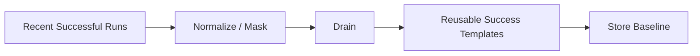

Later, when a build fails:

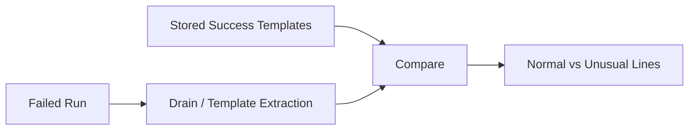

For us, the key question is:

> **How do we make that work when every team has its own Jenkins instance, repositories, pipeline definitions, stages, agents, tools, and parallel DAG execution?**

That is what this document explains.

---

# 0.1 Architecture Decision — Which Programming Language Should We Use?

For the new separate service, my recommendation is:

> **Use Python for V1 and the first production version.**

The new service will be called in this document:

```text
Log Intelligence Service
```

Its responsibilities will eventually include:

```text
successful-log baseline creation
Drain template mining
template persistence
failed-log template extraction
log diffing
candidate generation
context expansion
block ranking
token budgeting
evidence-pack generation
```

The existing Spring Boot MCP server will **not** implement these algorithms itself.

Instead:

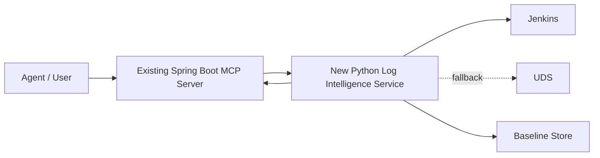

## Why Python?

### Reason 1 — Drain3 is already implemented in Python

The most practical reason is that the actively used reference implementation of Drain, **Drain3**, is a Python project.

That means instead of doing this:

```text
read Drain paper
    ↓
rewrite Drain in Java
    ↓
debug our implementation
    ↓
prove it behaves like Drain
```

we can begin with:

```text
use proven Drain3 implementation
    ↓
wrap it behind our own TemplateMiner interface
    ↓
focus engineering effort on OUR real problems
```

Those real problems are:

```text
pipeline identity
team isolation
DAG stages
baseline mapping
versioning
redaction
Jenkins / UDS integration
log diffing
ranking
token optimization
```

Drain3 is designed as a streaming log-template miner, so it fits our workload naturally.

### Reason 2 — Strong ecosystem for log/text processing

This service will do a lot of operations such as:

```text
regex / masking
text normalization
stream processing
tokenization
template mining
statistical analysis
later possibly embeddings / ML
```

Python has a very mature ecosystem for these tasks.

That does **not** mean Python is magically faster than Java.

It means:

> We can implement and experiment with this kind of algorithmic service faster with fewer custom components.

### Reason 3 — Easy API boundary with FastAPI

A small FastAPI layer can expose APIs such as:

```text
POST /v1/reductions
GET  /v1/baselines/{...}
POST /v1/baselines/rebuild
GET  /health
```

The Spring Boot MCP server does not need to know that Drain is implemented in Python.

From MCP's point of view:

```text
HTTP request
    ↓
JSON response
```

That's it.

### Reason 4 — Separation removes the biggest argument for Java

If this logic had to live **inside** the existing MCP application, Java/Spring Boot would be attractive because the rest of the application is already Java.

But we have now decided:

> **This will be a separate service.**

Therefore language consistency inside one process is no longer necessary.

A clean service API is the contract.

### Reason 5 — Future experimentation becomes easier

Later we may experiment with:

```text
Drain parameters
different log parsers
lightweight classifiers
embeddings
near-duplicate detection
statistical anomaly detection
```

Python gives us a convenient environment for those experiments.

---

# 0.2 Python vs Java vs Go

| Area | Python | Java / Spring Boot | Go |
|---|---|---|---|
| Drain3 integration | **Best — native reference implementation** | Would likely require port/wrapper/alternative | Would require port/wrapper/alternative |
| Text/log experimentation | **Excellent** | Excellent | Good |
| API development | FastAPI is simple | Excellent | Excellent |
| Streaming I/O | Good | Excellent | Excellent |
| CPU efficiency | Good enough initially | Very good | Very good |
| Existing company MCP stack | Different runtime | **Same stack** | Different runtime |
| Future ML/embedding experiments | **Excellent** | Good | Limited compared with Python |
| Speed of prototyping | **Excellent** | Good | Good |
| Operational simplicity if company is JVM-only | Moderate | **Best** | Moderate |

## When would I choose Java instead?

Choose Java if:

```text
our platform only allows JVM services
or
the team has much stronger Java operational expertise
or
security/observability libraries are only supported internally for Java
or
Python deployment is prohibited
```

Java itself is completely capable of processing large logs.

The downside is mainly:

> We may need to implement or maintain our own Drain-compatible parser instead of using Drain3 directly.

## What about Go?

Go is attractive for high-throughput streaming services.

But for **this particular service**, our early engineering risk is not raw HTTP throughput.

Our bigger risks are:

```text
template quality
baseline correctness
DAG mapping
log-diff accuracy
evidence recall
```

So I would optimize for correctness and iteration speed first.

## Final decision

```text
Recommended:
Python + FastAPI

Template miner:
Drain3 behind our own abstraction

Storage:
PostgreSQL first
Redis optional for hot baseline cache

Existing MCP:
Spring Boot remains unchanged architecturally
and calls the service over HTTP
```

Important:

> Our business logic should depend on our own interfaces, not directly on Drain3 everywhere.

For example:

```python
class TemplateMiner:
    def build_profile(self, logs):
        ...

    def match(self, line, profile):
        ...
```

If we ever replace Drain3 later, the rest of the service should not care.


---

# 1. First: What Is Drain?

Drain is a **log parsing / template-mining algorithm**.

Do not think of it as AI.

Do not think of it as an LLM.

Do not think of it as something that understands the meaning of an error.

Think of Drain as a very fast librarian that looks at millions of log lines and says:

> "These lines have the same shape. I will put them into the same bucket."

Example:

```text
Downloaded junit-5.10.jar in 420ms
Downloaded jackson-core-2.17.jar in 515ms
Downloaded slf4j-api-2.0.jar in 390ms
```

A human sees the common pattern:

```text
Downloaded <FILE> in <DURATION>
```

Drain can learn a reusable template such as:

```text
Downloaded <*> in <*>ms
```

Another example:

```text
Connecting to 10.10.1.10 port 5432
Connecting to 10.10.1.11 port 5432
Connecting to 10.10.1.12 port 5432
```

After masking:

```text
Connecting to <IP> port <NUM>
```

This is a **log template**.

---

# 2. Why Do We Need Templates?

Consider three successful Jenkins runs.

## Successful run #101

```text
Starting agent worker-21
Workspace /jenkins/workspace/payment-101
Downloading junit.jar
Compiling payment-service
Running 124 tests
BUILD SUCCESS
```

## Successful run #102

```text
Starting agent worker-27
Workspace /jenkins/workspace/payment-102
Downloading junit.jar
Compiling payment-service
Running 126 tests
BUILD SUCCESS
```

## Successful run #103

```text
Starting agent worker-19
Workspace /jenkins/workspace/payment-103
Downloading junit.jar
Compiling payment-service
Running 125 tests
BUILD SUCCESS
```

Exact string comparison would say many lines are different:

```text
worker-21 != worker-27
payment-101 != payment-102
124 != 126
```

But as engineers we know these are normal variable values.

Drain helps us learn:

```text
Starting agent <*>
Workspace <*>
Downloading junit.jar
Compiling payment-service
Running <NUM> tests
BUILD SUCCESS
```

Now we have a compact description of what a healthy build normally prints.

---

# 3. What Does "Reusable Template" Actually Mean?

A common misunderstanding is:

```text
One pipeline
    ↓
One giant template
```

That is **not** what we want.

A reusable success baseline should contain a **set of log templates**.

Example:

```text
Template T001
Starting agent <*>

Template T002
Workspace <*>

Template T003
Downloading <*> from <*>

Template T004
Compiling payment-service

Template T005
Running <NUM> tests

Template T006
Tests run: <NUM>, Failures: 0

Template T007
BUILD SUCCESS
```

In our design, a template should also carry metadata.

Example:

```json
{
  "template_id": "t-005",
  "template": "Running <NUM> tests",
  "stage": "unit-test",
  "occurrence_count": 3,
  "supporting_success_runs": ["101", "102", "103"]
}
```

So when we say:

> "Store the success template"

we really mean:

> **Store a versioned success baseline/profile containing many templates and useful metadata.**

---

# 4. Drain's Job vs Our Baseline Service's Job

These are different responsibilities.

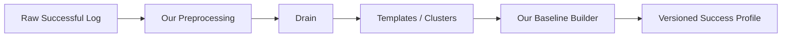

Drain does:

```text
raw lines
    ↓
group similar lines
    ↓
generalize variable parts
    ↓
templates
```

Our system does:

```text
which successful runs?
which team?
which pipeline?
which stage?
which agent/toolchain?
where should templates be stored?
when should they expire?
which baseline is compatible with a failed build?
```

Drain does **not** solve those company-specific mapping questions for us.

We need to design that layer ourselves.

---

# 5. Drain Step by Step

Let's use three lines.

```text
User rahul logged in
User priya logged in
User aman logged in
```

## Step 1 — Preprocess / mask obvious variables

Before Drain, we may mask known variable patterns.

For example:

```text
Job 98173 running on 10.1.2.3
Job 98210 running on 10.1.2.7
```

becomes:

```text
Job <NUM> running on <IP>
Job <NUM> running on <IP>
```

Typical things we may mask:

```text
timestamps
IP addresses
UUIDs
build numbers
durations
ports
commit hashes
temporary paths
request IDs
```

Important:

> **Masking is not the same as deleting the line.**

We keep the structure, but replace changing values.

---

# 6. Step 2 — Tokenize the Line

Drain splits the message into tokens.

Example:

```text
User rahul logged in
```

becomes approximately:

```text
["User", "rahul", "logged", "in"]
```

Four tokens.

Another line:

```text
Downloaded junit jar
```

becomes:

```text
["Downloaded", "junit", "jar"]
```

Three tokens.

Token count is important because Drain uses it as one of the first routing decisions.

---

# 7. Step 3 — Fixed-Depth Parse Tree

This is where the name "Drain" can sound complicated.

Think of a supermarket.

Instead of comparing your new product with every item in the entire store, you first go to:

```text
Floor
  ↓
Aisle
  ↓
Shelf
  ↓
small group of products
```

Drain does something similar.

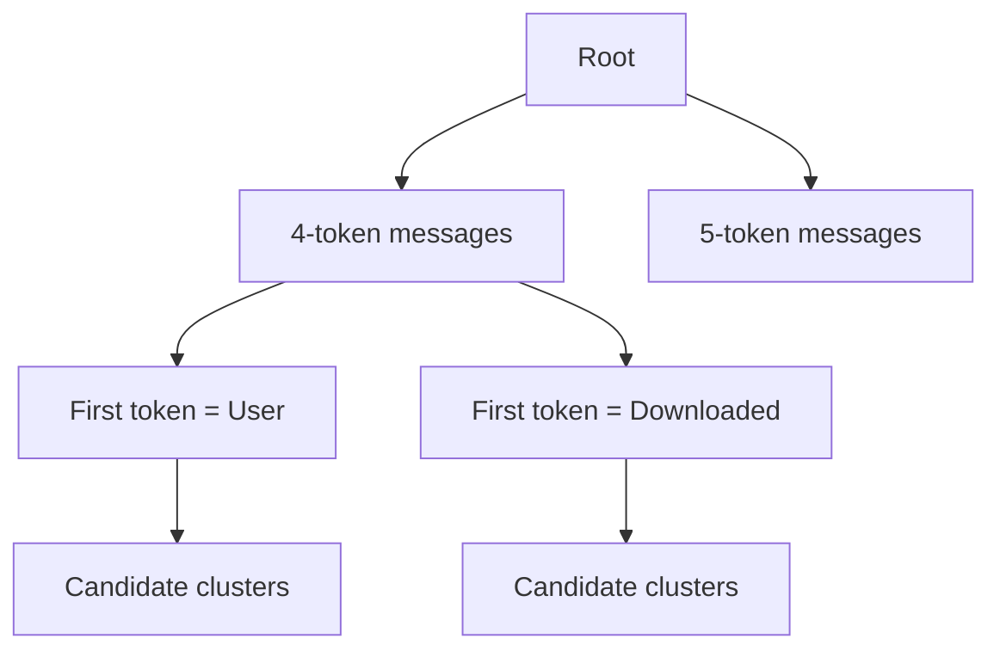

The tree has a fixed maximum depth.

This prevents Drain from creating an enormous, deeply nested search structure.

Instead of comparing a new log line against 50,000 templates, Drain routes it to a much smaller candidate set.

---

# 8. Step 4 — Compare With Existing Clusters

Suppose Drain already knows:

```text
User rahul logged in
```

Now it receives:

```text
User priya logged in
```

Token comparison:

```text
User    == User      MATCH
rahul   != priya     DIFFERENT
logged  == logged    MATCH
in      == in        MATCH
```

So:

```text
3 out of 4 positions are the same
```

Drain calculates similarity.

If similarity is high enough, it decides:

```text
These lines belong to the same log event / cluster.
```

If similarity is too low, Drain creates a new cluster.

---

# 9. Step 5 — Generalize the Template

Originally:

```text
User rahul logged in
```

New line:

```text
User priya logged in
```

The differing position becomes a wildcard:

```text
User <*> logged in
```

Now:

```text
User aman logged in
```

also matches.

The reusable template becomes:

```text
User <*> logged in
```

---

# 10. Full Drain Mental Model

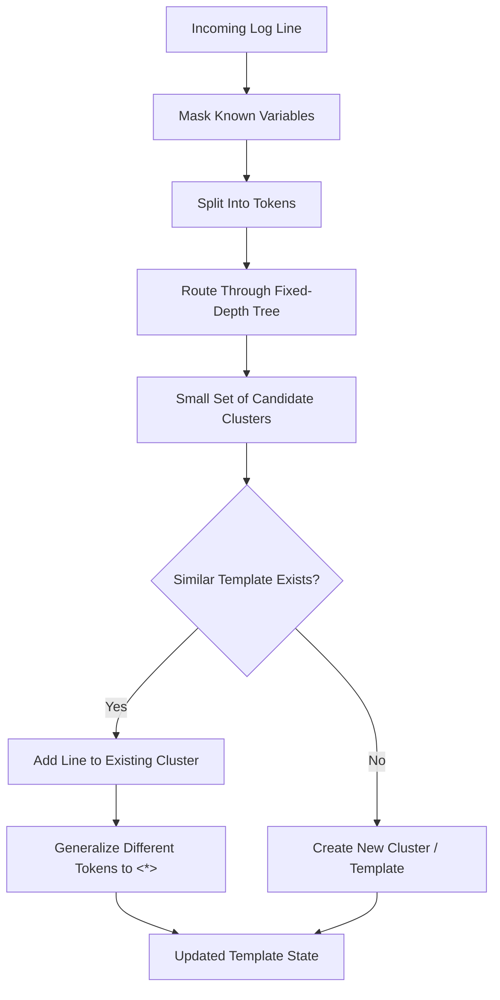

That is Drain.

At a beginner level, remember:

> **Route → Compare → Cluster → Generalize.**

---

# 11. Drain Is Online/Streaming Even Though LogSage Uses It in an "Offline" Phase

This wording can be confusing.

Drain itself supports streaming log messages:

```text
line 1 arrives → process
line 2 arrives → process
line 3 arrives → process
```

It does not need an LLM training job.

LogSage calls template preparation "offline" because it happens **before a failed run needs diagnosis**.

So:

```text
"Offline LogSage step"
does NOT mean
"Drain can only run in batch."
```

For our architecture, we can process successful logs asynchronously after a run completes.

---

# 12. Our Company Environment

Our environment is more complicated than:

```text
one Jenkins
one repo
one pipeline
```

We have something closer to:

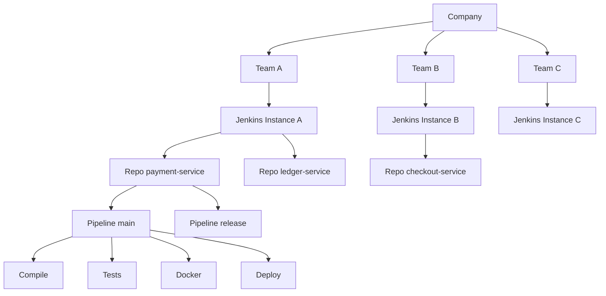

Therefore:

> **We cannot create one company-wide Drain template set.**

That would mix unrelated logs and make the baseline useless.

---

# 13. The Most Important Design Question: "Which Successful Runs Belong Together?"

Suppose we have:

```text
Team A
payment-service
main pipeline
Java 21
Maven
Linux runner
```

and another pipeline:

```text
Team B
mobile-app
release pipeline
Node.js
npm
macOS runner
```

Their successful logs are completely different.

They must not share the same baseline.

We need a **Baseline Key**.

---

# 14. Recommended Baseline Key

Start strict.

Conceptually:

```text
tenant/team
+
repository
+
logical pipeline/job
+
stage
+
pipeline definition fingerprint
+
runner/agent family
+
major toolchain
+
normalizer version
+
template parser version
```

Example:

```text
team          = payments
repo          = payment-service
pipeline      = main-ci
stage         = integration-test
jenkinsfile   = hash:a81f...
runner        = linux-java21
toolchain     = maven-4
normalizer    = v2
drain-config  = v1
```

That entire combination points to one compatible success baseline.

---

# 15. Why Jenkins Instance Should Not Be Our Only Key

Imagine:

```text
Jenkins Instance A

payment-service
inventory-service
mobile-app
platform-tools
```

If we use:

```text
jenkins_instance = A
```

as the template key, we mix four unrelated pipelines.

Bad idea.

Now imagine `payment-service` moves from Jenkins A to Jenkins B.

If everything else stays compatible, we may still want to reuse the logical baseline.

Therefore:

> Jenkins instance is important **source/provenance metadata**, but it should not be the only identity of a success baseline.

However, if Jenkins instances use meaningfully different agents/toolchains/configuration, that difference should enter the **compatibility fingerprint**.

---

# 16. Recommended Mapping Hierarchy

Think:

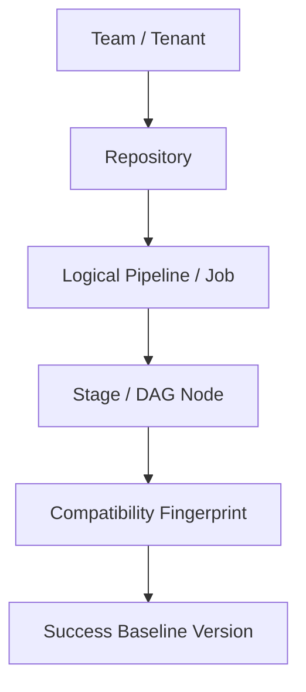

Example:

```text
payments
  └── payment-service
       └── main-ci
            ├── compile
            │    └── fingerprint java21+maven+linux
            │
            ├── unit-test
            │    └── fingerprint java21+maven+linux
            │
            └── docker-build
                 └── fingerprint docker-buildx+linux
```

---

# 17. Why Stage-Level Baselines Matter for Our DAG Pipelines

Our CI is DAG-based and stages can run in parallel.

Example:

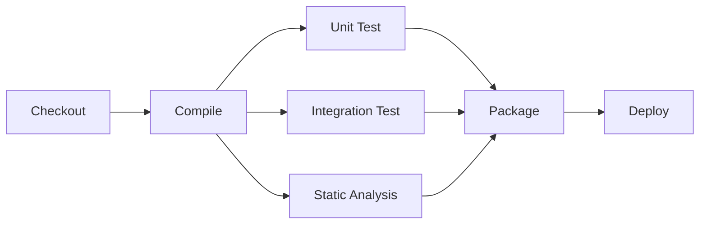

Now imagine these run in parallel:

```text
Unit Test
Integration Test
Static Analysis
```

Their console lines may become interleaved.

Example:

```text
[unit] Running PaymentTest
[lint] Running checkstyle
[integration] Starting postgres
[unit] Test 1 passed
[integration] Connecting DB
[lint] 0 violations
[unit] Test 2 passed
```

If we treat this as one linear "normal sequence", the ordering may change on every run.

Next successful run:

```text
[integration] Starting postgres
[unit] Running PaymentTest
[unit] Test 1 passed
[lint] Running checkstyle
[integration] Connecting DB
...
```

Both are healthy.

The global line order changed only because branches ran concurrently.

---

# 18. Important DAG Design Rule

For parallel pipelines:

> **Do not make global log order the main definition of "normal."**

Instead, prefer:

```text
stage-local / node-local templates
```

Example:

```text
unit-test baseline:
    Running <*>Test
    Test <*> passed
    Tests run: <NUM>, Failures: 0

integration-test baseline:
    Starting postgres
    Connecting to <HOST>
    Integration tests passed

static-analysis baseline:
    Running checkstyle
    <NUM> violations
```

Then parallel scheduling does not matter very much.

---

# 19. DAG-Aware Offline Flow

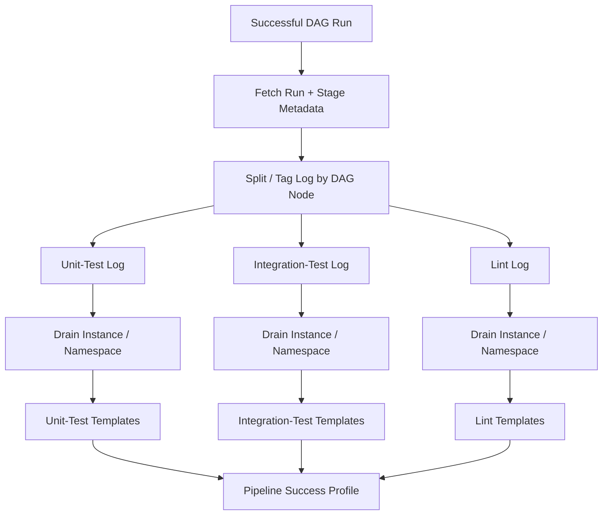

We do not necessarily need three physical Drain processes.

"Drain instance / namespace" means:

> Do not mix incompatible stage template states.

---

# 20. What If Jenkins Gives Us Stage Metadata?

Best case:

```text
stage_id
stage_name
parallel_branch
job_id
node_id
```

Then mapping is easy.

Example line internally:

```json
{
  "line": "Connection to payment-db established",
  "stage": "integration-test",
  "dag_node": "integration-test"
}
```

Drain processes it under:

```text
payments/payment-service/main-ci/integration-test
```

---

# 21. What If We Only Have One Interleaved Console Log?

Then we need fallback strategies.

Priority:

```text
1. Jenkins structured stage metadata
2. Pipeline/plugin markers
3. Prefixes like [unit], [lint], [integration]
4. Textual stage boundaries
5. Unknown/run-level baseline
```

If we cannot reliably recover the DAG structure:

```text
baseline_scope = RUN_LEVEL
confidence = LOWER
```

We should not pretend stage mapping is perfect.

---

# 22. Dynamic DAG Nodes / Test Shards

Suppose we have:

```text
test-shard-1
test-shard-2
test-shard-3
...
test-shard-20
```

Creating twenty unrelated baselines may be unnecessary if they execute the same kind of work.

We may normalize the logical stage identity:

```text
test-shard-1
test-shard-2
test-shard-3
```

into:

```text
test-shard-<NUM>
```

But only if:

```text
same command
same toolchain
same environment family
same expected logging shape
```

Do not merge them merely because their names look similar.

---

# 23. Where Should We Store the Templates?

Important distinction:

Drain creates **parser state / clusters**.

Our product needs a **baseline store**.

Drain3 itself supports persistence of learned state using mechanisms such as:

```text
Kafka
Redis
File
```

But for our company architecture, I recommend treating persistence as our own service contract rather than coupling the entire design to a Drain implementation.

---

# 24. Recommended Storage Design

For our first production design:

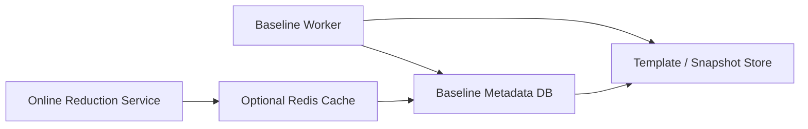

A practical starting point could be:

```text
PostgreSQL:
    baseline identity
    version
    compatibility fingerprint
    source success runs
    freshness
    template metadata
    counts
    config versions

JSON/JSONB or object storage:
    larger template profile / Drain snapshot

Redis:
    optional hot cache
```

For a smaller initial system, PostgreSQL/JSONB may be enough.

We do **not** need a vector database for Drain templates.

Why?

Because online log diff is mostly:

```text
extract template
    ↓
does compatible success baseline contain this template?
```

That is structured lookup, not semantic RAG.

---

# 25. Example Baseline Record

```json
{
  "baseline_id": "baseline-92811",
  "team": "payments",
  "repository": "payment-service",
  "pipeline": "main-ci",
  "stage": "integration-test",

  "compatibility_fingerprint": "cf-21aa9",

  "source": {
    "jenkins_instance": "jenkins-payments-01",
    "success_runs": [9811, 9822, 9837]
  },

  "versions": {
    "normalizer": "2",
    "masking_policy": "4",
    "drain_config": "1"
  },

  "templates": [
    {
      "template_id": "t1",
      "template": "Starting postgres container <*>",
      "count": 3
    },
    {
      "template_id": "t2",
      "template": "Connecting to <HOST> port <NUM>",
      "count": 3
    },
    {
      "template_id": "t3",
      "template": "Integration tests passed",
      "count": 3
    }
  ],

  "created_at": "2026-08-15T10:00:00Z"
}
```

The exact database schema can change later.

The important idea is the mapping.

---

# 26. Should This Be a Scheduled Process?

My recommendation:

> **Primary mechanism: event-driven.**
>
> **Secondary mechanism: scheduled reconciliation/backfill.**

Do not make "run every night at 2 AM" the main design if successful builds happen continuously.

---

# 27. Event-Driven Offline Flow

Whenever a compatible pipeline finishes successfully:

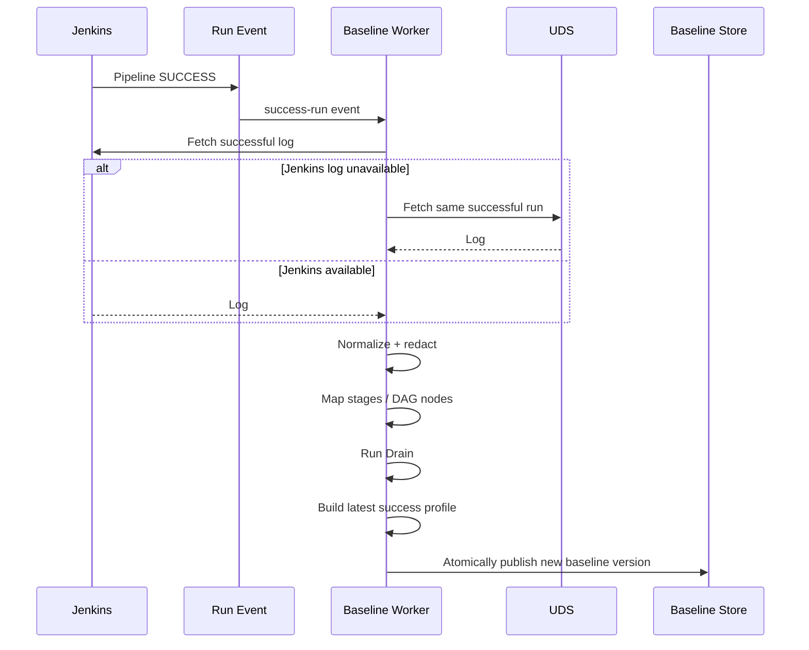

The successful pipeline should **not wait** for template generation.

Template generation is asynchronous.

---

# 28. Why Event-Driven Is Better

Suppose:

```text
10:00 build success
10:15 pipeline config changes
10:20 build success
10:30 build failure
```

A nightly scheduled baseline might still represent yesterday's pipeline.

An event-driven baseline can already know about today's successful configuration.

That matters because freshness is very important for log diff.

---

# 29. Why We Still Need a Scheduled Job

Events can be lost.

Workers can fail.

A Jenkins outage can prevent fetching a log.

Therefore also run reconciliation periodically:

```text
Every N hours:
    find successful runs
    whose baseline event was not processed
        ↓
    rebuild missing/stale profile
```

So:

```text
Event-driven = normal path

Schedule = safety net
```

---

# 30. Should We Update Drain Incrementally or Rebuild From Recent Successes?

There are two approaches.

## Option A — Keep Learning Forever

```text
Success #1 → Drain
Success #2 → same Drain state
Success #3 → same Drain state
...
Success #5000 → same state
```

Problem:

The baseline can accumulate very old patterns.

Imagine six months ago the build used Gradle.

Today it uses Maven.

If both remain in the same "normal" set, we may incorrectly treat obsolete lines as normal.

---

# 31. Option B — Rolling Recent-Success Window

This is closer to the LogSage idea.

Example:

```text
Keep recent compatible successful runs:

#103
#104
#105
```

When #106 succeeds:

```text
drop #103
keep #104
keep #105
add  #106
```

Then rebuild/publish:

```text
baseline v17
```

This keeps the baseline fresh.

For our first design, I recommend:

> **Rebuild a baseline from a small rolling window of recent compatible success logs instead of letting Drain learn forever.**

LogSage reports using the most recent configurable number of successful logs and found three useful in its environment.

For us:

```text
3 is a starting experiment
not a magic production number.
```

---

# 32. Example Rolling Window

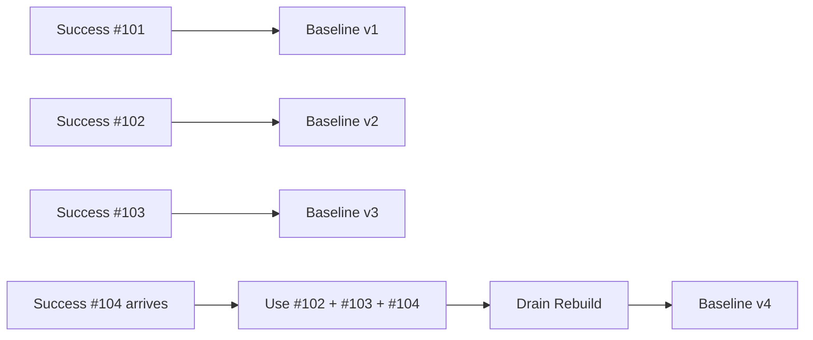

---

# 33. How Do We Handle Different Projects and Repo Configurations?

We do **not** ask:

```text
Is it from the same Jenkins instance?
```

We ask:

```text
Is this successful run compatible with this failed run?
```

That is a more useful question.

---

# 34. Compatibility Fingerprint

Think of a fingerprint as a compact description of:

> "What kind of pipeline execution is this?"

Possible inputs:

```text
repository
pipeline/job identity
Jenkinsfile / pipeline-definition hash
stage identity
branch family
agent label
OS / architecture
Java major version
Maven/Gradle/npm major version
container image family
important build parameters
normalizer version
masking version
Drain configuration version
```

Hash the important values:

```text
SHA256(...)
    ↓
compatibility fingerprint
```

Then:

```text
failed run fingerprint
        ==
success baseline fingerprint
```

means:

```text
safe candidate for comparison
```

---

# 35. Example: Same Repo, Different Pipeline

Repo:

```text
payment-service
```

Pipeline A:

```text
PR validation
Java 21
unit tests only
```

Pipeline B:

```text
production release
Java 21
unit + integration + docker + deploy
```

Do not use one baseline for both.

```text
payment-service/pr-validation
payment-service/release
```

should be different logical baselines.

---

# 36. Example: Same Pipeline, Jenkinsfile Changed

Yesterday:

```text
Maven test
```

Today Jenkinsfile changes to:

```text
Maven test
Docker build
Security scan
```

If the pipeline definition fingerprint changed:

```text
old baseline != new compatibility fingerprint
```

Initially:

```text
new baseline = unavailable
```

After a successful execution of the new design:

```text
create fresh baseline
```

This is safer than pretending yesterday's pipeline is identical.

---

# 37. Example: Feature Branch

Suppose all feature branches use the same Jenkinsfile and toolchain.

We have two choices.

Strict:

```text
baseline per branch
```

More reusable:

```text
baseline per branch family / workflow
```

For the first version, prefer **strict compatibility**.

Why?

False "normal" matches can hide useful evidence.

Later, after measuring data, we can safely broaden sharing.

---

# 38. Important Safety Rule

Do NOT implement:

```text
if template exists in any successful build:
    drop failed line
```

That is too aggressive.

Instead:

```text
if template matches compatible successful baseline:
    reduce novelty score
```

Then other signals can still rescue the line.

Example:

Successful build sometimes contains:

```text
ERROR cache lookup failed
Using local fallback
```

A failed build also contains the same line.

That does not automatically mean:

```text
delete it
```

It means:

```text
this line is less novel
```

Later:

```text
failure keywords
failed stage
tail
exit code
context
```

can still make it important.

---

# 39. What Exactly Should We Store Per Template?

A richer version:

```text
template_id
template_text
cluster_id
stage_id
dag_node_type
occurrence_count
run_support_count
supporting_run_ids
first_seen
last_seen
normal_frequency
parser_config_version
masking_policy_version
```

Potentially later:

```text
typical_position
typical_stage
sequence statistics
```

But keep V1 simpler.

---

# 40. Do We Store Raw Successful Logs?

Ideally:

```text
Jenkins / UDS remains source of truth
```

Our reducer should not permanently duplicate every raw log.

We can store:

```text
templates
statistics
source run IDs
fingerprints
versions
```

If a rebuild needs the latest three raw successful logs:

```text
fetch from Jenkins / UDS
```

If retention makes that impossible, we may need an approved short-term/redacted store.

That is a separate retention/security decision.

---

# 41. Redaction Must Happen Before Template Persistence

Important example:

```text
Using API token sk_live_REAL_SECRET
```

If Drain sees only one successful log, it might initially create:

```text
Using API token sk_live_REAL_SECRET
```

and we definitely do not want that stored as a "normal template".

So:

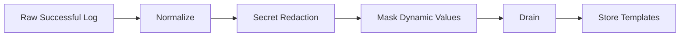

Redaction is a mandatory boundary.

---

# 42. Normalization vs Masking vs Drain

These sound similar but are different.

## Normalization

Remove presentation noise.

Example:

```text
ANSI color
carriage-return progress updates
timestamp formatting
line-ending differences
```

## Redaction

Remove sensitive values.

Example:

```text
Bearer abc123
```

becomes:

```text
Bearer <REDACTED_TOKEN>
```

## Masking

Tell the template miner that certain changing values are parameters.

Example:

```text
10.10.1.23
```

becomes:

```text
<IP>
```

## Drain

Group similar normalized/masked lines and learn templates.

Flow:

```text
raw
 ↓
normalize
 ↓
redact
 ↓
mask
 ↓
Drain
 ↓
template
```

---

# 43. Example End-to-End Offline Run

Successful Jenkins log:

```text
12:31:02 [INFO] Build 9812 started on agent-42
12:31:03 [INFO] Workspace /jenkins/payment/9812
12:31:05 [INFO] Downloaded junit.jar in 420ms
12:31:06 [INFO] Downloaded jackson.jar in 510ms
12:31:08 [INFO] Running 124 tests
12:31:30 [INFO] Tests run: 124, Failures: 0
12:31:31 [INFO] BUILD SUCCESS
```

## Normalize

Remove timestamp and structured prefix where appropriate:

```text
Build 9812 started on agent-42
Workspace /jenkins/payment/9812
Downloaded junit.jar in 420ms
Downloaded jackson.jar in 510ms
Running 124 tests
Tests run: 124, Failures: 0
BUILD SUCCESS
```

## Mask

```text
Build <NUM> started on <AGENT>
Workspace <PATH>
Downloaded junit.jar in <NUM>ms
Downloaded jackson.jar in <NUM>ms
Running <NUM> tests
Tests run: <NUM>, Failures: <NUM>
BUILD SUCCESS
```

## Drain clusters

```text
Build <*> started on <*>
Workspace <*>
Downloaded <*> in <NUM>ms
Running <NUM> tests
Tests run: <NUM>, Failures: <NUM>
BUILD SUCCESS
```

## Store success baseline

```text
payment-service
main-ci
unit-test
fingerprint=xyz

templates:
    Build <*> started on <*>
    Workspace <*>
    Downloaded <*> in <NUM>ms
    Running <NUM> tests
    Tests run: <NUM>, Failures: <NUM>
    BUILD SUCCESS
```

Later, a failed run can be compared to this.

---

# 44. What Happens With a Failed Run?

Failed run:

```text
Build 9899 started on agent-17
Workspace /jenkins/payment/9899
Downloaded junit.jar in 390ms
Running 124 tests
Connection refused payment-db:5432
PSQLException
PaymentServiceIT FAILED
BUILD FAILURE
```

Template extraction gives:

```text
Build <*> started on <*>
Workspace <*>
Downloaded <*> in <NUM>ms
Running <NUM> tests

Connection refused <HOST>:<PORT>
PSQLException
PaymentServiceIT FAILED
BUILD FAILURE
```

Compare with success baseline:

```text
MATCH NORMAL:
Build <*> started on <*>

MATCH NORMAL:
Workspace <*>

MATCH NORMAL:
Downloaded <*> in <NUM>ms

MATCH NORMAL:
Running <NUM> tests

NEW / NOVEL:
Connection refused <HOST>:<PORT>

NEW / NOVEL:
PSQLException

NEW / NOVEL:
PaymentServiceIT FAILED

NEW / NOVEL:
BUILD FAILURE
```

That comparison is the beginning of **log diffing**.

We will deep-dive that next.

---

# 45. Final Service Boundary — Separate Service

We have now made the architecture decision:

> **Drain/template learning and intelligent log reduction will live in a separate service.**

The existing Spring Boot MCP server remains an **orchestrator/client**.

It should not own:

```text
Drain state
success baseline creation
template versioning
large-log parsing
log diffing
ranking
token-budget selection
```

Those belong to the new:

```text
Python Log Intelligence Service
```

---

# 46. High-Level Architecture

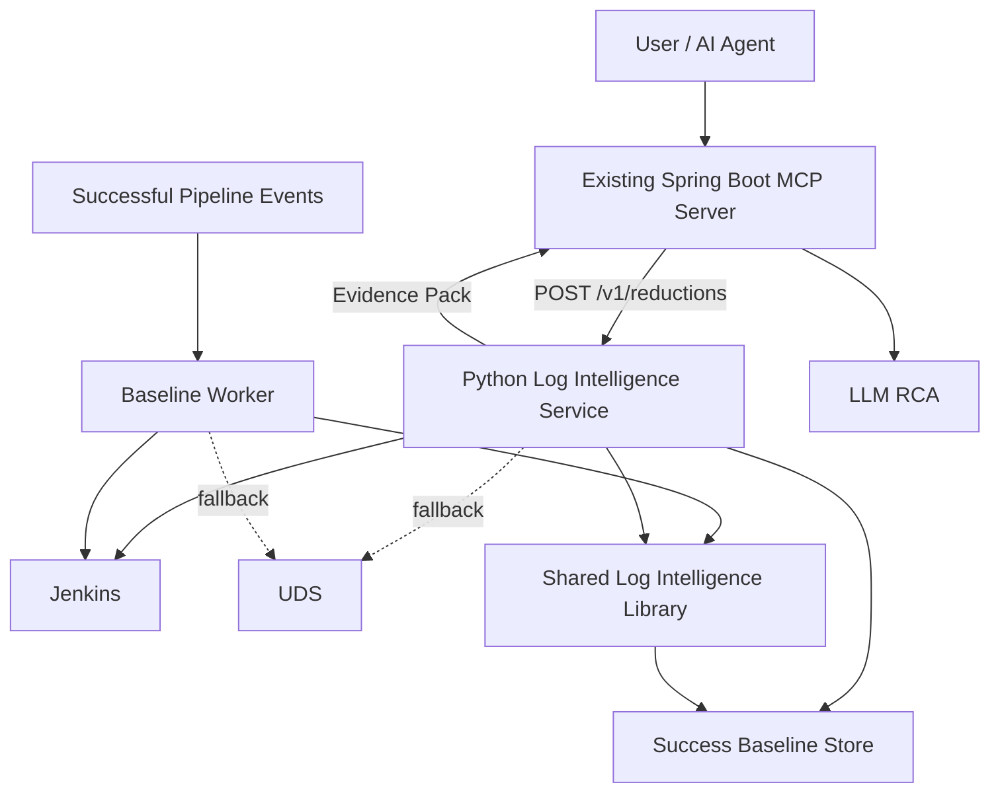

There are now three clear responsibilities:

```text
MCP Server
    = expose agent tools + orchestrate

Log Intelligence API
    = online reduction requests

Baseline Worker
    = offline learning from successful runs
```

---

# 47. Important: Separate Service Does Not Mean One Single Process

A good production shape is:

```text
same Python codebase
        │
        ├── API deployment
        │      handles online MCP requests
        │
        └── Worker deployment
               handles success events /
               baseline rebuilds
```

For example:

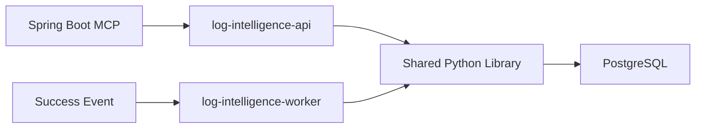

Why split API and worker processes?

Because:

```text
online failure diagnosis wants predictable latency

offline baseline rebuilding can process large logs
and may take longer
```

They can scale independently even though they share code.

---

# 48. What the MCP Server Will Call

When a pipeline fails, the MCP server should make one main call:

```http
POST /v1/reductions
```

Example request:

```json
{
  "tenant": "payments",
  "repository": "payment-service",
  "pipeline_id": "main-ci",
  "run_id": "9899",
  "job_id": "build-and-test",
  "token_budget": 12000
}
```

Notice:

> MCP does **not** need to fetch the huge log and send the entire file to the Python service.

Prefer this:

```text
MCP sends run identity
       ↓
Log Intelligence Service fetches from Jenkins
       ↓
UDS fallback if required
```

Why?

Because then the service can:

```text
stream the log
fetch ranges
track source completeness
reuse the same source logic for offline and online processing
```

---

# 49. Online MCP → Log Intelligence Service Flow

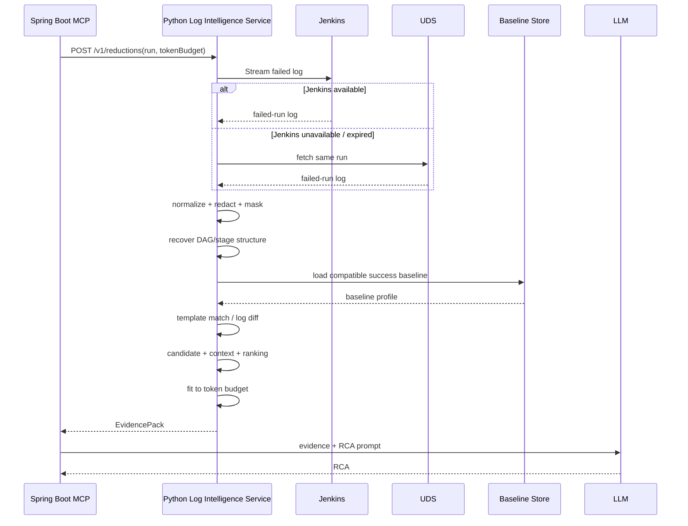

This becomes the replacement for:

```text
MCP fetch huge log
    ↓
tail/head+tail
    ↓
LLM
```

---

# 50. Example Reduction Response

```json
{
  "reduction_id": "red-72819",
  "run_id": "9899",
  "source": "jenkins",
  "baseline": {
    "status": "FOUND",
    "baseline_id": "base-812",
    "version": 17
  },
  "statistics": {
    "original_lines": 118220,
    "selected_lines": 417,
    "original_tokens_estimate": 148000,
    "selected_tokens": 10820
  },
  "blocks": [
    {
      "block_id": "b-001",
      "stage": "integration-test",
      "start_line": 88210,
      "end_line": 88238,
      "reasons": [
        "novel_vs_success",
        "exception",
        "failed_stage"
      ],
      "score": 9.1,
      "text": "..."
    }
  ]
}
```

The MCP server then sends these evidence blocks to the RCA LLM.

---

# 51. Separate-Service Components

Inside the Python service codebase:

```text
log-intelligence/
│
├── api/
│   ├── reduction_routes.py
│   └── baseline_routes.py
│
├── acquisition/
│   ├── jenkins_client.py
│   └── uds_client.py
│
├── preprocessing/
│   ├── normalizer.py
│   ├── redactor.py
│   ├── masker.py
│   └── dag_segmenter.py
│
├── templates/
│   ├── drain_miner.py
│   ├── template_matcher.py
│   └── baseline_builder.py
│
├── reduction/
│   ├── log_diff.py
│   ├── candidate_generation.py
│   ├── context_expansion.py
│   ├── scoring.py
│   └── token_budget.py
│
├── storage/
│   ├── baseline_repository.py
│   └── models.py
│
├── workers/
│   ├── success_run_worker.py
│   └── reconciliation_worker.py
│
└── domain/
    ├── run_descriptor.py
    ├── evidence_block.py
    └── evidence_pack.py
```

The exact Python framework is secondary.

The important architecture is:

> **Algorithms live behind internal interfaces and are not mixed into FastAPI route code.**

---

# 51.1 API Responsibilities

The API process should handle:

```text
authentication / authorization
request validation
run identity
deadlines
idempotency
calling reduction workflow
returning evidence packs
health / metrics
```

It should **not** itself run scheduled baseline jobs.

---

# 51.2 Worker Responsibilities

The baseline worker handles:

```text
successful-run events
recent compatible success lookup
Jenkins / UDS log acquisition
normalization + redaction + masking
DAG segmentation
Drain template mining
baseline version creation
baseline publishing
reconciliation / backfill
```

---

# 51.3 Suggested APIs

## Online reduction

```http
POST /v1/reductions
```

Used by:

```text
Spring Boot MCP server
```

## Get reduction

```http
GET /v1/reductions/{reductionId}
```

Useful if large reductions become asynchronous.

## Bounded evidence expansion

```http
POST /v1/reductions/{reductionId}/expand
```

Example:

```json
{
  "stage": "integration-test",
  "around_block": "b-004",
  "additional_token_budget": 3000
}
```

This lets the LLM/MCP ask for more evidence without retrieving the full log.

## Administrative/manual baseline rebuild

```http
POST /v1/baselines/rebuild
```

This should be protected and primarily operational.

## Read baseline metadata

```http
GET /v1/baselines/compatible?...
```

Normally the service uses this internally; it can be useful for debugging.

---

# 51.4 Spring Boot MCP Client

The Java side needs only a typed client.

Conceptually:

```java
interface LogIntelligenceClient {

    EvidencePack reduce(ReductionRequest request);

    EvidencePack expand(
        String reductionId,
        ExpansionRequest request
    );
}
```

Then an MCP tool can remain simple:

```text
analyze_pipeline_failure(...)
        ↓
LogIntelligenceClient.reduce(...)
        ↓
Evidence Pack
        ↓
LLM RCA
```

The MCP tool does not know about:

```text
Drain
parse trees
baseline storage
template similarity
PostgreSQL
worker scheduling
```

That separation is exactly what we want.


# 52. Event Processing Safety

Imagine the same Jenkins success event arrives twice.

We do not want:

```text
duplicate rebuild
duplicate baseline version
```

Use an idempotency key:

```text
team + pipeline + run_id + baseline_builder_version
```

Also protect the same baseline from concurrent writes.

Example:

```text
run 101 success
run 102 success
```

finish almost together.

Use:

```text
optimistic versioning
or
per-baseline-key lock
```

and publish new baseline versions atomically.

---

# 53. Baseline Versioning

Never just overwrite:

```text
current_templates.json
```

without metadata.

Prefer:

```text
baseline v12
baseline v13
baseline v14  ← active
```

Why?

Because if RCA suddenly becomes worse, we need to answer:

```text
Which template baseline was used?
Which Drain configuration?
Which masking version?
Which successful runs?
```

That makes the system debuggable.

---

# 54. Freshness

Each profile should know:

```text
created_at
last_success_run
source_run_ids
pipeline_definition_fingerprint
toolchain_fingerprint
```

If baseline is old:

```text
status = STALE
```

Online diagnosis should not blindly trust it.

---

# 55. What If There Are No Successful Runs?

New repository:

```text
first build = failed
```

No success baseline exists.

We still have other techniques:

```text
failure keywords
tail
stack traces
exit codes
failed stage
context expansion
```

So:

```text
No baseline
    !=
No diagnosis
```

It simply means:

```text
novelty / success-diff signal unavailable
```

and confidence is lower.

---

# 56. What If Successful Runs Have Different Optional Paths?

Example:

```text
if docs changed:
    run docs stage

if backend changed:
    run backend tests

if UI changed:
    run frontend tests
```

A successful pipeline may legitimately have different DAG paths.

Therefore baseline identity should not require:

```text
every success log contains every template
```

We should track support/frequency.

Example:

```text
Template A:
seen in 3/3 success runs

Template B:
seen in 1/3 success runs
```

Both can be normal, but confidence differs.

This becomes useful during online log diff.

---

# 57. Template Frequency

Suppose success runs show:

```text
"Retrying dependency download"
```

counts:

```text
run 1 = 1
run 2 = 2
run 3 = 1
```

Failed run:

```text
50,000 retries
```

The template itself is "normal".

But its **frequency is abnormal**.

Therefore later we may want:

```text
template exists
+
occurrence frequency
```

This is more advanced than basic LogSage template membership, but valuable for our environment.

Keep it as a V2 enhancement.

---

# 58. Parallel Logs Can Also Create Frequency Distortions

Suppose 20 test shards all emit:

```text
Starting JVM
```

Then the run-level count is 20.

If next build has 40 shards:

```text
count = 40
```

That may be totally normal after scaling.

Another reason why stage/DAG metadata and compatibility fingerprints matter.

---

# 59. What Is NOT Drain's Responsibility?

Drain will not tell us:

```text
"This is the root cause."
```

Drain will not know:

```text
"This warning is harmless."
```

Drain will not know:

```text
"This database failure caused Maven to fail."
```

Drain only helps answer:

```text
"What structural log event does this line look like?"
```

and:

```text
"Have we seen this structural event before?"
```

The later log-diff/ranking/RCA layers give that information diagnostic meaning.

---

# 60. Drain Is a Noise-Normalization Tool, Not the Whole Intelligence Layer

Think of our complete system as:

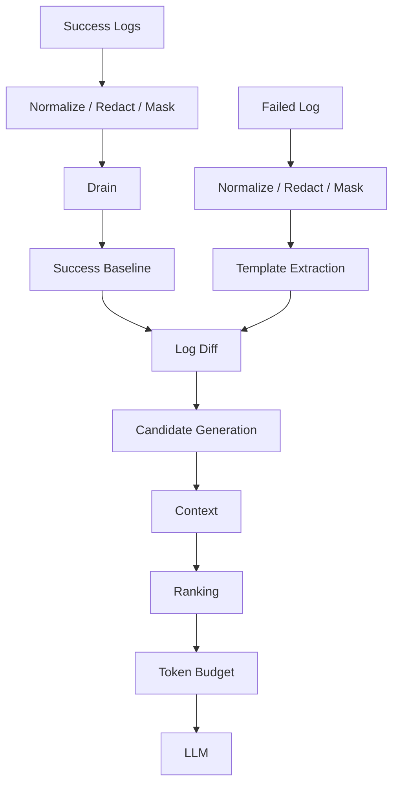

Drain is only one box.

Very useful box.

Not the whole system.

---

# 61. Recommended Offline Architecture for the Separate Service

The offline flow is owned completely by the Python service's **baseline worker**.

The MCP server is not involved.

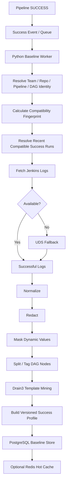

This is asynchronous.

The successful Jenkins pipeline finishes normally and does not wait for Drain processing.

---

# 62. Recommended Online Architecture — MCP Calls the Service

When a pipeline fails:

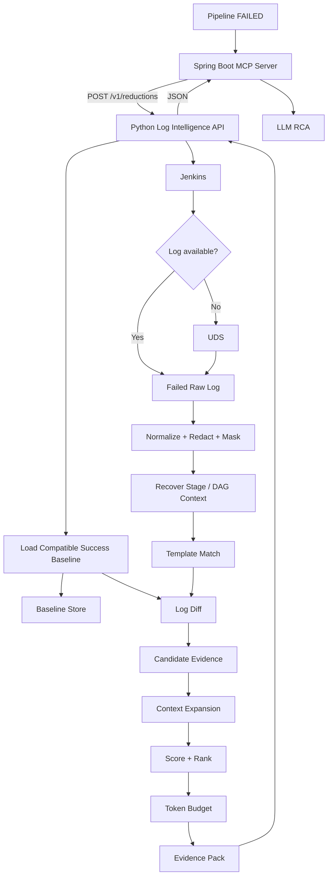

Important boundary:

```text
MCP:
    orchestration + agent tools + LLM call

Python service:
    all heavy log intelligence
```

This means the MCP server can evolve independently from the reduction algorithms.


# 63. Why Parser/Masking Version Is Part of the Baseline

Suppose baseline v1 was built with:

```text
IP addresses NOT masked
```

Later failed-log parser uses:

```text
IP addresses masked
```

Success template:

```text
Connecting 10.1.2.3
```

Failed template:

```text
Connecting <IP>
```

They won't match even though they represent the same event.

Therefore store:

```text
normalizer_version
masking_version
drain_config_version
```

and compare only compatible representations.

---

# 64. Drain Parameters We Will Eventually Need to Tune

Drain3 exposes parameters such as:

```text
similarity threshold
tree depth
max children
max clusters
extra delimiters
masking rules
```

Do not tune these blindly now.

Our process should be:

```text
start reasonable
    ↓
create internal labeled test corpus
    ↓
measure template quality
    ↓
adjust
```

The reference Drain3 implementation currently documents defaults including a similarity threshold of 0.4 and tree depth of 4, but those are library defaults, not automatically the right values for our Jenkins environment.

---

# 65. What Would Bad Drain Templates Look Like?

## Too specific

```text
Downloaded junit-5.10.2.jar in 431ms
```

Every build creates a new template.

Problem:

```text
normal lines look novel
```

## Too generic

```text
<*> <*> <*> <*>
```

Everything matches everything.

Problem:

```text
real failure lines can look normal
```

We need a balance.

This is why:

```text
masking
similarity threshold
scope
```

matter.

---

# 66. Testing Drain Before We Trust It

Take successful logs and manually inspect templates.

Ask:

```text
Did changing IDs become wildcards?
Did stable words stay stable?
Did ERROR lines get over-generalized?
Did Maven and Docker messages get mixed incorrectly?
Did parallel stage logs get mixed?
```

Then test:

```text
same healthy line from a new success run
    ↓
does it match existing template?
```

This is **template match recall**.

Also test:

```text
obviously different error line
    ↓
does it incorrectly match a normal template?
```

This is where over-generalization hurts.

---

# 67. Proposed V1 Scope for Our Company

Do not begin with every Jenkins instance and every pipeline.

Start with:

```text
1–3 teams
a few high-volume pipelines
known stable Jenkins metadata
mix of Maven/Gradle/etc.
some parallel DAG pipelines
```

Collect:

```text
successful runs
failed runs
human-known root causes
```

Build the baseline service in shadow mode.

Do not let success-template matching remove lines from production RCA until we have evidence it behaves safely.

---

# 68. Proposed V1 Decisions

These are design recommendations, not final decisions.

```text
Baseline generation:
    event-driven after successful runs

Reconciliation:
    scheduled backup job

Success window:
    start testing with latest 3 compatible success runs

Scope:
    team + repo + pipeline + stage + compatibility fingerprint

DAG:
    stage/node-local baseline where metadata exists

Storage:
    versioned baseline store
    relational metadata + template profile
    optional Redis cache

Raw success log:
    Jenkins / UDS remains source of truth where possible

Redaction:
    before Drain/template persistence

Baseline update:
    rebuild rolling recent-success window

Service boundary:
    separate Python Log Intelligence Service from day one

MCP:
    Spring Boot orchestration/tool interface only
    calls Python service over HTTP

Python deployment:
    API process for online reduction
    worker process for offline success baselines
    same codebase/shared domain logic

Production scaling:
    API and worker scale independently
```

---

# 69. Paper vs Our Design

Important to keep this honest.

## LogSage gives us these ideas

```text
recent successful logs of the same pipeline
Drain template extraction
store reusable success templates
online failed-vs-success comparison
recent-success window
```

## LogSage does NOT specify our company details

The paper does not tell us exactly:

```text
how to map hundreds of our Jenkins instances
our tenant isolation strategy
our DAG node identity scheme
our Spring Boot deployment topology
our Postgres/Redis choice
our compatibility fingerprint fields
our event bus
our retention policy
```

Those are **our engineering design decisions**.

We should borrow the principle, not blindly copy infrastructure.

---

# 70. Whiteboard Summary

If I were explaining our offline design on a whiteboard:

```text
"Every time a compatible pipeline succeeds,
we asynchronously learn what normal looked like."

SUCCESS
   ↓
Which team/repo/pipeline/stage is this?
   ↓
Is it compatible with recent successful runs?
   ↓
Fetch recent success logs
   ↓
Normalize + redact + mask
   ↓
Split/tag DAG stages
   ↓
Drain groups similar lines
   ↓
Create reusable templates
   ↓
Build versioned success profile
   ↓
Store it
   ↓

WAIT FOR FAILURE
```

Then:

```text
FAILURE
   ↓
Create templates from failed log
   ↓
Load matching success profile
   ↓
Compare
   ↓
"What is normal?"
"What is new?"
   ↓
candidate evidence
```

---

# 71. The One Thing I Want You to Remember About Drain

Drain does this:

```text
different-looking concrete log lines
              ↓
        common structure
              ↓
       reusable template
```

Example:

```text
Build 101 on agent-1
Build 102 on agent-7
Build 103 on agent-9
```

becomes:

```text
Build <*> on <*>
```

Then the success baseline says:

```text
"We normally see this."
```

That gives our future log-diff layer a way to distinguish:

```text
normal repetition
```

from:

```text
new/unusual event
```

---

# 72. What Should We Deep-Dive Next?

We have covered the Drain layer enough to move forward, but there are two closely related concepts.

## Optional mini-deep-dive before log diff

**Normalization + Masking**

Questions:

```text
Which parts should be removed?
Which parts should become <IP>, <NUM>, <PATH>, etc.?
How do we avoid over-masking?
How do we version those rules?
```

This directly affects Drain quality.

If that part is clear enough, then the **next major topic is Log Diffing**.

---

# 73. Recommended Next Major Topic: Log Diffing

The next question becomes:

> We now have a failed log and a compatible success baseline. **How exactly do we compare them safely?**

We should deep-dive:

```text
1. How a failed line becomes a template
2. Exact template membership
3. Baseline novelty
4. What "normal" really means
5. Why matching a success template must not always delete a line
6. What happens when pipeline config changes
7. Stage-aware diff in a DAG
8. Frequency anomalies
9. No-baseline behavior
10. How diff output enters the candidate pool
```

That is the natural next step.

---

# 74. Sources / Design Basis

This guide separates two things:

## Research / reference behavior

- **LogSage** describes an offline phase where recent successful logs from the same pipeline are processed using Drain to create success-log templates, which are stored and later used by the online key-log filtering stage. LogSage keeps a configurable recent-success window and reports `x = 3` as its default after empirical analysis.
- **Drain / Drain3** is a streaming log-template miner based on a fixed-depth parse tree. It routes messages to candidate clusters, compares similarity, groups matching messages, and generalizes changing positions into parameters/wildcards. Drain3 also supports masking and persistence of learned state.
- **Drain3 reference implementation:** https://github.com/logpai/Drain3
- **Original Drain/logparser reference:** https://github.com/logpai/logparser/tree/main/logparser/Drain
- **FastAPI documentation:** https://fastapi.tiangolo.com/
- **Spring REST client documentation:** https://docs.spring.io/spring-framework/reference/integration/rest-clients.html

## Our proposed company architecture

The following are our engineering design recommendations rather than claims made by LogSage:

- baseline keys across multiple Jenkins instances;
- team/repo/pipeline/stage isolation;
- DAG-aware profiles;
- compatibility fingerprints;
- event-driven baseline worker plus scheduled reconciliation;
- versioned baseline store;
- Postgres/JSONB + optional Redis/object-store shape;
- separate Python Log Intelligence Service;
- Spring Boot MCP-to-service HTTP integration;
- redaction/versioning rules;
- rolling-window rebuild strategy;
- frequency-aware future extensions.

These decisions should be validated against our own Jenkins/UDS logs before production rollout.
