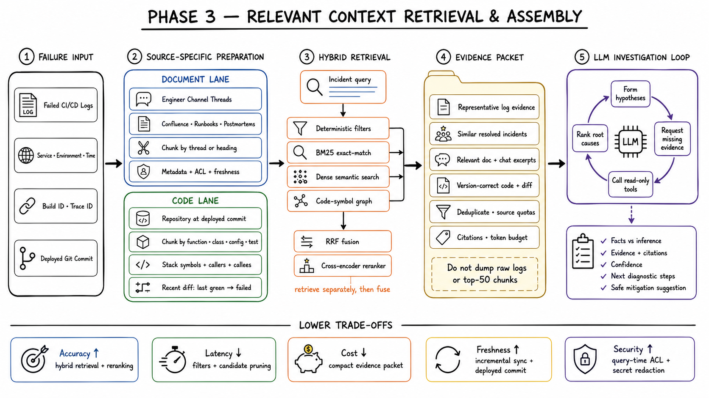

# Logsift Phase 3: RAG knowledge and code context

[Main design](LogSift.md) · [Failure-analysis input example](examples/failure-analysis/scoring/llm_input.md) · [Recommended retrieval policy](final/logsift-architecture/examples/retrieval-policy.yaml)

> **Design status:** Logsift already defines the evidence pack produced by failure analysis. The repository does not yet define a production Phase 3 ingestion service, vector database, lexical index, code graph, permission contract, or retrieval API. This document is the recommended starting design. It must be validated before it becomes an implementation contract.

## 1. Why Phase 3 exists

Phase 2 finds the most useful evidence in the current failed run. It can tell us that a timeout is new, a retry count changed, a test failed, and the worker exited with code `1`. That describes **what changed**, but it may not explain **why it changed**.

Phase 3 adds relevant knowledge and version-matched code. It should help Logsift move from:

```text
This timeout is unusual.
```

to:

```text
The timeout was raised by this function at the failed commit.
This configuration controls its connection pool.
This runbook explains the correct diagnostic check.
A reviewed earlier incident had a similar cause in the same component.
```

Phase 3 does not replace LogDiff, failed-log evidence, or engineer judgment. The current run remains the main evidence. Retrieved material supplies context and possible explanations.

### Input

Phase 3 receives the redacted and token-bounded evidence pack from Phase 2. It does not receive every raw log line.

### Output

Phase 3 produces:

- a grounded root-cause analysis with citations;
- an explanation of what is known, inferred, conflicting, or missing;
- relevant runbooks, incidents, code, configuration, deployment, and ownership;
- a separate remediation suggestion based on the reviewed root cause;
- exact references to logs, documents, incidents, files, commits, and line ranges.

### Important boundary

Root-cause analysis and remediation are two separate passes:

1. **RCA pass:** explain the failure using current evidence and relevant context.
2. **Remediation pass:** after an RCA exists, retrieve approved guidance and confirmed fixes that match the cause, repository version, and environment.

This prevents an old fix from becoming the explanation before the cause has been established.

## 2. RAG, embeddings, and vector databases

### What RAG means

RAG means **retrieval-augmented generation**.

It has two main actions:

1. Search trusted data for information related to the current failure.
2. Give only the best results, with provenance, to the language model.

The model is not expected to remember every runbook, incident, configuration, or code version. Logsift retrieves the relevant version at request time.

### What an embedding is

An embedding is a numeric representation of a piece of text or code. Text with similar meaning often produces nearby vectors.

For example:

```text
dependency request exceeded its deadline
payment service timed out
```

These messages do not share every word, but semantic vector search may still connect them.

Embeddings are useful for meaning. They are not reliable enough for every exact identifier. Error codes, class names, file paths, test names, configuration keys, commit hashes, and template fingerprints also need exact-text search.

### What a vector database stores

A vector database should store:

- a vector ID;
- the embedding;
- the embedding-model version;
- the stable chunk ID and content digest;
- filter metadata such as `seal_id`, source type, service, repository, commit, trust, freshness, and permissions;
- a safe content preview or a reference to protected content.

It should not be the only copy of:

- the source document;
- source code;
- access-control rules;
- the exact-text index;
- the dependency graph;
- raw logs;
- incident approval state.

The vector database is one search component, not the complete knowledge system.

### Other important terms

| Term | Simple meaning |
|---|---|
| Chunk | A useful, independently retrievable part of a document, thread, incident, file, or code symbol |
| Lexical search | Search based on exact words and identifiers |
| Semantic search | Search based on embedding similarity |
| Metadata filter | A required condition such as tenant, permission, repository, commit, service, or time |
| Graph search | Following relationships such as function → configuration → test → owner |
| Reranker | A later stage that reads the query and candidates, then puts the most useful results first |
| Provenance | Exact source, version, location, permission decision, and content digest |
| Grounding | Requiring generated claims to be supported by current evidence or cited sources |

## 3. How Phase 3 fits into Logsift



The high-level flow is:

```text
Phase 2 evidence pack
    → build exact, semantic, and structural queries
    → enforce tenant, permission, repository, and commit filters
    → search lexical index, vector index, and relationship graph
    → merge and rerank results
    → remove repetition and fit the retrieval token budget
    → assemble context with provenance
    → produce grounded RCA
    → retrieve approved remediation knowledge
    → suggest a cited next step
```

The success baseline remains separate. Confirmed incidents and fixes can improve Phase 3 knowledge, but they never update the successful-log baseline directly.

> **Image-generation prompt — Three Phase 3 operating modes**
>
> Create a wide 16:9 technical diagram on a clean warm off-white notebook page with a faint square grid and polished hand-drawn styling. Use dark navy headings, teal for Logsift learning and indexing, orange for incoming failure evidence, purple for retrieval and remediation, and yellow sticky notes only for key insights. Maintain generous spacing and a clear left-to-right flow. Show three separate horizontal lanes. Lane 1 is “Mode 1 — Knowledge learning” with “Source change → Permission check → Redact → Parse + chunk → Embed → Update indexes.” Lane 2 is “Mode 2 — Failure retrieval” with “Evidence pack → Query plan → Exact + Vector + Graph → Rerank → Context pack → Grounded RCA.” Lane 3 is “Mode 3 — Validated feedback” with “Engineer review → Confirm RCA + fix → Publish reviewed incident → Re-index.” Draw a crossed-out arrow from Mode 3 to a separate teal cylinder “Success baseline” labelled “Never updated by Phase 3.” Add yellow notes “Learning means indexing, not model training” and “Queries do not rewrite knowledge.” Include a compact legend. Use simple arrows, document icons, filters, storage cylinders, shields, and magnifying glasses. Use short readable labels, no tiny paragraphs, no external logos, and Logsift as the only product name. Verify spelling and arrow direction.

## 4. The three operating modes

Phase 3 should have three modes with different permissions and state changes.

| Mode | When it runs | Reads | Writes | Main purpose |
|---|---|---|---|---|
| Knowledge learning and indexing | A permitted source is created, changed, deleted, reviewed, or re-versioned | Source documents, threads, incidents, repositories, deployment data, ownership, and manifests | Versioned chunks, content references, lexical records, embeddings, graph edges, and index manifests | Keep searchable knowledge current |
| Failure retrieval and analysis | Phase 2 completes an evidence pack | Evidence pack and active indexes | Retrieval trace, selected context, RCA result, and later remediation result | Find the best context for one failed run |
| Validated feedback | An engineer reviews an RCA and effective fix | Evidence pack, RCA, remediation, fix proof, and reviewer decision | Immutable incident and confirmed-fix records, then new index versions | Turn reviewed outcomes into future knowledge |

### Learning mode does not train the language model

The word “learning” means that Logsift updates its knowledge indexes. It does not mean:

- changing the language model's weights;
- adding failed templates to the success baseline;
- treating every engineering message as fact;
- publishing an unreviewed model answer as confirmed knowledge.

### Query mode is read-only for shared knowledge

A failure query can write its own retrieval trace and analysis results under `analysis_id`. It must not modify shared chunks, embeddings, graph edges, trust labels, or validated incidents.

### Feedback mode requires approval

Only reviewed outcomes enter durable incident memory. “Helpful” and “confirmed” are different states.

## 5. What enters Phase 3 from Phase 2

The evidence pack is the bridge between the two phases.

| Evidence-pack field | How Phase 3 uses it |
|---|---|
| `analysis_id` | Isolates retrieval state for this analysis |
| `seal_id` | Selects the tenant partition and permission authority |
| `project_id` and `repo_id` | Restrict code, configuration, pipeline, and incident results |
| `branch` and `commit_sha` | Select the code version that actually failed |
| `source_type` | Preserves Jules or Lattice interpretation |
| Pipeline, stage or node, and attempt | Narrows runbooks, pipeline definitions, incidents, and ownership |
| Service and environment | Narrows operational knowledge and configuration |
| Failure time | Selects the deployment and knowledge state that existed then |
| Exact error strings | Builds lexical queries |
| Template fingerprints | Finds the same pattern in reviewed incidents and summaries |
| Failed tests and code symbols | Seeds code and test retrieval |
| Correlation digests | Connects related blocks without exposing protected identifiers |
| Ranked evidence blocks | Supplies the current failure story and query terms |
| LogDiff reasons and counts | Adds novelty, frequency, scope, order, severity, and parameter signals |
| Provenance | Lets the final answer cite exact failed-log locations |

If repository or commit metadata is missing, Logsift may retrieve general operational documents when permissions allow. It must not silently return current code as if it were the code that failed.

## 6. Mode 1 — knowledge learning and indexing

Knowledge learning is asynchronous. It should not run inside the critical failure-analysis request.

### Triggers

Typical triggers are:

- a runbook or service document is created, changed, reviewed, moved, or deleted;
- an engineering thread is closed or linked to an incident;
- an incident or fix is confirmed;
- a repository commit changes permitted source, tests, configuration, or pipeline definitions;
- a deployment record is published;
- ownership or permissions change;
- the chunking, embedding, parser, or policy version changes.

### Processing order

Every source follows this order:

1. Receive a source event with a stable source ID and revision.
2. Resolve the source using a service identity.
3. Read and store the source permission labels.
4. Reject content that Logsift is not allowed to index.
5. Detect and remove secrets from derived content.
6. Parse the source according to its type.
7. Split it into useful chunks.
8. Add tenant, service, repository, version, trust, freshness, and provenance metadata.
9. Calculate a content digest.
10. Write protected content or its reference.
11. Update the lexical index.
12. Generate embeddings in bounded batches and update the vector index.
13. Update source and code relationships.
14. Publish an index manifest only after all required writes succeed.

Repeating the same source ID, revision, and processing versions must not create duplicate active chunks.

### Incremental updates

- Unchanged chunks keep their embedding when the embedding version is unchanged.
- Changed chunks create a new immutable chunk revision.
- Deleted or newly restricted chunks leave active retrieval immediately.
- Physical deletion follows retention policy.
- A new embedding model builds a separate index generation.
- Traffic moves only after the new generation passes coverage and retrieval checks.


> **Image-generation prompt — Knowledge learning and incremental indexing**
>
> Create a wide 16:9 ingestion diagram on a clean warm off-white notebook page with a faint square grid and polished hand-drawn technical styling. Use dark navy headings, teal for learning and indexing, purple for searchable knowledge, orange only for later failure queries, and two yellow sticky notes. At left, show source icons labelled “Runbooks,” “Service docs,” “Engineering threads,” “Incidents,” “Deployments,” “Ownership,” “Pipeline,” “Configuration,” “Source,” and “Tests.” Pass them through boxes in this exact order: “Source event,” “Permission check,” “Secret removal,” “Source parser,” “Meaningful chunks,” “Trust + freshness + version,” and “Content digest.” Fan out to four stores labelled “Protected content,” “Lexical index,” “Vector index,” and “Relationship graph.” Above the stores show “Index manifest — publish last.” Add a small update path “Changed chunks only” and a deletion path “Tombstone → remove from active search.” Add yellow notes “Indexing is not model training” and “Permission changes are data changes.” Use simple arrows, documents, filters, shields, storage cylinders, and magnifying glasses. Keep labels short, use Logsift as the only product name, avoid external logos, photorealism, 3D, gradients, dark backgrounds, and tiny text, and verify every arrow direction.

## 7. Knowledge sources and trust

Different sources have different purposes and default trust.

| Source | Best chunk boundary | Important metadata | Trust rule |
|---|---|---|---|
| Approved runbook | Heading or complete procedure | Service, owner, reviewed date, environment, permissions | High when current and approved |
| Service documentation | Heading and related paragraphs | Service, component, status, review date | Medium to high when reviewed |
| Architecture documentation | Decision or component section | Service, repository, status, effective date | Useful, but age and status stay visible |
| Engineering thread | Complete thread or resolved sub-thread | Channel, participants, time, linked incident, permissions | Low until a conclusion is reviewed |
| Previous incident | Symptoms, timeline, evidence, RCA, and fix as separate children | Service, environment, versions, validation status | Confirmed parts rank above hypotheses |
| Confirmed fix | One reviewed change and proof | Incident, affected versions, commit, tests, reviewer | High only inside compatible versions |
| Deployment metadata | One deployment event | Service, environment, artifact, commit, time | High for identifying what ran |
| Ownership | One component record | Service, component, team, effective time | High when fresh |
| Pipeline definition | One stage, node, or command | Repository, commit, source type, stage or node | High at matching commit |
| Configuration | One section or key group | Repository, commit, environment, secret status | High when version and environment match |
| Source code | Function, method, class, or module summary | Repository, commit, path, symbol, lines | High for what code says, not proof of runtime state |
| Test code | Test, fixture, or assertion group | Repository, commit, tested symbols | High for expected behavior at matching commit |
| Run summary | One reviewed successful or failed summary | Pipeline, source, branch, result, time | Lower than current-run evidence |

Raw logs do not belong in the Phase 3 knowledge index. Phase 2 supplies redacted blocks and protected references.

## 8. Chunking rules

Chunking decides what unit can be found and placed into context.

### Documents

Split by the author's structure: a heading with related paragraphs, one procedure, one decision, one table with its explanation, or one incident-timeline period. Each chunk keeps its heading path and a parent summary.

### Engineering threads

Do not index every message as an independent fact. Keep the connected thread, timestamps, authors, links, explicit decisions, and a status such as `open`, `suspected`, `resolved`, or `confirmed`. Speculation stays labelled.

### Incidents

Use a parent incident summary with child records for symptoms, timeline, evidence, hypotheses with status, confirmed root cause, mitigation, permanent fix, and verification.

### Code

Use symbol-aware chunks for functions, methods, classes, modules, tests, configuration sections, and pipeline steps. Do not split code only by a fixed character count.

### Parent, child, and overlap

A short parent supports broad search. A child supplies exact content. Use small overlap only when content crosses a meaningful boundary. Large repeated overlap wastes storage and creates duplicate search results.

### Stable IDs and content digests

```text
stable chunk ID = which logical item is this?
content digest  = did its content change?
```

## 9. Commit-aware code indexing

Code retrieval must use the version that failed.

Every code record requires:

```text
seal_id
project_id
repo_id
branch
commit_sha
path
symbol_id
line_start
line_end
```

### Recommended representation

- readable symbol chunks;
- exact-text index for symbols, errors, keys, and paths;
- embeddings for symbol text and file summaries;
- parser-derived symbol and source ranges;
- call, import, test, configuration, pipeline, dependency, and ownership edges;
- immutable snapshots or reproducible content references;
- a diff between the last compatible successful commit and failed commit when available.

The syntax tree helps find structure. It should not be the only item stored in the vector database.

### Structural expansion

A stack frame or error literal can lead to its function, class, callers, callees, tests, configuration, pipeline step, recent changes, and owner. Graph traversal stays bounded by hop and result limits.

### Unsupported languages

Use file-type-aware text chunks with exact lines, delimiters, and parse quality `fallback`. Do not invent symbols or relationships.

### Commit fallback

Exact commit is the default. An ancestor fallback is allowed only when policy proves the selected content digest is unchanged and labels the fallback. A descendant or current-main fallback must not happen silently.


> **Image-generation prompt — Commit-aware code and configuration retrieval**
>
> Create a wide 16:9 technical diagram on a clean warm off-white grid notebook page with polished hand-drawn styling. Use dark navy headings, teal for run and repository metadata, orange for a suspicious failure block, purple for retrieval, and two yellow sticky notes. At left, show a repository snapshot tagged “seal + project + repo + branch + failed commit,” containing source, tests, configuration, and pipeline files. Pass it through a language parser into cards “Function,” “Class,” “Test,” “Config section,” and “Pipeline step,” each with file and line range. In the center, show a small relationship graph with edges “calls,” “tests,” “configured by,” “runs in,” “depends on,” and “owned by,” plus separate exact-text and vector stores. At right, show the suspicious block finding a function, its test, its configuration, its recent diff, and its owner. Draw a different commit blocked by a filter. Add notes “Readable chunks carry context” and “Never mix commits silently.” Use simple arrows, document icons, filters, storage cylinders, graphs, and magnifying glasses. Use Logsift as the only product name, avoid external logos, tiny text, photorealism, 3D, gradients, and dark backgrounds, and verify spelling and arrow direction.

## 10. Storage design

Logsift should separate authoritative content from search indexes.

| Storage component | What it stores | Why it exists |
|---|---|---|
| Source systems | Original documents, threads, repositories, incidents, and ownership | Remain the authority |
| Protected content store | Redacted immutable chunk content or secure references | Resolves exact content after authorization |
| Metadata catalog | Identity, revisions, digests, permissions, trust, freshness, relationships, and deletion state | Coordinates every index |
| Lexical index | Searchable text, symbols, fingerprints, keys, and paths | Finds exact identifiers |
| Vector index | Embeddings plus filter metadata and content references | Finds similar meaning |
| Relationship store | Code, service, deployment, incident, ownership, and document edges | Connects related evidence |
| Index manifest store | Active generation and all processing versions | Prevents mixed or partial generations |
| Retrieval trace store | Queries, filters, ranks, selected context, timing, and omissions for one `analysis_id` | Makes retrieval explainable |

### Recommended starting physical design

Start with an object-style protected content store, relational metadata catalog, lexical search index, vector index, and relationship tables in the relational catalog. A separate graph database is not required initially.

### Logical storage layout

```text
phase3/
├── sources/{seal_id}/{source_type}/{source_id}/{revision}/
│   ├── source-manifest.json
│   └── chunks/{chunk_id}.json
├── code/{seal_id}/{project_id}/{repo_id}/{commit_sha}/
│   ├── snapshot-manifest.json
│   ├── symbols/{chunk_id}.json
│   └── graph-edges.ndjson
├── incidents/{seal_id}/{incident_id}/{version}/
│   ├── incident.json
│   └── confirmed-fix.json
├── index-generations/{seal_id}/{generation_id}/
│   └── index-manifest.json
└── retrieval-runs/{seal_id}/{analysis_id}/{retrieval_request_id}/
    ├── query-plan.json
    ├── candidate-results.json
    ├── selected-context.json
    └── retrieval-trace.json
```

This is a logical layout, not a required filesystem.

### What the vector index does not contain

Do not place unredacted secrets, unrestricted documents, raw logs, permission authority rules, complete repository archives, or mutable incident workflow state into the vector index.

> **Image-generation prompt — Phase 3 storage responsibilities**
>
> Create a wide 16:9 storage diagram on a clean warm off-white notebook page with a faint square grid and polished hand-drawn styling. Use dark navy headings, teal for source metadata, purple for Phase 3 stores, orange only for one query, and two yellow sticky notes. At left, show authoritative sources “Docs,” “Threads,” “Incidents,” “Repositories,” “Deployments,” and “Ownership.” In the middle, draw a permission shield and separate stores “Protected content,” “Metadata catalog,” “Lexical index,” “Vector index,” and “Relationship edges.” Show stable chunk IDs connecting the stores. At right, show an orange retrieval request reading metadata and indexes first, then resolving only selected protected content. Draw crossed-out arrows from “Raw logs,” “Unredacted secrets,” and “Permission authority” to the vector index. Add notes “Indexes are derived” and “Resolve content only after authorization.” Use simple arrows, documents, filters, shields, storage cylinders, and magnifying glasses. Use Logsift as the only product name, avoid external logos, tiny text, photorealism, 3D, gradients, and dark backgrounds, and verify spelling and arrow direction.

## 11. Recommended record shapes

These are small starting contracts. The names and required fields should be reviewed before implementation.

### Knowledge chunk

```json
{
  "chunk_id": "kc_01",
  "seal_id": "seal_42",
  "source_type": "runbook",
  "source_id": "payments-timeout-runbook",
  "source_revision": "rev_17",
  "title": "Payment timeout checks",
  "heading_path": ["Payments", "Timeouts", "Connection pool"],
  "text_ref": "secure://knowledge/kc_01",
  "content_digest": "sha256:...",
  "access_scope_ids": ["team_payments"],
  "service_ids": ["payment-api"],
  "environment": ["staging", "production"],
  "trust": "approved",
  "valid_from": "2026-08-01T00:00:00Z",
  "valid_until": null,
  "embedding_version": "embed-v1",
  "index_generation": "kg_2026_08_26"
}
```

### Code-symbol chunk

```json
{
  "chunk_id": "code_01",
  "seal_id": "seal_42",
  "project_id": "project_8",
  "repo_id": "repo_19",
  "branch": "release/4.2",
  "commit_sha": "9f3a2b1",
  "language": "python",
  "path": "payments/client.py",
  "symbol_id": "payments.client.PaymentClient.charge",
  "symbol_kind": "method",
  "line_start": 88,
  "line_end": 137,
  "text_ref": "secure://code/code_01",
  "content_digest": "sha256:...",
  "parse_quality": "exact",
  "access_scope_ids": ["repo_19_readers"],
  "embedding_version": "code-embed-v1",
  "index_generation": "cg_9f3a2b1"
}
```

### Confirmed incident

```json
{
  "incident_id": "inc_1042",
  "seal_id": "seal_42",
  "service_ids": ["payment-api"],
  "environment": "production",
  "status": "confirmed",
  "summary": "Connection pool exhaustion after timeout change",
  "root_cause_ref": "secure://incidents/inc_1042/rca",
  "fix_ref": "secure://incidents/inc_1042/fix",
  "related_repo_id": "repo_19",
  "related_commits": ["4b712aa"],
  "reviewed_by": ["incident-reviewer"],
  "confirmed_at": "2026-07-12T16:40:00Z",
  "supersedes": [],
  "access_scope_ids": ["team_payments"]
}
```

### Retrieval candidate

```json
{
  "retrieval_request_id": "rr_01",
  "analysis_id": "analysis_7f91",
  "candidate_id": "kc_01",
  "source_type": "runbook",
  "retrieval_routes": ["exact", "vector"],
  "route_ranks": {"exact": 3, "vector": 2},
  "scores": {
    "fused": 0.0315,
    "reranker": 0.88,
    "trust": 1.0,
    "freshness": 0.94,
    "compatibility": 1.0
  },
  "selected": true,
  "selection_reason": "Approved runbook matches the timeout and service",
  "provenance": {
    "source_id": "payments-timeout-runbook",
    "source_revision": "rev_17",
    "heading": "Connection pool"
  }
}
```

## 12. Mode 2 — failure retrieval

This mode runs after Phase 2 has built the evidence pack. It reads shared knowledge but does not change it.

### Step 1: extract useful search signals

Logsift extracts exact errors, fingerprints, failed tests, stack frames, symbols, paths, configuration keys, services, stage or node, environment, `seal_id`, `project_id`, `repo_id`, branch, failed commit, correlation IDs, and the highest-value Phase 2 evidence. Secrets and masked values must not be reconstructed.

### Step 2: build three searches

1. **Exact search** looks for error strings, fingerprints, symbols, paths, keys, incident IDs, and service names.
2. **Meaning search** uses embeddings to find related wording and concepts.
3. **Relationship search** follows bounded links such as function to caller, test, configuration, pipeline step, deployment, incident, runbook, and owner.

A query normally contains several small searches instead of one large paragraph.

### Step 3: apply hard filters

Filters run before protected content is returned:

- `seal_id` and the caller's permissions;
- project and repository when relevant;
- exact failed commit for code;
- service, environment, pipeline, trust, age, and active index generation.

Metadata filters reduce the search space. Permission checks are security controls, not ranking hints.

### Step 4: retrieve candidates

Each route returns candidate references. Every candidate records which route found it and its position in that route.

### Step 5: merge and rerank

The recommended starting flow is:

1. merge route rankings using reciprocal rank fusion;
2. reject permission or compatibility failures;
3. rerank the best candidates;
4. adjust for trust, freshness, and source quality;
5. remove near-duplicate passages;
6. keep useful variety across documents, incidents, code, configuration, and ownership.

Reciprocal rank fusion combines rank positions instead of comparing unrelated raw scores:

```text
fusion(d) = Σ 1 / (k + rank_route(d))
```

- `d` is one candidate.
- `rank_route(d)` is its position in one route.
- `k` is a smoothing value. Start with `60` and validate it.
- A missing candidate contributes nothing for that route.

A reranker reads the query and candidate together. Its score is useful only within that request; it is not a permanent truth score.

### Step 6: keep a varied set

A useful result normally includes one approved operational instruction, one or two reviewed incidents, relevant failed-commit code and tests, matching configuration or deployment context, ownership, and provenance. Logsift should avoid returning ten copies of one incident.

### Step 7: resolve protected content

Only selected and authorized references are opened. The trace may record that unauthorized candidates were rejected, but it must not store their text.


> **Image-generation prompt — Hybrid retrieval for one failure**
>
> Create a wide 16:9 technical diagram on a clean warm off-white notebook page with a faint square grid and polished hand-drawn styling. Use dark navy headings, orange for the incoming evidence pack, purple for retrieval, teal for compatible metadata, and two yellow sticky notes. At left, show an “Evidence pack” document containing “error,” “fingerprint,” “failed test,” “stage or node,” “service,” “repo,” and “failed commit.” Pass it through a large shield-and-filter labelled “seal + permissions + repo + commit + service + time.” Split into three lanes “Exact search,” “Meaning search,” and “Relationship graph.” Merge them into “Rank fusion,” then “Rerank by relevance + trust + freshness + compatibility,” then “Remove duplicates + keep variety,” and finally a retrieval token filter. At right, show selected cards “Runbook,” “Confirmed incident,” “Code symbol,” “Configuration,” and “Owner,” each with a source link. Show wrong-commit and unauthorized results blocked. Add notes “Vector search is one route” and “Current log evidence stays authoritative.” Use simple arrows, documents, filters, shields, storage cylinders, graphs, and magnifying glasses. Use Logsift as the only product name, avoid external logos, tiny text, photorealism, 3D, gradients, and dark backgrounds, and verify spelling and arrow direction.


## 13. Two retrieval passes

### Pass A: root-cause context

The first pass asks: **What best explains this failure?**

It gives priority to failed-commit code, tests, configuration, pipeline definitions, deployment state, current runbooks, architecture notes, confirmed incidents, owners, and service relationships. The output separates facts from hypotheses and may say that evidence is insufficient.

### Pass B: remediation context

The second pass starts only after the first pass has produced a likely cause or an engineer has confirmed one. It asks: **What safe action addresses this cause?**

It gives priority to approved runbook steps, fixes from confirmed incidents, compatible patches, rollback steps, validation steps, and escalation paths. An old fix must be labelled historical and checked against the current commit and environment.

## 14. Retrieval token budget

The Phase 2 evidence budget and Phase 3 retrieval budget are separate. Retrieval must not push out the failure evidence that caused the search.

Recommended starting budget:

| Context category | Tokens | Purpose |
|---|---:|---|
| Runbooks and architecture | 1,400 | Current operating and design guidance |
| Confirmed incidents and fixes | 1,200 | Reviewed historical evidence |
| Source and test code | 1,800 | Failed-commit behavior |
| Configuration, pipeline, deployment, and ownership | 900 | Runtime and responsibility context |
| Provenance and compatibility labels | 500 | Citations, versions, and warnings |
| Safety reserve | 200 | Small estimation differences |
| **Total** | **6,000** | Separate Phase 3 budget |

This is a configurable starting point.

Selection uses value, token cost, and variety. A focused 250-token runbook section may be more useful than a 1,500-token document. Code should be cut only at safe symbol boundaries. If an important item cannot fit, Logsift can include a short derived summary, the exact source reference, and a truncation notice.

Score decides priority. It does not decide how many tokens an item owns. Chunk boundaries, source quotas, minimum representation, duplicate removal, and the remaining budget decide what fits.

## 15. The context pack

The language model receives a small context pack, not direct access to the vector database.

```json
{
  "schema_version": "phase3-context-v1",
  "analysis_id": "analysis_7f91",
  "retrieval_request_id": "rr_01",
  "purpose": "root_cause",
  "failure_evidence_ref": "evidence-pack://analysis_7f91",
  "filters": {
    "seal_id": "seal_42",
    "project_id": "project_8",
    "repo_id": "repo_19",
    "commit_sha": "9f3a2b1",
    "service_id": "payment-api",
    "environment": "production"
  },
  "selected_context": [
    {
      "context_id": "ctx_01",
      "source_type": "code",
      "title": "PaymentClient.charge",
      "content": "...",
      "why_selected": "Contains the timeout raised by the top stack frame",
      "trust": "repository_snapshot",
      "compatibility": "exact_failed_commit",
      "provenance": {
        "path": "payments/client.py",
        "line_start": 88,
        "line_end": 137,
        "commit_sha": "9f3a2b1"
      }
    }
  ],
  "omissions": [
    {"reason": "wrong_commit", "count": 4},
    {"reason": "no_permission", "count": 2}
  ],
  "warnings": [],
  "token_usage": {"selected": 4820, "budget": 6000}
}
```

### Recommended order in the model input

1. task and safety rules;
2. failed-run facts and Phase 2 evidence;
3. LogDiff summary;
4. failed-commit code and configuration;
5. approved operational knowledge;
6. confirmed historical incidents;
7. ownership and deployment context;
8. citations, compatibility labels, omissions, and truncation notices.

Retrieved text is data, not instruction. A sentence inside a document must never override Logsift's system rules.

## 16. Bounded investigation

One retrieval pass may reveal a precise new signal, such as a function name or configuration key. Logsift may allow a small read-only investigation loop:

1. run the first hybrid search;
2. let the model request one narrow follow-up with a clear reason;
3. apply the same permissions and compatibility filters;
4. add the result to the same retrieval trace;
5. allow at most one more narrow follow-up;
6. stop and produce an answer or state that evidence is insufficient.

The loop must have limits for searches, graph hops, results, tokens, time, and cost. It cannot change pipelines, repositories, deployments, incidents, or knowledge records.

## 17. Worked example

Assume a failed Jules run contains:

```text
Stage: integration-test
ERROR payment request exceeded 30000 ms
at payments.client.PaymentClient.charge(client.py:112)
FAILED test_charge_when_pool_is_full
```

Phase 2 reports:

- a new timeout template fingerprint;
- a frequency increase from `0` to `18`;
- a failed test;
- a stack frame;
- exact failed commit `9f3a2b1`;
- the evidence block and original log provenance.

### Searches built by Phase 3

| Route | Search |
|---|---|
| Exact | Error text, template fingerprint, test name, `PaymentClient.charge`, `client.py` |
| Meaning | Payment timeout, connection exhaustion, integration-test failure |
| Relationship | Function → test → connection configuration → pipeline stage → service owner |
| Hard filters | `seal_42`, caller permissions, `repo_19`, commit `9f3a2b1`, `payment-api`, production |

### Results before reranking

1. a current approved timeout runbook;
2. the exact function and test at `9f3a2b1`;
3. the connection-pool configuration used by the failed pipeline;
4. a confirmed incident involving the same fingerprint and service;
5. an old incident from a different service;
6. matching code from the latest main branch;
7. a document the caller cannot read.

The old unrelated incident is ranked down. Latest-main code is rejected because the commit is wrong. The unauthorized document is rejected without exposing its text.

### Grounded RCA result

```text
Observed fact:
The integration-test stage failed after 18 requests exceeded 30 seconds.

Relevant code:
PaymentClient.charge at payments/client.py:88-137 in commit 9f3a2b1
raises this timeout after waiting for a pooled connection.

Relevant configuration:
integration/payment.yaml sets pool_size to 4 for this run.

Historical support:
Reviewed incident inc_1042 describes the same service and timeout pattern,
but it is supporting context rather than proof.

Likely cause:
The failed commit increased parallel requests without increasing the test
connection pool. This is a hypothesis supported by the failed-commit diff,
configuration, and current log evidence.

Confidence:
Medium-high. Confirm by checking the pool-wait metric named in the runbook.
```

The remediation pass can now retrieve the approved validation and mitigation steps for connection-pool exhaustion.

### Jules and Lattice

Phase 3 receives the source type and scope from Phase 2:

- For Jules, stage order and the failed stage help query pipeline definitions and runbooks.
- For Lattice, node ID, attempt, dependencies, and interleaved provenance help query node configuration and upstream dependencies.

Phase 3 does not reconstruct segment ordering. Phase 2 already provides the correct evidence and provenance.

## 18. Mode 3 — validated feedback

A generated RCA must not enter shared knowledge automatically.

Recommended flow:

1. Logsift creates a draft incident summary with evidence links.
2. An engineer confirms or corrects the root cause.
3. The fix, affected versions, validation result, and reviewer are recorded.
4. Permission and secret checks run again.
5. A new versioned incident and confirmed-fix record is published.
6. The next index generation adds it to exact and meaning search.
7. The success baseline remains unchanged.

A corrected record supersedes the old version; it does not silently overwrite history. Suspected incidents can be stored for workflow purposes, but retrieval must label or exclude them according to policy.


> **Image-generation prompt — Confirmed learning feedback**
>
> Create a wide 16:9 hand-drawn technical diagram on a clean warm off-white grid notebook page. Use dark navy headings, orange for failed-run evidence, purple for Phase 3, teal for validated metadata, and two yellow sticky notes. Show “Evidence pack → Draft RCA → Engineer review” followed by a decision. Route “Not confirmed” to a grey draft store. Route “Confirmed” through “Secret check + permission check + version” into separate documents “Confirmed incident” and “Confirmed fix,” then into a new exact-and-vector index generation. Draw a crossed-out arrow from the draft RCA to shared knowledge and another crossed-out arrow to the success baseline. Add notes “Only reviewed facts become knowledge” and “Correction creates a new version.” Use simple arrows, document icons, shields, storage cylinders, filters, and magnifying glasses. Use Logsift as the only product name, avoid external logos, tiny text, photorealism, 3D, gradients, and dark backgrounds, and verify spelling and arrow direction.


## 19. Permissions, privacy, and answer safety

### Permission checks happen more than once

Logsift should enforce access at:

1. source ingestion;
2. chunk creation;
3. index writing;
4. query filtering;
5. protected-content resolution;
6. caching;
7. context assembly;
8. citation opening.

The `seal_id` must be part of storage identity and every query. Tenant separation must not depend on a prompt or a final clean-up filter.

### Secrets

Secret removal happens before chunk text is embedded or indexed. A safe typed placeholder may remain when its type has diagnostic meaning. Access tokens, passwords, private keys, and similar values must never enter embeddings.

### Untrusted text

Documents, code comments, threads, and incident text are untrusted input. Logsift treats them as evidence. They cannot change system rules, ask the model to ignore permissions, or trigger an action.

### Stale or conflicting knowledge

Every result carries its revision, age, trust status, and supersession state.

- Superseded records are rejected or clearly labelled.
- Old but still valid runbooks may be down-ranked.
- Conflicting confirmed incidents are both shown when the conflict matters.
- Suspected causes never look like confirmed facts.
- The current failed-run evidence remains authoritative.

### Required citations

Every factual claim based on retrieved material should point to one or more of:

- document and revision plus heading;
- incident and reviewed version;
- repository, commit, path, symbol, and line range;
- configuration, pipeline, deployment, or ownership record and version;
- Phase 2 evidence block and raw-log provenance.

If the model cannot cite support, it should label the statement as a hypothesis or omit it.

## 20. Concurrent requests, caching, and failures

### Request isolation

Many failures may be analyzed at the same time. Runtime state is scoped by:

```text
seal_id + analysis_id + retrieval_request_id + policy_version
```

Candidates, traces, token accounting, follow-up searches, cancellation, and final context stay inside this scope. Shared indexes are read-only during failure retrieval.

### Safe cache key

A retrieval cache must include:

```text
seal_id
permission-set digest
project_id and repo_id
branch and commit
query digest
active index generation
retrieval-policy version
```

This prevents one tenant, permission set, commit, or older index generation from reusing another result.

### Failure behavior

| Problem | Safe behavior |
|---|---|
| Meaning search unavailable | Continue with exact and relationship search; report reduced semantic coverage |
| Exact search unavailable | Continue only if policy permits; report weak identifier coverage |
| Relationship store unavailable | Return direct exact and meaning results without graph expansion |
| Exact failed-commit code missing | Do not silently use current code; return a clear gap or policy-approved labelled fallback |
| Permission metadata missing | Deny the record |
| Protected content missing | Omit it and report a broken reference |
| Record stale or superseded | Reject or label it according to policy |
| New index generation incomplete | Continue using the last complete generation |
| Deadline reached | Return the best complete authorized subset with a partial-result notice |
| Evidence too weak | State that a grounded RCA cannot yet be produced |

## 21. Quality checks

Evaluation must measure retrieval and the final answer separately.

### Retrieval checks

- Did the required source appear in the top results?
- How many selected results were relevant?
- Did important sources appear early?
- Did the result cover documents, incidents, code, and configuration when needed?
- Was every code result from the correct commit?
- Were permissions always respected?
- Were citations resolvable and accurate?
- Were stale and superseded records handled correctly?
- Was important evidence lost during duplicate removal or token selection?

Useful measures include recall at `k`, precision at `k`, first useful rank, source coverage, commit accuracy, citation accuracy, and permission accuracy.

### End-to-end checks

Use reviewed historical failures with known evidence, root causes, and fixes. Measure:

- correct root cause in the top explanation;
- correct abstention when evidence is insufficient;
- unsupported-claim rate;
- engineer usefulness and acceptance;
- retrieval and total latency;
- token and model cost;
- permission leakage, which must remain zero.

Split evaluation data by time. A test failure must not retrieve an incident document that was written after the failure unless the test is specifically measuring historical replay.

Human feedback should record whether the result was useful, wrong, incomplete, stale, or from the wrong version. Only reviewed corrections enter validated knowledge.

## 22. Trade-offs

| Decision | Benefit | Cost or risk | Recommended control |
|---|---|---|---|
| Exact + meaning + relationship search | Finds identifiers, similar concepts, and connected code | More services and tuning | Start with exact and meaning search; add bounded relationships where useful |
| Smaller semantic chunks | More focused matches | Less surrounding meaning | Store parent links and expand only selected chunks |
| Symbol-aware code chunks | Better code retrieval and line citations | Language parsers require maintenance | Support common languages first; use a labelled text fallback |
| Exact commit matching | Prevents wrong-version code | Old snapshots may be missing | Preserve indexed release and failure commits; use only labelled compatible fallback |
| Separate protected content and indexes | Better permission control and smaller indexes | One extra content-resolution step | Resolve only selected references and cache safely |
| Reranking | Better ordering | Adds latency and model cost | Rerank only the top bounded candidate set |
| Strict permissions | Prevents data leakage | Some useful context may be absent | Report the coverage gap without revealing protected content |
| Reviewed feedback only | Keeps shared knowledge trustworthy | Learning is slower | Make review easy and store draft and confirmed states separately |
| Bounded follow-up retrieval | Can find missing precise evidence | Adds latency and complexity | Limit searches, hops, tokens, and time |
| Source quotas and diversity | Avoids repeated context | May skip a similar high-scoring item | Keep selection reasons and evaluate on real failures |
| RAG before fine-tuning | Fresh, cited, permission-aware context | Retrieval quality becomes critical | Build retrieval evaluation and traces before considering model training |

### Main limitation

RAG cannot create missing knowledge. If the repository snapshot, runbook, incident review, deployment metadata, or ownership record does not exist or cannot be read, Phase 3 should report the gap instead of inventing an answer.

## 23. Recommended implementation sequence

### Step 1 — contracts and security

Define the evidence-pack input, chunk records, permission fields, trust states, retrieval request, context pack, citation format, deletion behavior, and retention.

### Step 2 — small knowledge index

Start with approved runbooks, architecture documents, confirmed incidents, confirmed fixes, ownership, and pipeline metadata. Build exact and meaning search with strict `seal_id` and permission filters.

### Step 3 — commit-aware code

Add repository snapshots, symbol-aware chunks, exact failed-commit filters, file and line links, tests, configuration, pipeline files, and a small relationship graph.

### Step 4 — hybrid retrieval and evaluation

Add rank fusion, bounded reranking, duplicate removal, source quotas, retrieval token selection, traces, and a reviewed evaluation set.

### Step 5 — feedback and operations

Add engineer confirmation, versioned incident/fix publishing, deletion, re-indexing, index-generation switching, monitoring, cancellation, retries, and safe fallbacks.

The first useful version does not need a separate graph database, autonomous tools, or model fine-tuning.

## 24. Artifacts produced by Phase 3

| Artifact | Created by | Used by | Purpose |
|---|---|---|---|
| Source manifest | Ingestion | Chunking and deletion | Tracks source identity, revision, permissions, and digest |
| Knowledge chunks | Document chunker | Exact and meaning indexes | Stores focused readable sections and provenance |
| Code-symbol chunks | Code indexer | Exact, meaning, and relationship search | Stores commit-matched readable code |
| Relationship edges | Code and metadata indexers | Structural retrieval | Connects code, tests, config, pipelines, services, and owners |
| Incident and fix records | Validated feedback | Retrieval | Provides reviewed historical knowledge |
| Index manifest | Index builder | Query service | Identifies a complete compatible generation |
| Query plan | Query builder | Retrieval routes | Records signals, filters, limits, and purpose |
| Candidate results | Retrieval and reranking | Selector and trace | Records ranks, scores, rejections, and reasons |
| Selected context | Token selector | Language model | Supplies the bounded authorized context |
| Retrieval trace | Whole request | Engineers and evaluation | Explains what was searched, selected, rejected, or missing |
| Grounded RCA | RCA pass | Engineer and remediation pass | Separates facts, hypotheses, confidence, and citations |
| Remediation plan | Remediation pass | Engineer | Gives compatible, cited, reviewable next steps |

## 25. Open decisions

> **Status: TODO — review before implementation**

- [ ] Confirm the Phase 2 evidence-pack contract used by Phase 3.
- [ ] Choose the first knowledge sources and their owners.
- [ ] Define source-specific permission and deletion integrations.
- [ ] Define approved, confirmed, suspected, stale, and superseded states.
- [ ] Choose embedding and reranking models and record their versions.
- [ ] Select the metadata, exact-search, vector, protected-content, and optional relationship stores.
- [ ] Define which repository commits are indexed and how long snapshots remain.
- [ ] Define the allowed commit fallback, if any.
- [ ] Set chunk sizes, overlap, candidate limits, graph hops, timeouts, and token budgets using real data.
- [ ] Define retention for query text, traces, model inputs, and generated answers.
- [ ] Build a permission-leakage test suite.
- [ ] Build a time-split retrieval and RCA evaluation set.
- [ ] Decide how engineers confirm, correct, reject, and publish an RCA or fix.
- [ ] Define reliability targets for indexing freshness and query latency.
- [ ] Decide which follow-up retrieval requests are allowed in the bounded investigation loop.

## 26. Complete Phase 3 flow

```text
Knowledge learning mode
    authorized sources
    → secret check
    → parse and chunk
    → add permissions, trust, freshness, and versions
    → exact index + vector index + relationship edges
    → publish one complete index generation

Failure retrieval mode
    Phase 2 evidence pack
    → extract search signals
    → apply seal, permission, repository, commit, service, and time filters
    → exact + meaning + relationship search
    → rank fusion and reranking
    → remove duplicates and keep variety
    → fit the retrieval token budget
    → RCA context pack
    → grounded RCA with citations

Remediation pass
    grounded RCA + critical current evidence
    → retrieve approved and compatible fixes
    → remediation context pack
    → cited next steps for engineer review

Validated feedback mode
    reviewed RCA and tested fix
    → versioned confirmed records
    → next index generation
    → never update the success baseline directly
```

The simple rule is: Phase 2 decides which current log evidence matters. Phase 3 finds authorized, trusted, and version-compatible context that helps explain that evidence. Logsift keeps the two parts connected through exact provenance.

