# Offline Log Processing Service Design

## 1. Assumptions

This document explains the proposed design for an offline log-processing service written in Python.

We will start with the following assumptions:

| Item | Initial Assumption |
|---|---|
| Incoming traffic | Around **100 requests/minute** (~1.7 requests/second) |
| Log size | Can be small, but may go up to around **200 MB per log file** |
| CPU | Start with **4 vCPU** |
| Memory | Start with **8 GB RAM** |
| Temporary disk | Around **20–50 GB** |
| Concurrent log processing | Start with around **4 logs at the same time** |
| Queue | Bounded queue |
| Processing style | **Streaming** |
| Chunking | **Not used initially** |
| Log parser | Drain or Drain-style template extraction |
| Idempotency key | **`event_id`** from the incoming event; `request_id = event_id` or is deterministically derived from it |
| Baseline family | **`seal_id + project_id + repo_id + source_type`** |
| Baseline update rule | Only one run at a time may update/publish the same baseline family |
| Main processing steps | Eligibility → Download → Stream → Normalize → Redact/Mask → Stage → Family Lease → Drain/Merge → Publish |
| Scaling approach | Increase workers carefully, then scale service instances if needed |

These are starting values, not fixed rules. The final numbers should be decided after load testing with real logs.

> **Size assumption to validate:** this document uses **~200 MB per log** as the starting sizing assumption. If another flow is sized by line count (for example, ~5 million lines), measure real success and failure logs and confirm that both assumptions describe the same practical upper bound. Failed runs can be more verbose than successful runs, so queue and disk sizing should use observed high-percentile file sizes, not only the success-path average.

---

# 2. High-Level Approach

The main idea is still simple, but LogSift has two important rules before and during learning:

1. Use the incoming **`event_id` as the idempotency key**. The simplest model is `request_id = event_id`.
2. Check whether the event is **eligible to teach the baseline before downloading the log**.
3. If the same `event_id` already exists, return the existing status/result instead of processing it again.
4. If the event is ineligible, record that decision and stop. Do not download the log.
5. If it is eligible and capacity is available, download the log safely.
6. Save the downloaded file to temporary disk or durable object storage.
7. Add only metadata to the bounded queue.
8. A limited worker streams the log one logical event at a time.
9. Normalize and redact/mask each event.
10. Write the safe normalized events to a temporary **staging file**. This keeps all expensive independent work outside the shared-baseline lock.
11. Build the baseline-family key: `seal_id + project_id + repo_id + source_type`.
12. Acquire a **distributed lease** for that family.
13. After the lease is acquired, load the **latest baseline version**, run Drain/merge using the staged events, and publish a new baseline version atomically.
14. Release the family lease.
15. Store the run result, mark the event complete, and clean temporary files.

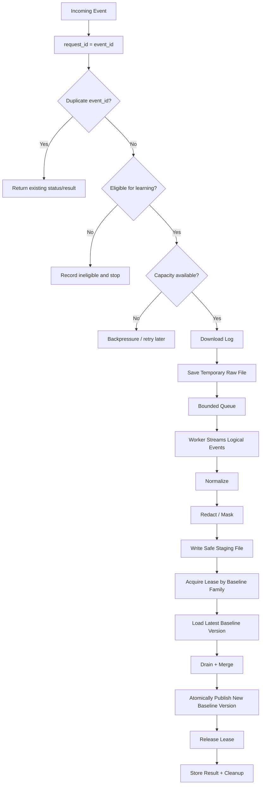

The important design decisions are:

> We parallelize independent work at the **log-file level**, but we do not initially parallelize chunks inside a log file.

> We serialize only the **Drain update + baseline publish** step for two runs that belong to the **same baseline family**. Different families continue to run in parallel.

This keeps CPU use controlled while also protecting the shared learned baseline from races.

## 2.1 Eligibility Check Before Download

Eligibility is based only on event metadata, so it should happen before any large network or disk work.

Typical checks include:

- trusted branch / trusted source,
- required IDs are present,
- `seal_id`, `project_id`, `repo_id`, and `source_type` are valid,
- rule/parser versions are known and supported,
- any other policy required before a run is allowed to teach the baseline.

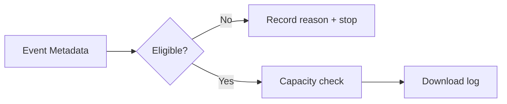

### Why this is better

If a 200 MB run is not eligible, downloading it first wastes:

- network bandwidth,
- temporary disk,
- disk writes,
- queue capacity,
- worker time.

### Tradeoff

The eligibility rules must be versioned and deterministic. If eligibility depends on information that is only available inside the log, that specific check cannot happen before download. Metadata-only checks still should.

## 2.2 Idempotency: `event_id` Is the Request Identity

A fresh random `request_id` does not protect the service when the upstream pipeline retries the same completion event.

Use the event schema's `event_id` as the idempotency key:

```text
request_id = event_id
```

or derive `request_id` deterministically from `event_id`.

The status table should have a unique key on `event_id`.

```text
First delivery:
event_id=abc123 → create row → process

Retry of same webhook:
event_id=abc123 → row already exists → return first status/result
```

This prevents duplicate downloads, duplicate Drain learning, and duplicate baseline publication.

### Tradeoff

This works only if the producer guarantees that `event_id` represents one logical event. If the same logical run can arrive with different event IDs, a second domain-level idempotency key may also be needed.

---

# 3. Why We Need a Queue

At 100 requests/minute, a queue may not always be required from a pure throughput point of view.

However, log processing time can vary.

For example:

- one request may contain a 5 MB log,
- another request may contain a 200 MB log,
- one log may contain simple messages,
- another may contain expensive regex processing and many unique templates.

Because of this, request arrival speed and processing speed will not always match.

The queue acts as a waiting area.

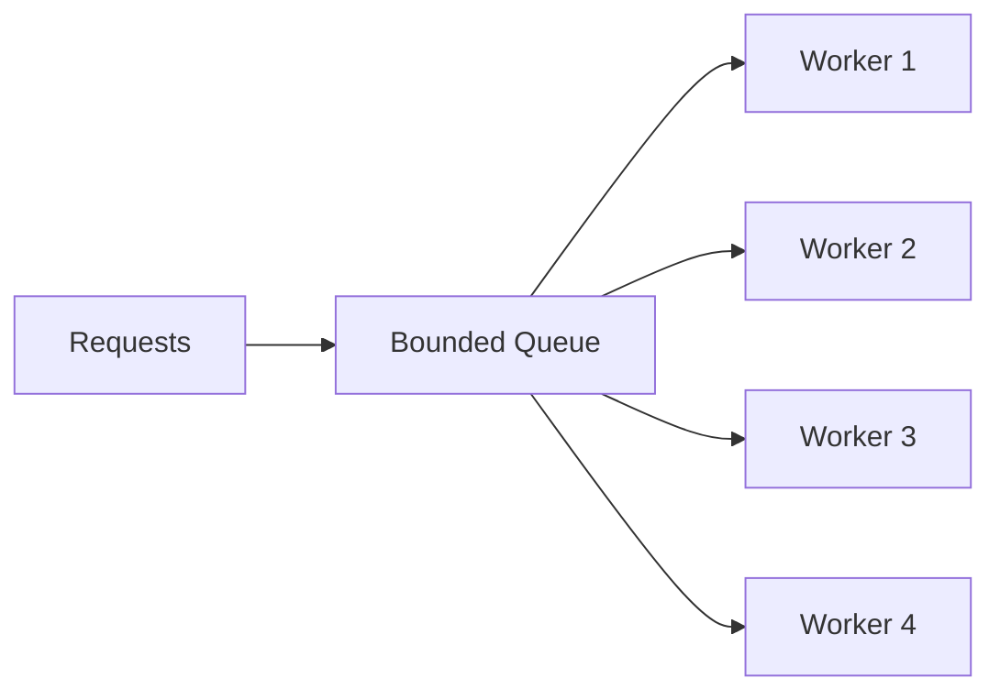

Example:

```text
Incoming capacity     = 100 requests/minute
Processing capacity   = 80 requests/minute

20 requests/minute cannot be processed immediately.
They wait in the queue.
```

## Why a bounded queue?

The queue must not be unlimited.

If requests keep arriving and workers cannot keep up, an unlimited queue can keep growing.

That can eventually create:

- too many pending files,
- too much disk usage,
- more memory used by metadata,
- very long waiting times,
- service instability.

So use a **bounded queue**.

When the queue is full, apply backpressure.

Backpressure can mean:

- reject new work temporarily,
- return a retryable response,
- throttle producers,
- stop downloading additional logs until capacity becomes available.

## Tradeoff

### Queue advantages

- protects workers from traffic spikes,
- controls concurrency,
- supports retries,
- separates request handling from heavy processing,
- makes the service more stable.

### Queue disadvantages

- adds another component,
- requests may wait,
- queue state needs monitoring,
- retry and duplicate handling must be designed.

For offline processing, these disadvantages are normally acceptable.

---

# 4. Where the Downloaded Log Should Be Stored

A 200 MB log should normally **not be kept fully in Python memory**.

The safer approach is:

```text
Request
   ↓
Download
   ↓
Temporary disk / object storage
   ↓
Worker streams the file
```

For a single-machine service, local temporary disk is the simplest solution.

For Kubernetes, multiple replicas, or crash recovery requirements, durable object storage such as S3-style storage is safer.

---

# 5. Safe Temporary File Lifecycle

Do not allow a worker to read a file while it is still being downloaded.

Use a simple state change.

Example:

```text
request-123.downloading
        ↓
download completes
        ↓
optional size/checksum verification
        ↓
request-123.ready
```

A worker should only process files that are marked ready.

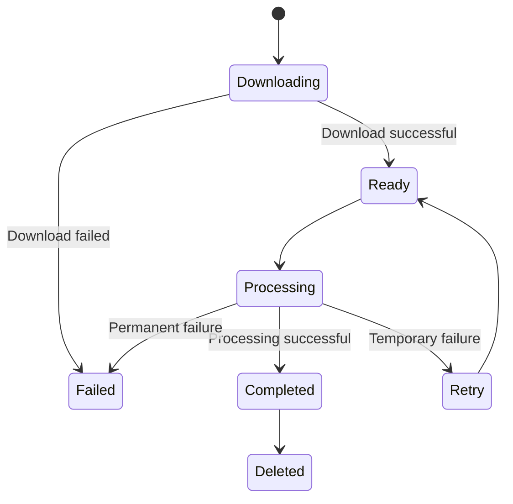

The rename from `.downloading` to `.ready` should ideally be atomic when using local disk.

This prevents partial or corrupted processing.

## Tradeoff

### Temporary disk advantages

- file does not need to stay in RAM,
- worker can retry from the same file,
- crash recovery is easier,
- streaming becomes simple,
- download and processing are separated.

### Temporary disk disadvantages

- disk can fill up,
- files must be cleaned,
- disk I/O is added,
- local disk can be lost if the container or node disappears.

For production Kubernetes environments, object storage can reduce the local-disk durability problem.

---

# 6. Does a 200 MB Temporary File Consume 200 MB RAM?

No.

A 200 MB file stored on disk mainly consumes **disk space**.

It does not automatically mean the Python process uses 200 MB of application memory.

The worker can read a small portion at a time.

```text
200 MB file on disk
        ↓
read small buffer
        ↓
process it
        ↓
release / reuse buffer
        ↓
read next data
```

For example, the application may only keep a few KB or MB of log data in memory at a time.

The operating system may also use RAM as file-system cache, but that memory is generally reclaimable and is different from the Python process holding the whole file.

## Main risk

The biggest risk with temporary files is usually **disk capacity**, not RAM.

Example:

```text
10 files × 200 MB = 2 GB
50 files × 200 MB = 10 GB
100 files × 200 MB = 20 GB
```

This is another reason why the queue and download concurrency must be bounded.

---

# 7. Why We Prefer Streaming

After the log has been downloaded safely, the worker opens the file and processes it as a stream.

We do not load the complete 200 MB file into memory.

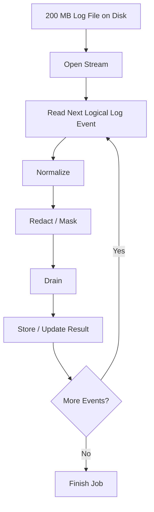

Streaming provides:

- low memory usage,
- predictable memory usage,
- easy processing of very large files,
- less memory pressure,
- no need to wait for the whole file to be loaded into RAM.

---

# 8. Line-by-Line vs Byte Chunks

For Drain, the best input is normally **one complete logical log event at a time**.

That means we should not send arbitrary pieces such as:

```text
1 MB raw bytes → Drain
```

because one 1 MB block may contain:

- half of one log event,
- hundreds of log events,
- the beginning of another log event.

Drain works on log messages, not arbitrary byte boundaries.

Therefore:

## Single-line logs

If every log event is one physical line:

```text
Line 1 → Drain
Line 2 → Drain
Line 3 → Drain
```

This is ideal.

## Multiline logs

For stack traces or multiline messages, combine physical lines into one logical event first.

Example:

```text
2026-09-11 ERROR Payment failed
    java.lang.RuntimeException
        at PaymentService.process(...)
        at CheckoutService.execute(...)
```

These lines should become one logical event:

```text
Complete stack-trace event
        ↓
Normalize
        ↓
Redact / Mask
        ↓
Drain
```

So the correct rule is:

> Stream the file, but feed Drain **complete logical events**.

---

# 9. Processing Pipeline

For every log event:

```text
Raw Event
   ↓
Normalize
   ↓
Redact / Mask
   ↓
Drain
   ↓
Template / Cluster Result
```

## 9.1 Normalization

Normalization converts different representations into a consistent format.

Examples:

- normalize whitespace,
- normalize timestamps when appropriate,
- normalize IDs or known patterns,
- standardize field names,
- clean irrelevant formatting.

The goal is to reduce unnecessary variation before template extraction.

### Tradeoff

Too little normalization causes too many different templates.

Too much normalization can remove information that is actually useful.

So normalization rules should be deliberate.

---

# 10. Redaction and Masking

Sensitive information should normally be removed or masked **before Drain receives the event**.

Examples:

```text
email=rahul@example.com
```

can become:

```text
email=<EMAIL>
```

or:

```text
email=[REDACTED]
```

Similarly:

```text
card=1234567812345678
```

can become:

```text
card=************5678
```

This provides two benefits:

1. sensitive values do not enter template-processing state,
2. changing sensitive values do not create unnecessary template variation.

## Redaction vs Masking

Redaction removes the value completely.

```text
token=abc123
→
token=[REDACTED]
```

Masking keeps part of the value.

```text
card=1234567812345678
→
card=************5678
```

## Tradeoff

Aggressive redaction improves privacy but may remove useful debugging context.

The rules should therefore be field-specific.

---

# 11. Can Drain Work with Streaming?

Yes.

Drain is well suited to incremental processing.

It does not require the entire 200 MB log file to be loaded first.

A simplified model is:

```text
Event 1 → Drain → update cluster/template state
Event 2 → Drain → update cluster/template state
Event 3 → Drain → update cluster/template state
...
```

Drain mainly needs to keep its template/tree/cluster state in memory.

So memory usage depends more on things such as:

- number of unique templates,
- number of clusters,
- parser configuration,
- metadata being stored,

rather than only on the raw file size.

---

# 12. Why We Are Not Doing Manual Chunking Initially

Suppose one 200 MB log is manually split into five chunks.

```text
Log 1
 ├── Chunk 1
 ├── Chunk 2
 ├── Chunk 3
 ├── Chunk 4
 └── Chunk 5
```

Now suppose ten logs are processed at the same time.

```text
10 logs × 5 chunks = 50 chunk tasks
```

If all chunks are made parallel, the system can suddenly have up to 50 runnable tasks.

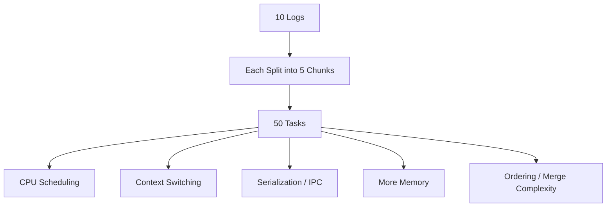

More tasks do not automatically mean more speed.

On a 4-vCPU machine, 50 CPU-heavy tasks must fight for the same four CPU cores.

This can create:

- CPU contention,
- context switching,
- process scheduling overhead,
- serialization overhead,
- inter-process communication,
- larger memory usage,
- more complex retries,
- result merge complexity,
- ordering problems.

Because of this, our starting design is:

```text
Parallelism between logs     = YES
Parallelism inside each log  = NO initially
```

Example:

```text
Worker 1 → Log A → stream events sequentially
Worker 2 → Log B → stream events sequentially
Worker 3 → Log C → stream events sequentially
Worker 4 → Log D → stream events sequentially
```

---

# 13. Chunking Is Not the Same as Streaming

This distinction is important.

## Streaming

Streaming means:

```text
Read a small amount
→ process
→ continue reading
```

Its main purpose is low memory usage.

## Parallel chunking

Parallel chunking means:

```text
Split one file into independent large pieces
→ create multiple tasks
→ process pieces in parallel
→ combine results
```

Its main purpose is parallel execution.

Streaming does not require creating many parallel tasks.

Our design uses **streaming**, but avoids **parallel chunking** initially.

---

# 14. When Chunking Is Actually Useful

Chunking can be useful in some situations.

### Case 1: Batch jobs

If there are millions of independent records and ordering does not matter, chunks can be distributed across workers.

Example:

```text
10 million independent records
        ↓
Chunk A
Chunk B
Chunk C
Chunk D
        ↓
Parallel batch workers
```

### Case 2: One huge file is the bottleneck

If only one extremely large log is being processed and one CPU core cannot keep up, chunk-level parallelism may help.

But it should only be added after profiling proves that it improves throughput.

### Case 3: Independent expensive operations

If each record or chunk is completely independent and processing is CPU-heavy, a ProcessPool can be useful.

### Case 4: Smaller retry units

Chunks can make retries cheaper.

Instead of repeating an entire 10 GB batch, only one failed chunk may need to be retried.

---

# 15. Problems with Chunking Logs for Drain

Drain makes chunk-level parallel processing more complicated.

Imagine:

```text
Chunk 1 → Drain instance A
Chunk 2 → Drain instance B
Chunk 3 → Drain instance C
```

Each Drain instance may build slightly different template state.

Now the system has to merge template clusters from different processes.

That is much harder than:

```text
One logical event stream
        ↓
One Drain state
```

If all chunks instead share one Drain state, synchronization or locking may be required.

That can reduce the benefit of parallelism.

Therefore, sequential streaming into one Drain state per processing context is usually the cleaner starting point.

---

# 15.1 Shared Baseline Concurrency: Family Lease

The previous section explains why multiple chunks should not independently update separate Drain trees and then be merged later.

The same rule must also be applied **between different log jobs**.

Two workers may be processing two successful runs for the same repository at the same time. Both runs may belong to this baseline family:

```text
family_key = seal_id + project_id + repo_id + source_type
```

If both workers update the same `templates.json` or Drain tree concurrently, the baseline can suffer lost updates or corruption.

If each worker builds an independent Drain state and someone merges them later, we reintroduce the difficult cluster-merging problem we are intentionally avoiding.

So we use a **family-scoped lease**.

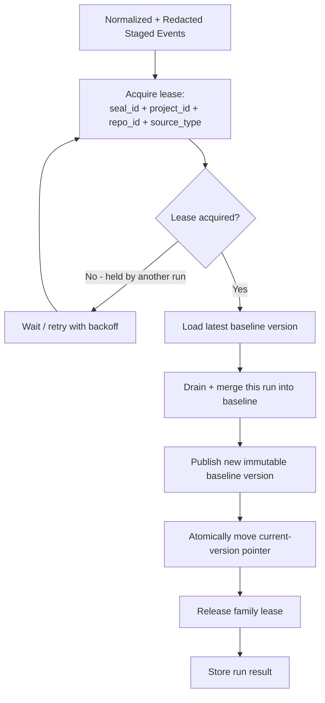

## What stays parallel?

Everything before the lease remains independent:

```text
Download
→ stream
→ normalize
→ redact / mask
→ create staged safe events
```

So two runs for different repositories or source types remain fully parallel.

Even two runs for the **same** family can do their expensive download and preparation work in parallel. They serialize only when they are ready to modify the shared baseline.

## Why stage before acquiring the lease?

If the worker acquires the family lease before reading a 200 MB log, it may hold the lease for a long time while doing work that does not need exclusivity.

Instead:

```text
Raw log
   ↓
stream + normalize + redact/mask
   ↓
Safe staged file
   ↓
Acquire family lease
   ↓
Drain + baseline publish
```

The staging file can be JSONL or another simple sequential format containing complete safe logical events.

This adds some disk I/O, but it keeps the critical section short and allows different jobs to keep using CPU and I/O in parallel.

If policy allows, the raw file can be deleted after the safe staging file is complete and validated. If raw input must be retained until the whole job succeeds, size temporary disk for both raw and staged data during the overlap.

## Load the baseline only after the lease is acquired

Do not load baseline version `v41`, wait for the lease, and then publish based on that stale copy.

Correct order:

```text
Acquire family lease
    ↓
Read current baseline version
    ↓
Apply this run
    ↓
Publish next version
```

Example:

```text
Run A acquires lease
baseline v41 → Run A → publish v42
release

Run B acquires lease next
baseline v42 → Run B → publish v43
```

This guarantees that Run B learns on top of Run A instead of accidentally overwriting it.

## The lease should be distributed

If the service can have multiple processes, pods, or machines, a normal in-process Python lock is not enough.

Use a shared coordination mechanism such as a database-backed lease or distributed lock. The exact technology is an implementation choice; the important behavior is:

- lease is keyed by the baseline family,
- lease has an owner,
- lease has a timeout/TTL,
- a long-running owner can renew it,
- release happens in a `finally`-style cleanup path,
- stale owners must not be allowed to publish after their lease has expired.

A fencing token or baseline-version compare-and-swap is useful protection against the last case.

## Serialization is not automatically business ordering

The family lease guarantees that two runs do not update the baseline at the same time. It does **not** by itself guarantee which waiting run goes first.

If LogSift requires same-family learning to follow a specific order, such as pipeline sequence or commit ancestry, store that ordering metadata and only allow the next valid family event to publish. If order is not semantically important, normal lease acquisition order is sufficient.

## Atomic versioned publish

Do not modify the currently visible `templates.json` in place while readers can see it.

Prefer:

```text
baseline/v41   <- existing immutable version
baseline/v42   <- write complete new version
current        <- atomically change pointer from v41 to v42
```

If publication fails, readers still see the complete old version rather than a partially written new one.

## Tradeoff

### Advantages

- prevents same-family lost updates,
- avoids concurrent writes into one Drain tree,
- avoids merging independently learned Drain trees,
- different baseline families remain parallel,
- lock is held only for the truly shared operation,
- version history makes rollback and debugging easier.

### Costs

- same-family runs can wait behind each other,
- lease coordination adds operational complexity,
- staging adds temporary disk I/O,
- baseline publication needs atomic/versioned storage semantics.

This is the correct tradeoff because the learned baseline is shared state. Correctness is more important than parallelizing two writes to the same state.

---

# 16. ThreadPool vs ProcessPool

The executor should not be selected only because the machine has a certain number of CPU cores.

First decide what kind of work dominates.

## ThreadPool

Use threads mainly for I/O-bound work:

- downloading files,
- waiting on network,
- waiting on object storage,
- database calls,
- remote API calls.

Threads are lightweight and share the same process memory.

## ProcessPool

Use processes for CPU-heavy Python work:

- expensive regex processing,
- heavy parsing,
- compression,
- CPU-intensive transformation,
- expensive template computation.

Processes have separate memory spaces.

This gives better CPU parallelism for Python CPU-bound work but costs more.

## Tradeoff

### Threads

Advantages:

- cheaper to create,
- easier shared state,
- lower memory overhead,
- good for I/O.

Disadvantages:

- CPU-heavy pure Python code does not scale well across cores because of Python's GIL,
- shared state requires care.

### Processes

Advantages:

- real CPU parallelism,
- memory isolation,
- useful for CPU-heavy Python workloads.

Disadvantages:

- higher memory usage,
- process startup cost,
- serialization cost,
- inter-process communication,
- Drain state sharing becomes harder.

---

# 17. Recommended Parallelism Model

For the first version, use a limited number of independent log-processing workers.

Each worker can independently download/stream/normalize/redact its log. The only shared gate is the family lease around Drain baseline update and publication.

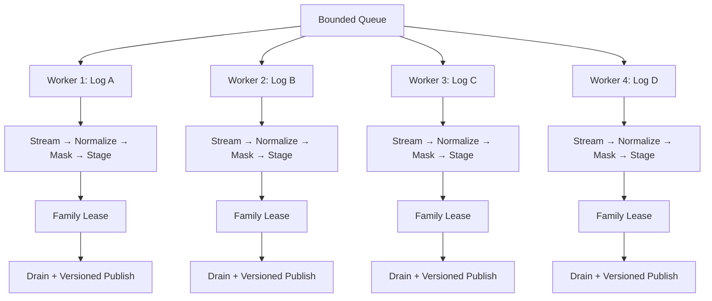

If Log A and Log B have different family keys, both lease sections can run at the same time.

If Log A and Log B have the same family key, one publishes first and the other waits, then loads the newly published baseline and continues.

If more logs are waiting:

```text
4 logs = active worker jobs
remaining logs = bounded queue
```

This gives controlled parallelism without allowing concurrent mutation of the same learned baseline.

---

# 18. Why Start with Around 4 Concurrent Logs?

Our starting machine assumption is around 4 vCPU.

Normalization, regex redaction, masking and Drain can use meaningful CPU.

If 20 large files are processed simultaneously on a four-core machine, those tasks still have to share four CPU cores.

The result can be:

```text
More workers
    ↓
More competition
    ↓
More context switching
    ↓
Potentially slower processing
```

Therefore, starting near the CPU count is a reasonable conservative choice for mixed or CPU-heavy workloads.

This is only a starting point.

Load testing may show that:

- 4 workers are best,
- 6 workers are better,
- 8 workers are acceptable,
- or only 2 workers are needed.

Measure instead of guessing.

---

# 19. Initial Resource Recommendation

A reasonable initial configuration is:

```text
CPU              : 4 vCPU
RAM              : 8 GB
Temporary disk   : 20–50 GB
Active log jobs  : around 4
Queue size       : around 20–50 jobs initially
```

Why 8 GB RAM if we are streaming?

Because RAM is also used by:

- Python runtime,
- libraries,
- Drain tree/cluster state,
- regex structures,
- worker processes,
- output buffers,
- metadata,
- operating-system cache,
- safety headroom.

Streaming protects us from needing RAM proportional to the entire file size.

---

## 19.1 Validate the 200 MB / Line-Count Assumption

The **200 MB** value is a capacity-planning assumption, not a protocol limit unless we explicitly make it one.

If another part of LogSift is described as handling around **5 million lines**, collect real samples and measure:

- MB per successful run,
- MB per failed run,
- lines per successful run,
- lines per failed run,
- p95/p99 file size,
- largest expected retry/diagnostic output.

A failure log can be much larger than a success log because retries, stack traces, debug output, or diagnostics can increase verbosity.

The service should therefore size disk and queue admission using actual bytes, not only line count.

A useful admission model is:

```text
estimated pending bytes
+ active raw bytes
+ active staged bytes
+ safety margin
< usable temporary storage
```

### Tradeoff

A hard 200 MB limit makes capacity predictable but rejects larger legitimate runs. A soft operational assumption is more flexible but requires good disk/backpressure monitoring. Decide which behavior LogSift actually wants after measuring production distributions.

---

# 20. Disk Space Role

Disk is mainly used as a temporary safe buffer between downloading and processing.

```text
Network / Source
      ↓
Temporary File
      ↓
Worker Streams It
      ↓
Delete After Success
```

Disk allows us to avoid holding a 200 MB log in application memory.

It also makes retry easier.

If processing fails halfway through, the original downloaded file can still exist.

The service can retry without downloading again.

## Disk controls

Monitor:

- free disk percentage,
- total bytes used by pending logs,
- number of pending files,
- oldest pending file,
- cleanup failures.

If disk usage becomes too high, stop accepting or downloading more jobs until space becomes available.

---

# 21. Failure Handling and Idempotent Status

Every logical event should be identified by its existing `event_id`.

The simplest rule is:

```text
request_id = event_id
```

The status table should enforce uniqueness on that value.

Track states such as:

```text
RECEIVED
INELIGIBLE
DOWNLOADING
READY
PREPROCESSING
WAITING_FOR_FAMILY_LEASE
UPDATING_BASELINE
COMPLETED
FAILED
```

Store enough metadata to retry safely:

```text
event_id / request_id
seal_id
project_id
repo_id
source_type
baseline_family_key
raw_file_location
staged_file_location
status
retry_count
baseline_version_read
baseline_version_published
created_at
started_at
completed_at
error_reason
```

If the exact same `event_id` arrives again, do not create a second learning job. Return the status/result associated with the existing row.

---

# 22. Retry Strategy

Retry should happen at the **log-job level** initially, while preserving the same `event_id`.

Example:

```text
Event abc123
 ↓
worker crashes
 ↓
status remains retryable
 ↓
another worker resumes/retries abc123
 ↓
same status row, not a new request
```

If preprocessing already produced a valid safe staging file, the retry may be able to restart from the family-lease/Drain step instead of downloading and normalizing the raw log again.

For the shared baseline step:

- acquire the family lease again,
- load the latest baseline only after the lease is acquired,
- publish a new version atomically,
- record which baseline version was published.

The publish operation should itself be idempotent or protected by event metadata so a crash after publication but before status update does not teach the same event twice.

A simple protection is to record the applied `event_id` together with the published baseline version and enforce uniqueness on `(baseline_family_key, event_id)`. On retry, if that pair already exists, return the previously published version instead of applying the same event again.

```text
family=A, event_id=abc123 → published baseline v42
worker crashes before marking COMPLETED
retry abc123 → sees abc123 already published as v42 → do not learn twice
```

## Tradeoff

Retrying a whole 200 MB file can repeat some work. Keeping a validated staged representation can reduce repeated CPU and network work, but temporarily uses more disk.

Chunk-level retry could reduce repeated work further, but adds much more complexity and still does not remove the need for the family lease during shared baseline publication.

Start simple unless retry cost becomes a measured problem.

---

# 23. Temporary File Cleanup

A worker should delete the temporary file only after successful processing and successful result persistence.

```text
Process log
   ↓
Persist result successfully?
   ↓ yes
Delete temporary file
```

If the process crashes before deletion, a cleanup mechanism should eventually remove old abandoned files.

Example policy:

```text
Completed files → delete immediately
Failed files    → keep for retry / limited retention
Orphan files    → cleanup after configured TTL
```

Do not depend only on normal application shutdown for cleanup.

---

# 24. Backpressure

The service should not accept unlimited work.

Consider:

```text
100 incoming 200 MB logs
= potentially 20 GB of temporary data
```

If the disk only has 20 GB available, allowing every request to download immediately is dangerous.

So capacity should be checked before accepting more work.

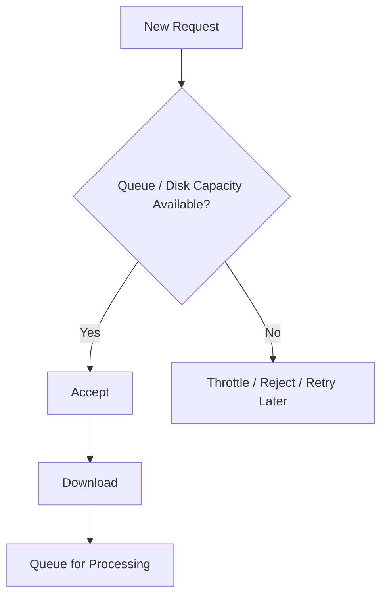

Backpressure protects the service.

---

# 25. Isolation

There are two different kinds of isolation.

## Job isolation

Each log should have its own:

- `request_id`,
- temporary file,
- status,
- processing context,
- output.

A failure in Log A should not corrupt Log B.

## Process isolation

If ProcessPool workers are used, each process has its own memory space.

That provides stronger memory isolation but increases memory and communication cost.

Threads are lighter but share memory.

For the initial architecture, job-level isolation is essential. Full process-level isolation should only be used where CPU requirements justify it.

## Baseline-family isolation

Job isolation does **not** mean every job owns an independent learned baseline. Jobs with the same `seal_id + project_id + repo_id + source_type` intentionally share one versioned baseline.

That shared state is protected by the family lease described in section 15.1. This is the boundary where concurrency must be serialized.

---

# 26. Why Not Process 50 Chunks in Parallel?

Consider:

```text
10 logs
×
5 chunks per log
=
50 parallel tasks
```

But suppose the machine has:

```text
4 CPU cores
```

Only around four CPU-heavy tasks can truly execute on four cores at the same instant.

The remaining tasks are waiting and being scheduled.

This creates overhead without creating 50 times the CPU capacity.

The correct goal is not:

> Create the maximum number of parallel tasks.

The correct goal is:

> Keep available CPU busy without creating unnecessary scheduling and coordination overhead.

That is why bounded concurrency is important.

---

# 27. Why Our Approach Is Better for the Starting Scenario

Our starting architecture is:

```text
100 requests/minute
        ↓
event_id idempotency + eligibility
        ↓
Bounded Queue
        ↓
Limited Workers
        ↓
Safely Stored Log File
        ↓
Stream Complete Log Events
        ↓
Normalize → Redact / Mask → Stage
        ↓
Family-scoped lease
        ↓
Load latest baseline
        ↓
Drain + merge
        ↓
Atomic versioned publish
        ↓
Store Output + Cleanup
```

It gives us:

- simple implementation,
- controlled CPU usage,
- controlled memory usage,
- predictable disk usage,
- easy retries,
- safe handling of 200 MB files,
- no need to merge Drain state from chunks,
- no nested parallelism,
- easier troubleshooting.

---

# 28. Alternatives and Why We Are Not Choosing Them Initially

## Alternative 1: Load the complete file into RAM

```text
200 MB file → Python memory → process
```

### Problem

With multiple files:

```text
10 × 200 MB = 2 GB raw data
```

Actual Python memory usage can be even larger after parsing strings and objects.

### Decision

Do not use this approach.

Use streaming.

---

## Alternative 2: Split every log into five chunks

### Advantage

Potential internal parallelism.

### Problems

- boundary handling,
- multiline logs,
- Drain-state merging,
- process overhead,
- ordering,
- retry complexity,
- nested parallelism.

### Decision

Not justified initially.

---

## Alternative 3: One thread/process per incoming request

At 100 requests/minute, this can eventually create uncontrolled concurrency if requests take a long time.

### Decision

Use a fixed/bounded worker pool instead.

---

## Alternative 4: Unlimited queue

### Advantage

Simple producer behavior.

### Problem

Backlog can grow until disk or memory is exhausted.

### Decision

Use a bounded queue.

---

## Alternative 5: Put complete log data inside the queue

### Problem

A queue is not a good place for hundreds of MB per message.

It creates:

- network overhead,
- memory pressure,
- serialization cost,
- broker storage pressure.

### Decision

The queue should contain only metadata.

Example:

```text
request_id
file_location
status
retry_count
```

---

## Alternative 6: Let all workers write the same baseline directly

### Advantage

Maximum apparent parallelism and very little coordination code.

### Problems

- two same-family runs can read the same old baseline,
- one update can overwrite the other,
- `templates.json` can be exposed while partially written,
- process-local locks do not protect multiple pods,
- independent Drain trees bring back the difficult merge problem.

### Decision

Do not allow concurrent same-family baseline writes. Use a distributed family lease plus atomic versioned publication.

---

# 29. When We Should Revisit the Design

Add more complexity only when measurements show a real problem.

Consider chunk-level parallelism if:

- one file takes too long even when CPU is available,
- one log is much larger than normal,
- work inside chunks is independent,
- Drain state can be handled correctly,
- profiling proves the speed improvement is larger than the overhead.

Consider more workers if:

- CPU remains low,
- queue keeps growing,
- disk and memory are healthy.

Consider horizontal scaling if:

- CPU stays near saturation,
- queue delay grows,
- one instance cannot meet throughput,
- adding more workers to the same instance no longer helps.

---

# 30. Scaling Strategy

The preferred order is:

```text
Step 1
Measure one worker

Step 2
Increase workers gradually

Step 3
Find safe concurrency

Step 4
If one machine reaches CPU limit,
add more service instances
```

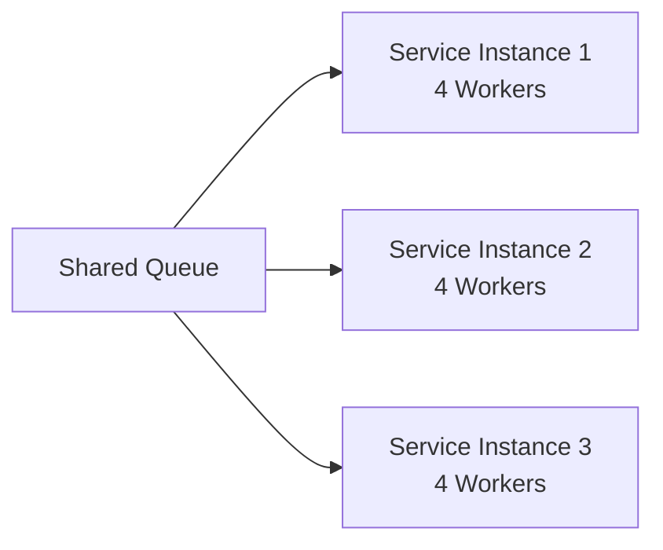

This is usually cleaner than creating extreme parallelism inside each file.

---

# 31. What Should Be Monitored

At minimum monitor:

### Request metrics

- requests/minute,
- accepted requests,
- rejected/throttled requests.

### Queue metrics

- queue length,
- oldest job age,
- average wait time.

### Processing metrics

- processing time per log,
- processing time per MB,
- logs completed,
- logs failed,
- retries.

### Resource metrics

- CPU usage,
- RAM usage,
- disk usage,
- disk I/O,
- number of active workers.

### Drain metrics

- template count,
- cluster count,
- new templates created,
- processing latency per event.

These metrics tell us whether worker count or resource size should change.

---

### Eligibility and idempotency metrics

- eligible vs ineligible events,
- ineligibility reasons,
- duplicate `event_id` deliveries,
- duplicate requests short-circuited before download.

### Family lease / baseline metrics

- lease wait time,
- number of same-family collisions,
- lease timeout/renewal failures,
- baseline publish latency,
- baseline version before/after each event,
- publish conflicts or fencing/CAS failures.

A growing queue with low CPU can mean the bottleneck is not worker CPU at all; it may be repeated same-family serialization. These metrics make that visible.

---

# 32. Final Recommended Flow

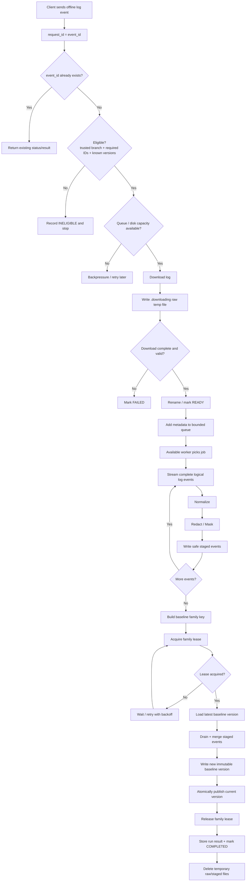

The key concurrency rule is:

```text
Different baseline families  → may update in parallel
Same baseline family         → Drain update/publish is serialized
```

Everything before the family lease remains parallel and independent per log.

---

# 33. Final Design Decision

For the current requirement, the recommended approach is:

**Use controlled parallelism across log files, streaming inside each individual log file, and a short family-scoped serialization point around shared Drain baseline update and publication.**

The default architecture is:

```text
Incoming event
      ↓
event_id idempotency
      ↓
early eligibility check
      ↓
capacity / backpressure
      ↓
download safely
      ↓
bounded queue
      ↓
limited worker pool
      ↓
stream complete logical log events
      ↓
normalize → redact / mask
      ↓
safe staged events
      ↓
family lease keyed by
seal_id + project_id + repo_id + source_type
      ↓
load latest baseline
      ↓
Drain + merge
      ↓
atomic versioned publish
      ↓
release lease
      ↓
store result + cleanup
```

This approach is preferred because it provides the right balance between:

- throughput,
- CPU overhead,
- memory usage,
- disk safety,
- idempotency,
- early rejection of ineligible work,
- correct shared-baseline learning,
- Drain correctness,
- retry handling,
- implementation and operational complexity.

Chunking is still an optimization, not a requirement.

The important LogSift-specific addition is that **parallel log jobs are independent only until they reach shared baseline state**. At that boundary, jobs from the same baseline family must serialize so that each run learns from the latest published baseline and no update is lost.

---

# 34. Short Decision Summary

```text
Do we download every event?          No. Eligibility first.
Do retries get a new request ID?     No. request_id = event_id.
Do we load 200 MB into RAM?          No. Stream it.
Do we split every log into chunks?   No.
Can multiple logs run together?      Yes, with bounded workers.
Can different families learn at once? Yes.
Can the same family publish at once? No. One family lease holder.
Do we merge independent Drain trees? No.
Do we overwrite templates.json live? No. Publish immutable versions atomically.
```
